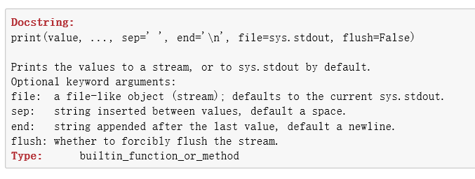
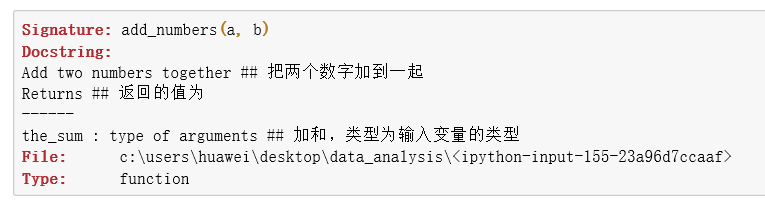
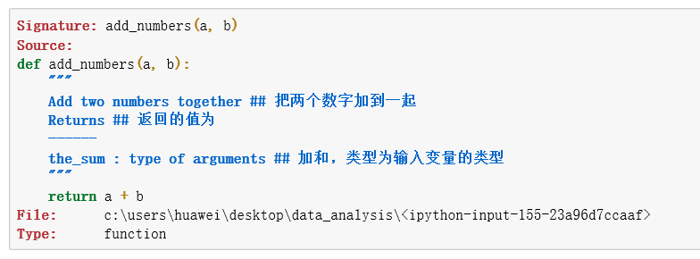
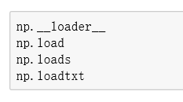
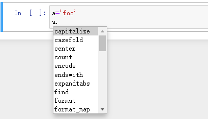

# 第2章 Python语言基础

## 2.2 IPython

所有关于IPython的先不看，就看先用这个jupyter

### 2.2.4 内省：？

在一个变量名，函数名后使用问好（？）可以显示一些关于该对象的概要信息

- ?：显示信息
- ?：函数的话，显示文档字符串，就是函数的注释，三个双引号那个
- ??：显示函数源代码
- 星号 名称 星号?：显示NumPy顶层函数中包含load的函数列表

```python
b = [1, 2, 3]
b?
```


```python
print?
```




```python
def add_numbers(a, b):
    """
    Add two numbers together ## 把两个数字加到一起
    Returns ## 返回的值为
    ------
    the_sum : type of arguments ## 加和，类型为输入变量的类型
    """
    return a + b
```


```python
add_numbers?
```




```python
add_numbers??
```




```python
import numpy as np
np.*load*?
```




## 2.3 Python语言基础

相对于《Python编程从入门到实践》有一定的拔高，挑几个补充点。

#### 2.3.1.6 isinstance检查对象的类型


```python
a = 5; b = 4.5
isinstance(a, int)
#输出为:True

isinstance(b, float)
#输出为:True

#isinstance接受一个包含类型的元组，只要类型在元组中出现，则为True
isinstance(a, (int, float))
#输出为:True
```

#### 2.1.3.7 属性和方法

对象（类）的属性和方法都可以通过`obj.attribute_name`的语法调用


```python
a = 'foo'
```



属性和方法还可以通过`getattr`函数获取


```python
getattr(a, 'split')
#<function str.split(sep=None, maxsplit=-1)>
```

#### 2.3.1.8 验证是否可迭代


```python
def isiterable(obj):
    try:
        iter(obj)
        return True
    except TypeError: ## 类型错误，不可遍历
        return False.
```

对于绝大部分的Python的容器列表类型，都是可迭代的


```python
isiterable('a string')
#True

isiterable([1, 2, 3])
#True

isiterable(5)
#False
```

#### 2.3.2.1 数值类型
整型和浮点型

1. 整型可以储存任意大小的数字

   ```python
   ival = 5211314
   ival**10
   #输出为:
   #14773126520894576247394034909454218428871028979977065385182498046976
   ```

2. 浮点型float，每个浮点数都是双精度64位数。

   ```python
   faval = 3.1415926
   
   #可以用科学计数法表示 
   faval = 12345.67e-5  #e-5,就是十的负5次方
   faval+1
   #输出为:1.1234567
   ```

3. 整数除法，自动转型为浮点数

   ```python
   3 / 2
   #输出为:1.5
   3//2 #如果想整数除完还是整数，C语言就是那样，可以用//
   #输出为:1
   ```

#### 2.3.2.2 字符串

<u>**多行字符串，用三引号**</u>


```python
c = """
一顿火锅
两串烧烤
三杯阔落
四盆龙虾
五香花生
六味猪蹄
七斤荔枝
八个榴莲
九足饭饱
食不我待，得抓紧
"""

#试着用count计算回车符
c.count('\n')
#输出为:11
```

这个字符串，包含了十行文本，换行符`\n`也是包含在其中的

不过这个count出来是11，好吧就算你11行文本

**:star:下面说以下这个反斜杠，\\**

1. **反斜杠作为转义符号**

   **<u>[参考苦行僧95的博客园](https://www.cnblogs.com/kuxingseng95/p/9462294.html)</u>**

   目前见过的\\', \t, \n

   ```python
   print('I\'am a good boy')
   #输出为:I'am a good boy
   
   s = '\n'
   print(s)
   ```

   可以看出反斜杠是有特殊作用的，那么杠一个普通的内容会怎么样？

   ```python
   s = '\a'
   print(s)
   #输出为:�
   ```

   ```python
   s = '\ab'
   print(s)
   #输出为:�b
   ```

   ```python
   s = 'b\a'
   print(s)
   #输出为:b�
   ```

   ```python
   s = '\'
   print(s)
   #输出为:
   #  File "<ipython-input-37-036df140a79b>", line 1
   #    s = '\'
   #           ^
   #SyntaxError: EOL while scanning string literal
   ```

   ```python
   s = '\\'
   print(s)
   #输出为:\
   ```

   ```python
   s = '\\\'
   #输出为:
   #print(s)
   #  File "<ipython-input-39-b985fd4a0675>", line 1
   #    s = '\\\'
   #             ^
   #SyntaxError: EOL while scanning string literal
   ```

   ```python
   s = '\\\\'
   print(s)
   #输出为:\\
   ```

   <font color=red size=5>:star:**贪心法：**</font>

   每个字符应该包含更多的字符。编译器将程序分解成符号的方法是，从左到右一个字符一个字符的读入，如果该字符可能组成一个符号，就再读入下一个字符，判断已经读入的两个字符组成的字符串是否可能是一个符号的组成部分；如果可能，继续读入下一个字符，重复上述判断，直到读入的字符组成的字符串不再可能组成一个有意义的符号。这种处理方法，又称为“贪心法”，或者“大嘴法””。

   ```python
   s = '\\\a'
   print(s)
   #输出为:\�
   
   s = '\a'
   print(s)
   #输出为
   
   s = '\ab'
   print(s)
   #输出为b
   
   s = 'b\a'
   print(s)
   #输出为b
   
   s = '\'
   print(s)
   #报错
   #  File "<ipython-input-37-036df140a79b>", line 1
   #    s = '\'
   #           ^
   #SyntaxError: EOL while scanning string literal
   
   s = '\\'
   print(s)
   #输出为\
   
   s = '\\\'
   print(s)
   #输出为
   #  File "<ipython-input-39-b985fd4a0675>", line 1
   #    s = '\\\'
   #             ^
   #SyntaxError: EOL while scanning string literal
   
   s = '\\\\'
   print(s)
   #输出为\\
   ```

2. **再说一下杠数字的问题**

   ```python
   s = '12\\24'
   print(s)
   #输出为:12\24
   
   s = '\24'
   print(s)
   #####输出为:\\� 
   ```

   `jupyter`似乎默认做了一个进制转化，\24 是八进制 \024，0 省略了。\x14是16进制：2*8 + 4 = 1 * 16 +4 = 20。也就是八进制的24=十六进制的14=十进制的20

   

3.  **使用r'** 

    raw表示原生的，肉，生肉

    ```python
    s = r'人\生\不\易\\且\吃\且\珍\惜'
    print(s)
    #输出为:人\生\不\易\\且\吃\且\珍\惜
    ```

    

#### 2.3.2.5 类型转换
`str、bool、int、float`即是数据类型，又是转换为该数据类型的函数


```python
s = '3.1415926'
fs = float(s)  ## 字符串也可以直接转换为浮点型的嘛
type(s)
#str
type(fs)
#float
int(fs)
#3
bool(fs)
#True

bool(0) ## 0的布尔值是False
#False

bool(s) ## 字符串的布尔值也是true
#True

bool('0') ## 字符串是0也是true
#True

bool('') ## 字符串为空是 False
#False
```

#### 2.3.2.6 None

None可以作为一个常用的函数参数默认值


```python
def add_and_maybe_multiply(a, b, c=None):
    result = a + b
    
    if c is not None:
        result = result * c
        
    return result
```

None 不仅是一个关键字，还是NoneType类型的唯一实例。


```python
type(None)
#NoneType
```

#### 2.3.2.7 日期和时间

做数据，时间是一个非常重要的因素


```python
from datetime import datetime, date, time
dt = datetime(2011, 10, 29, 20, 30, 21)
dt.day
#29
dt.minute
#30
dt.date()
#datetime.date(2011, 10, 29)
dt.time()
#datetime.time(20, 30, 21)
```

1. `strftime`方法，将`datatime`转化为字符串

   ```python
   dt.strftime('%m/%d/%Y %H:%M')
   #'10/29/2011 20:30'
   ```

2. `strptime`方法，将字符串转化为`datatime`

   ```python
   datetime.strptime('20091031','%Y%m%d') ## 字符串转换为datetime对象
   #datetime.datetime(2009, 10, 31, 0, 0)
   ```

3. 替换时间中的一些值

   ```python
   dt ## dt是啥来着，看一眼
   #datetime.datetime(2011, 10, 29, 20, 30, 21)
   dt.replace(minute=0, second=0)
   #datetime.datetime(2011, 10, 29, 20, 0)
   ```

   `datetime.datetime`是不可变类型，以上都是产生新的对象

4. 如果想算两个时间点之间隔了多长时间怎么办

   ```python
   dt1 = datetime(2019, 5, 8, 10, 12, 30)
   dt2 = datetime(2024, 6, 7, 8, 28, 57)
   delta = dt2 - dt1
   #delta ## 产生一种新的类型
   #datetime.timedelta(days=1856, seconds=80187)
   ```

   将`timedelta`添加到`datetime`，会产⽣⼀个新的偏移`datetime`：

   ```python
   dt1 + delta
   #datetime.datetime(2029, 7, 8, 6, 45, 24)
   ```

**:star:<font color=red>Datetime格式化的详细说明(ISO C89兼容)</font>>**

---

- `%Y ` 四位年份

- `%y  ` 两位年份

- `%m ` 两位的月份 [01,12]

- `%d ` 两位的天数 [01,31]

- `%H ` 24小时制 [00, 23]

- `%I  `12小时制 [01,12]

- `%M ` 两位分钟 [00,59]

- `%S ` 秒值 [00,61] 60、61用于区分闰秒？？还有闰秒？

- `%w ` 星期值 [0, 6] 0星期天

- `%U ` 一年中第几个星期 [00,53]，星期天是每周第一天，第一个星期天前一周为第0个星期

- `%W ` 一年中第几个星期 [00,53]，星期一是每周第一天，第一个星期一前一周为第0个星期

- `%z`  UTC时区骗纸，格式为 +HHMM 或 -HHMM，简单时区则为空？？

- `%F`  `%Y-%y-%d`的简写，如2014-4-18

- %d  %m/%d/%y的简写，如04/18/12

---

