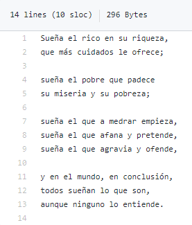

# 第3章 内建数据结构、函数及文件


## 3.1 数据结构和序列
### 3.1.1. 元组

可以使用 + 号来生成更长的元组


```python
(4, None, 'foo') + (6, 0) + ('bar',)  # 这个最后的逗号必须有，不然报错。证明是元组的是逗号，而不是()
#(4, None, 'foo', 6, 0, 'bar'）
```

元组 * 整数，生成含有多份的元组


```python
('foo', 'bar') * 4
#('foo', 'bar', 'foo', 'bar', 'foo', 'bar', 'foo', 'bar')
```

#### 3.1.1.1 元组拆包


```python
tup_1 = (4, 5, 6)
a, b, c = tup_1
print(b)
#5
print(c)
#6
```

嵌套元组也可以拆包


```python
tup_2 = 4, 5, (6, 7) 
a, b, c = tup_2
print(b)
#5
print(c)
#(6, 7)
```

利用这个功能可以轻易地交换变量名


```python
a, b = 1, 2 # a b 分别从元组（1，2）中取得值
#a为1，b为2
b, a = a, b # a, b为一个元组，值为1，2，ba从里面取值
#a为2，b为1
```


利用拆包遍历元组或列表组成的序列


```Python
seq = [(1, 2, 3), (4, 5, 6), (7, 8, 9)]
for a, b, c in seq:
    print('a={0}, b={1}, c={2}'.format(a, b, c))
    
#a=1, b=2, c=3
#a=4, b=5, c=6
#a=7, b=8, c=9
```


拆包工具*`rest`，从其起始位置取，`rest`是剩下的元素，作为列表


```python
values = 1, 2, 3, 4, 5
a, b, *rest = values
#a=1,b=2,rest=[3,4,5]
```

单个星号代表这个位置接收任意多个非关键字参数，所以不用`rest`也行。

```python
values = 1, 2, 3, 4, 5
a, b, *other =values
#a=1,b=2,others=[3,4,5]
```

用下划线表示不想要的变量

```python
values = 1, 2, 3, 4, 5
a, b, *_ = values
#a=1,b=2
```

#### 3.1.1.2 元组方法 count


```python
a = (1, 2, 3, 4, 3, 4)
a.count(3) # 查a里有几个3
```

### 3.1.2 列表

#### 3.1.2.2 链接和联合列表
可以使用‘+’连接列表，也可使用`extend`方法。


```python
[4, None, 'foo'] + [7, 8, 9]
#[4, None, 'foo', 7, 8, 9]

x = [4, None, 'foo']
x.extend([7, 8, (2, 3)]) # 添加多个元素
#[4, None, 'foo', 7, 8, (2, 3)]
```

#### 3.1.2.3 排序

用key按字符串长度进行排序


```python
b = ['saw', 'small', 'he', 'foxes', 'six']
b.sort(key=len)
#['he', 'saw', 'six', 'small', 'foxes']
```

#### 3.1.2.4 二分搜索和已排序列表的维护

`bisect.bisect` 按列表从小到大的顺序，看元素应当放到第几位，`bisect.insort `把元素插到第几位


```python
import bisect
c = [1, 2, 2, 2, 3, 4, 7]
bisect.bisect(c, 2)
#4
bisect.bisect(c, 5)
#6
bisect.insort(c, 6)
#[1, 2, 2, 2, 3, 4, 6, 7]
```

注意未排序的列表不会报错，但可能结果不正确

#### 3.1.2.5 切片

利用步长`step`对列表进行翻转


```python
seq = [1, 2, 5, 6, 3, 7, 8]
seq[::-1]
#[8, 7, 3, 6, 5, 2, 1]
```

### 3.1.3 内建序列函数

#### 3.1.3.1 enumerate 列举 历数

就是把列表的索引和元素对应提出来


```python
abc_list = ['a', 'b', 'c']
mapping = {}  #创建字典

for i, v in enumerate(abc_list):
    mapping[i] = v  #匹配key-values对
    
#mapping为{0: 'a', 1: 'b', 2: 'c'}
```

#### 3.1.3.2 sorted 排序

`sorted`的使用有刷新了我的认知


```python
sorted('horse race')
#[' ', 'a', 'c', 'e', 'e', 'h', 'o', 'r', 'r', 's']
```

**<u>其根本是，把一个序列中的元素排序</u>**

#### 3.1.3.3 zip

根本是把一个序列对应位置的元素组团


```python
a = ['a0', 'a1', 'a2']
b = ['b0', 'b1', 'b2', 'b3']
c = ('c0', 'c1', 'c2')
d = '0123456'
e = {'e1':'v1', 'e2':'v2', 'e3':'v3'}

ab = zip(a, b) ## 长度取短
list(ab)
#[('a0', 'b0'), ('a1', 'b1'), ('a2', 'b2')]

ac = zip(a, c) ## 不限类型，只要可迭代应该就行
list(ac)
#[('a0', 'c0'), ('a1', 'c1'), ('a2', 'c2')]

ad = zip(a, d) ## 字符串是可迭代类型
list(ad)
#[('a0', '0'), ('a1', '1'), ('a2', '2')]

ae = zip(a, e) ## 字典也可以
list(ae) ##不过字典不是无序得嘛
#[('a0', 'e1'), ('a1', 'e2'), ('a2', 'e3')]
```

`zip`经常要用到的情况，同时遍历多个序列，与`enumerate`同时使用


```python
seq1 = ['a', 'b', 'c']
seq2 = ['e', 'f', 'g']

for i, (a, b) in enumerate(zip(seq1, seq2)):
    print('{0}: {1}, {2}'.format(i, a, b))

#0: a, e
#1: b, f
#2: c, g
```

`zip`(*列表)可以拆分，以前见过不说了

#### 3.1.3.4 reversed

元素倒序排列


```python
list(reversed(range(10)))
#[9, 8, 7, 6, 5, 4, 3, 2, 1, 0]
```

### 3.1.4 字典

**<u>也叫哈希表或关联数组</u>**，字典大部分功能都见过了，这里补充几个。

1. `del`和`pop+key`值

   注意`pop`之后返回的是value值
   
   ```python
   a = {0: 'a', 1: 'b', 2: 'c'}
   del a[1]
   #a为{0: 'a', 2: 'c'}
   b = a.pop(0)
   #a为{2: 'c'}
   #b为value值'a'
   ```

2. `keys`和`values`

   <u>**提供字典`keys`值和`values`值的迭代器，字典`keys`值没有特定顺序**</u>，而迭代输出的`keys`和`values`会按照字典键值对的顺序。
   
   ```python
   a = {0: 'a', 1: 'b', 2: 'c'}
   list(a.keys())
   #[0, 1, 2]
   list(a.values())
   #['a', 'b', 'c']
   ```

3. `update`

   将两个字典合并，注意`key`值相同会被覆盖
   
   ```python
   a = {0: 'a', 1: 'b', 2: 'c'}
   a.update({3: 'd', 4: 'e', 0:'f'})
   #a为{0: 'f', 1: 'b', 2: 'c', 3: 'd', 4: 'e'}
   ```

#### 3.1.4.1 序列合成字典

常规操作


```python
key_list = [0, 1, 2]
value_list = ['a', 'b', 'c']

mapping = {}
for key, value in zip(key_list, value_list):
    mapping[key] = value
    
#mapping为{0: 'a', 1: 'b', 2: 'c'}
```

但是现在可以用`dict`直接来


```python
mapping_2 = dict(zip(key_list, value_list))
mapping_2为{0: 'a', 1: 'b', 2: 'c'}

mapping_3 = dict(zip(range(5), reversed(range(5))))
#mapping_3为{0: 4, 1: 3, 2: 2, 3: 1, 4: 0}
```

这里因为`dict`里面元素的本质，是两个元素的集合，故可以字典可以接受，以元组为元素的列表。

#### 3.1.4.2 默认值：`get` 、 `setdefault`、``defaultdict``

1. `get` 

    测试一个`keys`在不在字典里，在就输出`keys`对应的`values`，不在就返回默认值，比如'不在'常规做法：

    ```python
a_2 = {0: 'a', 1: 'b', 2: 'c'}
    def check_key(key, some_dict, default_value):
        if key in some_dict:
            value = some_dict[key]
        else:
            value = default_value
        print(value)
        
    check_key(0, a_2, '不在呀')
    #输出为a
    check_key(3, a_2, '真没有')
    #输出为真没有
    ```
    
    `get`可以用一行代码替换这个`if-else`
    
    
    ```python
    def get_check_key(some_dict, key, default_value):
        value = some_dict.get(key, default_value)
        print(value)
        
    get_check_key(a_2, 0, '没有')
    #输出为a
    get_check_key(a_2, 5, '这个真没有')
    #输出为这个真没有
    ```


2. `setdefault`

    一个列表有很多单词，想把单词按首字母分组做成字典，a对应所有a打头的单词，b对应所有b打头的单词

    ```python
    words = ['apple', 'bat', 'bar', 'atom','book']
    def key_in_dict(words):
    
        by_letter = {}
        for word in words: 
            ## 从列表里面取出一个词
            ## 如word = apple
            
            letter = word[0]
            ## apple的零位元素，就是a
            ## 注意字符串是可迭代的
            
            if letter not in by_letter:
                ## by_letter现在是空字典
                ## a 不在里面
                
                by_letter[letter] = [word]  #word是列表
                ## 字典里面加入{'a':['apple']}
                ## value是个列表，word是列表中的一个元素
                
            else:
                by_letter[letter].append(word)
                ## 循环到atom的时候，a在字典里了
                ## 所以执行else
                ## a的键对应的元素，用append往里加atom
                ## {'a':['apple', 'atom']}
            
        print(by_letter)
        
    key_in_dict(words)
    #{'a': ['apple', 'atom'], 'b': ['bat', 'bar', 'book']}
    
    words_2 = ['apple', 'bat', 'bar']
    key_in_dict(words_2) 
    ## 用这个方法默认加入的value是一个列表
    {'a': ['apple'], 'b': ['bat', 'bar']}
    ```

    `setdefault`就是实现上面这个功能，我们先说一下`setdefault`本身。

    [参考链接:](https://www.runoob.com/python/att-dictionary-setdefault.html)
    和前面的`get()`类似，`get`替换了一个`if-else`，`setdefault`也是替换`if-else`，不过`get()`是方法，`setdefault`是函数。

    - **功能：**如果字典中包含有给定`keys`值，则返回该`keys`值对应的`values`，否则返回为该`keys`设置的`values`，并把`keys-values`对加入字典。

    - **基本通式：**`some_dict.setdefault(key, default=None)`
      - `key`：查找是否存在`keys`值，如不存在`keys`值，则向字典中添加`keys`值。
      - `default`：在不存在`keys`值的情况下，为`keys`值默认设置`values`值（值由传入的参数绝对）

    ```python
    dict_1 = {0: 'a', 1: 'b', 2: 'c'}
    a=dict_1.setdefault(3, None)
    print(a)
    #a输出为None
    print(dict_1)
    #dict_1输出为{0: 'a', 1: 'b', 2: 'c', 3: None}
    ```

    明确了这个我们再来看书上的例子

    ```python
    words = ['apple', 'bat', 'bar', 'atom','book']
    by_letter_2={}
    
    for word in words:
        ## 列表，单词
        letter = word[0]
        ## 首字母
        by_letter_2.setdefault(letter, []).append(word)
        ## 字典.setdefault(首字母，默认类型列表).方法添加(字符串)
    
    print(by_letter_2)
    #输出为{'a': ['apple', 'atom'], 'b': ['bat', 'bar', 'book']}
    ```

    

    <font color=red>**:star:<u>在查询到`keys`的情况下，向`keys`对应的`values`值列表里，加入新的`values`值。</u>**</font>

    经过跟群里小伙伴的讨论，我们提出了

    - **进阶通式：**`some_dict.setdefault(key, []).append(word)`
      - `key`：还是你要查的`key`值
      - `[]`：`values`值的类型
      - `.append()`：对`values`（列表）执行的方法

    还是如果字典没有`key`默认添加`keys`，并设置默认的`values`值，一般是空，None不同在于，这里可以设置了`values`值的类型。

    ```python
    # by_letter_2.setdefault(letter, []).append(word)
    
    # 所以再解释一下这行代码
    # 对于by_letter_2这个字典
    # 启用setdefault函数
    # 查一查里面有没有这个letter，比如apple的首字母a
    # 如果有，对a的元素执行append（word）
    # 如果没有，字典里加入a这个key值，并将value值设为空列表
    # 再对这个空列表执行append（word）
    ```

    不论`keys`在不在字典中，通过`setdeafault`这波操作，都有了一个`keys`。`.append()`这就是对这个`keys`对应的元素执行的方法。所以理论上，只要是`[]`有的方法，我们都可以用。

    ---

    书上的代码理解了，对`setdefault`还存在两个疑问

    - 这个默认`values`的类型

    - 对`values`执行的方法

    要想测试这个，你要熟悉[所有的数据类型](https://www.cnblogs.com/littlefivebolg/p/8982889.html)，及方法。

    **已知变量类型：`int`、`float`、`bool`、`str`、`tuple`都是不可变类型；`list`、`dic`t、`set`是可变类型，那么问题来了，所有的类型都可以放在这里吗？**

    ---

    - **`int`**

      ```python
      dict_v_int = {0: 10, 1: 20}
      # dict_v_int.setdefault(3, int) # 我最初的错误,
      # print(dict_v_int)
      #{0: 10, 1: 20, 3: <class 'int'>}
      dict_v_int.setdefault(2, 0) # N先生更正
      #也可更正为dict_v_int.setdefault(3, int())
      print(dict_v_int)
      #{0: 10, 1: 20, 2: 0}
      
      
      dict_v_int_2 = {0: 10, 1: 20}
      a_int = dict_v_int_2.setdefault(0, 0).bit_length() #返回二进制结果的长度
      ## 将数字转换为二进制，并返回位数
      ## 十进制10  = 8*1+4*0+2*1+1*0= 二进制1010   
      print(dict_v_int_2)
      print(a_int)
      #{0: 10, 1: 20}
      #4
      ```

    - **`str`**

      `values`为`float`、`bool`意思一样

      ```python
      dict_v_str = {0: 'a', 1: 'b'} ## 测试字符串
      dict_v_str.setdefault(2, '') ## 基础款
      #也可以修改为dict_v_str.setdefault(2, str())
      print(dict_v_str)
      #{0: 'a', 1: 'b', 2: ''}
      
      ## 进阶款
      dict_v_str_2 = {0: 'a', 1: 'b'}
      a = dict_v_str_2.setdefault(0, '').upper()  #查询字典是否存在keys=0的
      print(dict_v_str_2)  #存在keys=0，其value='A'
      #{0: 'a', 1: 'b'}
      print(a)
      #'A'
      ```

    - **`tuple`**

      元组为不可修改类型，能进行的操作也不多呀

      ```python
      dict_v_tup = {0: ('a',), 1: ('b', 'c')}
      dict_v_tup.setdefault(2, ())
      #也可以修改为dict_v_tup.setdefault(2, tuple())
      a_tup = dict_v_tup.setdefault(0, ())
          
      print(dict_v_tup) 
      #{0: ('a',), 1: ('b', 'c'), 2: ()}
      print(a_tup)
      #('a',)
      ```
    - **`dict`**

      ```python
      words = ['apple', 'bat', 'bar', 'cat','dog']
      by_letter_5 = {}
      for word in words:
          letter = word[0]
          by_letter_5.setdefault(letter, {}).update(eg=word)
          ## 但这个eg默认是个字符串，没有办法传递变量
          
      print(by_letter_5)
      #{'a': {'eg': 'apple'}, 'b': {'eg': 'bar'}, 'c': {'eg': 'cat'}, 'd': {'eg': 'dog'}}
      
      words = ['apple', 'bat', 'bar', 'cat','dog']
      by_letter_5 = {}
      for word in words:
          letter = word[0]
          by_letter_5.setdefault(letter,word)
          ## 但这个eg默认是个字符串，没有办法传递变量
          
      print(by_letter_5)
      #{'a': 'apple', 'b': 'bat', 'c': 'cat', 'd': 'dog'}
      ```

    - **`set`**

      set为可变类型，关于set的具体操作后面会介绍，这里简单看一眼。

      ```python
      dict_v_set = {0: {1, 2, 3}, 1: {4, 5}}
      
      dict_v_set.setdefault(2, set).union({7,8}) # 我最初的错误
      ## 直接输入{}会被默认为字典
      ## 输入set是类型，不是空集合
      dict_v_set.setdefault(6, set()).union({7,8}) # N先生的更正
      print(dict_v_set) 
      #{0: {1, 2, 3}, 1: {4, 5}, 2: <class 'set'>, 6: set()}
      ```

      ```python
      dict_v_set = {0: {1, 2, 3}, 1: {4, 5}}
      a_set = dict_v_set.setdefault(0, set()).union({7,8})
      print(dict_v_set) 
      #{0: {1, 2, 3}, 1: {4, 5}}
      print(a_set)
      #{1, 2, 3, 7, 8}
      ```

      ```python
      dict_v_set = {0: {1, 2, 3}, 1: {4, 5}}
      dict_v_set.setdefault(0, set()).update({7,8})
      print(dict_v_set) 
      #{0: {1, 2, 3, 7, 8}, 1: {4, 5}}
      ```

      ```python
      dict_v_set = {0: {1, 2, 3}, 1: {4, 5}}
      dict_v_set.setdefault(2, set()).update({7,8})
      print(dict_v_set) 
      #{0: {1, 2, 3, 7, 8}, 1: {4, 5}, 2: {8, 7}}
      ```

      为什么呢？`int`与`0`，`set`与`set（）`有什么区别呢？

      ```python
    type(set)
      #输出为type
      type(set())
      #输出为set
      ```
      
      `set() `表示空集合，`set`表示`set`类型，这里表示的是值，用`set`的话，变成了`<class 'set'>` 即值为类型，该类型叫`set`，用`set()`就表示是一个值，`set`类型的空值。

3. `defaultdict`

   - **`get`是方法**

   - **`setdefault`是函数**

   - **`defauldict`是类**

   ```python
   from collections import defaultdict # 导入
   
   by_letter_6 = defaultdict(list)
   ## 调用类，定义一个实例
   ## 可以理解为空字典
   ## 但是默认了key，默认了value的类型为list
   
   for word in words:
       by_letter_6[word[0]].append(word)
       ## 空字典[key值].append(value列表的一个元素)
       
   print(by_letter_6)
   
   #输出为defaultdict(<class 'list'>, {'a': ['apple'], 'b': ['bat', 'bar'], 'c': ['cat'], 'd': ['dog']})
   ```


#### 3.1.4.3 有效的字典键类型

**<u>字典，`{key: value}`</u>**

`value`可以是任何Python对象，`key`必须是不可变的对象，如`int`,` float`, `str`, `tuple`。其中`tuple`的对象也必须是不可变。为了检验一个东西是否能作为字典的键，引入[`hash`函数](https://www.runoob.com/python/python-func-hash.html)，也叫是否能够**<u>哈希化</u>**。

```python
hash('string')
#-3246335748821269447
hash((1, 2, (2, 3)))
#1097636502276347782
```

输出的结果不仅与对象的值有关，也与对象的id地址，也就是存放的位置有关，不论如和，他是一个固定长度的数，只要不报错 应该就可以哈希化。


```python
hash((1, 2, [2, 3]))
```

---


    TypeError                                 Traceback (most recent call last)
    
    <ipython-input-108-8ffc25aff872> in <module>
    ----> 1 hash((1, 2, [2, 3]))
    TypeError: unhashable type: 'list'

---

那想用列表得值做`key`，就得转换为元组


```python
d = {}
d[tuple([1, 2, 3])] = 5
print(d)
#{(1, 2, 3): 5}
```

**<u>总结：</u>**

- 可以哈希化：
  - **不可变类型：**`int`、`float`、`bool`、`str`、`tuple`

- 不可以哈希化：
  - **可变类型：**`list`、`dict`、`set`

### 3.1.5 集合

集合也是一种装东西的容器，跟数学上的集合是一个概念，这就很简单了，记住集合就是两个圈。

- **特点：**无序、元素唯一，类似于没有`keys`值得字典

- **创建：**`set` 或` {}`


```python
a = {1, 2, 3, 4, 5}
b = {1, 3, 5, 7, 9}
a.union(b) ## 并
#{1, 2, 3, 4, 5, 7, 9}
a | b ## 并
#{1, 2, 3, 4, 5, 7, 9}

a.intersection(b) ## 交
#{1, 3, 5}
a & b ## 交
#{1, 3, 5}

a.difference(b)## 在a不在b
#{2, 4}
a - b ## 在a不在b
#{2, 4}

a.symmetric_difference(b) ## 对称的意思，不同时在
#{2, 4, 7, 9}
a ^ b ## 不同时在ab
#{2, 4, 7, 9}
```

另外，符号后面有个等号：`a |= b `这种形式，将`ab`的并集赋给`a`。名称也是在原来的后面加一个`_update`。


```python
c = a.copy()
c.update(b)  ## 并集赋给c
print(c)
#{1, 2, 3, 4, 5, 7, 9}

c = a.copy()
c |= b  ## 并集赋给c
print(c)
#{{1, 2, 3, 4, 5, 7, 9}

d = a.copy()
d.intersection_update(b)## 交并更新
print(d)
#{1, 3, 5}

d = a.copy()
d &= b ## 交并更新
print(d)
#{1, 3, 5}

e = a.copy()
e.difference_update(b) ## 在a不在b
print(e)
#{2, 4}

e = a.copy()
e -= b ## 在a不在b
print(e)
#{2, 4}

f = a.copy()
f.symmetric_difference_update(b) ## 不同时在ab
print(f)
#{2, 4, 7, 9}

f = a.copy()
f ^= b ## 不同时在ab
print(f)
#{2, 4, 7, 9}
```

除了交并补这些操作，还有用来判断包含关系的语句：


```python
a = {1, 2, 3, 4, 5}
b = {1, 3}
c = {9, 8}

#集合相等，元素一样
b == {3, 1} ## 所谓无序，顺序不同，元素相同就是相等
#True

a.issubset(b) ## a是b的子集
#False

b.issubset(a) ## b是a的子集
#True

a.issuperset(b) ## a包含b
#True

b.issuperset(a) ## b包含a
#False

a.isdisjoint(b) ## ab无交集
#False

a.isdisjoint(c) ## ac无交集
#True
```

### 3.1.6 列表、集合和字典的推导式

1. 列表的推导式

   ```python
   # [expr for val in collection if condition]
   
   # 与下面的for循环等价
   
   # result = []
   # for val in collection:
       #if condition:
       #result.append(expr)
   ```

   过滤出列表里长度大于2的字符串

   ```python
   strings = ['a', 'bcd', 'efgh', 'i']
   [x.upper() for x in strings if len(x) > 2]
   #['BCD', 'EFGH']
   ```

2. 字典

   `dict_comp = {key-expr : value-expr for value in colleciton if condition}`
   
   如列表中，索引和元素做一个字典
   
   
   ```python
   loc_mapping = {val: index for index, val in enumerate(strings)}
   #{'a': 0, 'bcd': 1, 'efgh': 2, 'i': 3}
   ```
   
3. 集合的推导式

   `set_comp = {expr for value in collection if condition}`

   如列表中字符串的长度，提出来做一个集合

   ```python
   strings = ['a', 'bcd', 'efgh', 'i']
   
   unique_lengths = {len(x) for x in strings}
   
   unique_lengths
   {1, 3, 4}
   ```

4. 也可以用map函数

   ```python
   set(map(len, strings))
   {1, 3, 4}
   ```

5. 小结：

   - 都是`for`循环套`if`判断

   - 看出三个的核心区别在哪了嘛

   - 列表：`[ ]`

   - 字典：`{a:b}`

   - 集合：`{ }`

#### 3.1.6.1 嵌套列表推导式

如想要获得一个类表所有含有两个以上字母e的名字

可以用`for`循环：


```python
all_data=[['John', 'Emily', 'Michael', 'Mary', 'Steven'],
         ['Maria', 'Juan', 'Javier', 'Natalia', 'Pilar', 'Shenzaier']]

names_of_interest = [] 
# 定义空列白，感兴趣的名字

for names in all_data:
    # 如names=['John', 'Emily', 'Michael', 'Mary', 'Steven']
    
    enough_es = [name for name in names if name.count('e')>=2]
    # 有足够的e的单词组成的列表 = 对于names里面的每一个name，当e>=2的时候，取name
    # 如name=John，不行，Emily不行，Mary不行
    # Steven可以，取
    # enough_es = ['Steven']
    
    names_of_interest.extend(enough_es)
    # extend是扩展 []+[]=[]
    # append是加元素[]append[]=[[]]
    # names_of_interest = ['Steven']
print(names_of_interest)
#['Steven', 'Shenzaier'] 
```


高段位操作来了，利用嵌套列表推导式来完成：


```python
result = [name for names in all_data for name in names if name.count('e')>=2]

# name是我们列表最终要的值
# 第一个循环for是大循环，从all_data取出names
# 第二个循环for是小循环，从names取name
# 当name满足if条件，就要这个值

print(result)
#['Steven', 'Shenzaier']
```

再看一个例子，含有整数元组的列表变为整数列表：


```python
some_tuples = [(1, 2, 3), (4, 5, 6), (7, 8, 9)]

## 我们最终要的是一个整数，比如x
## 两个循环
## 第一个for取出一个元组
## for a in some_tuples
## 第二个for取出元组里的元素
## for x in a
## 没有条件

flattened = [x for a in some_tuples for x in a]
print(flattened)
#[1, 2, 3, 4, 5, 6, 7, 8, 9]
```

 书上还有一种写法，列表推导式


```python
list_a=[[x for x in tup] for tup in some_tuples]
## [x for x in tup]是新列表要的元素
## 大循环取出tup
## 小循环取出x
## 所以是一个包含列表的列表
print(list_a)
#输出为[[1, 2, 3], [4, 5, 6], [7, 8, 9]]

#换一种写法试试，元组直接拆包
flattened_2 = [[a,b,c] for a, b, c in some_tuples]
print(flattened_2)
#[[1, 2, 3], [4, 5, 6], [7, 8, 9]]
```

## 3.2 函数

可以有多个返回语句，也就是可以有多个return语句，如果没有，自动返回None。

```python
def my_function(x, y, z=1.5):
    if z > 1:
        return z*(x + y)
    else:
        return z / (x+y)
    
my_function(5, 6, 0.7)
#0.06363636363636363
my_function(10, 20)
#45.0
my_function(x=5, y=6, z=7)
#77
my_function(y=6, x=5, z=7)# 可以换位置
#77
```

### 3.2.1 局部变量与全局变量

直接按着书上的例子打我是懵的，还好群里的小伙伴又救了我，我们学习的课本一般都是先上结论，后给证明。而真正的学习过程是反着来的，都是先有现象和问题，后有试错和偏证，最后有结论和简洁完美的证明。我这里倾向于采用后者，所以我们来看几个情况：

1. **情况1： 外部不定义内部定义**


   ```python
   def func():
       a_1 = [] 
       for i in range(5):
           a_1.append(i)
       print(a_1)
   
   func() ## 执行函数，打印内部变量
   #[0, 1, 2, 3, 4]
   
   print(a_1) ## 执行函数后，打印外部变量，显示报错
   
   ---------------------------------------------------------------------------
   NameError                                 Traceback (most recent call last)
   
   <ipython-input-73-52e972c3959f> in <module>
   ----> 1 print(a_1)
   NameError: name 'a_1' is not defined
   ```

   函数内部变量`a_1`，在函数调用时被创建，在函数退出时被销毁。

2. **情况2：外部定义，内部不定义**


   ```python
   ## 函数内部直接对变量操作
   
   a_2 = []
   def func():
       for i in range(5):
           a_2.append(i)
       print(a_2)
       print(id(a_2))
    
   func()
   #[0, 1, 2, 3, 4]
   #1835081160520
   
   print(a_2)
   #[0, 1, 2, 3, 4]
   print(id(a_2))
   #1835081160520
   ```


   当函数内部内没有定义变量，函数内部的操作直接会调用外部的变量进行操作。

3. **情况3：外部内部都定义**


   ```python
   ## 变量名称虽然相同
   ## 但id地址不同
   ## 说明本质上不是同一个变量
   
   a_3 = []
   def func():
       a_3 = []
       for i in range(5):
           a_3.append(i)
       print(a_3)
       print(id(a_3))
       
       
   func()
   #[0, 1, 2, 3, 4]
   #1847530358856
   print(a_3)
   #[]
   print(id(a_3))
   #1847530359112
   ```

4. **小结：**函数内部操作是否可以改变函数外部变量，也就是全局变量

   - 情况1，外部没有内部有：不能

   - 情况2，内部没有外部有：可以

   - 情况3，内部外部都有：不能

那么针对情况1、情况3，如果想改变外部变量怎么办？这就引出了`global`声明。


```python
# 情况1 + global 能在函数外，调用函数内定义的变量

def func():
    global a_1_g
    a_1_g = 1
    print(a_1_g)
    print(id(a_1_g))

func()
#1
#140708479406912
print(a_1_g)
#1
print(id(a_1_g))
#140708479406912
```

```python
# 情况3 + global 函数内外定义的变量是一样的，函数内重新定义变量时，会改变函数外的变量

a_3_g = 1

def func():
    global a_3_g
    a_3_g = 5
    print(a_3_g)
    print(id(a_3_g))

func()
#5
#140708479407040
print(a_3_g)
#5
print(id(a_3_g))
#140708479407040
```


#### 3.2.1.1 关于全局变量与局部变量的总结：

1. 函数里自己定义了变量

   - 属于函数内部局部变量

   - 调用函数创建，退出函数销毁

2. 函数里没有定义变量
   - 会默认调用外部的变量

3. 函数内部定义了变量，还想对应改变外部的全局变量
   - 则需要用`global`声明

<font color=red>:star:**同时注意：变量是否是同一个变量，根本区别是在于id，而不是变量名。**</font>

#### 3.2.1.2 从global反思类的意义：

**<u>这里只是简单讲一下`global`的用法，通常全局变量是用来储存系统中的某些状态。当你发现你在函数中需要大量使用`global`的时候，可能表明你需要面向对象编程（使用类）。</u>**

也就是我们从这个角度可以反思一下，类与函数有什么本质上的区别，想想一旦调用一个类创建一个对象。实际上是一下子创建了好多的全局变量，调用一次创建一堆，调用一次创建一堆，函数就不行。这应该就是类这种概念存在的重要意义之一。

### 3.2.2 返回多个值


```python
def f():
    a = 5
    b = 6
    c = 7
    return a, b, c #实质上是返回一个元组

a, b, c = f() #元组又被拆包
abc = f()

print(a, b, c)
#5 6 7
print(abc)
#(5, 6, 7)
```

 以此类推也可以返回成别的

```python
def f():
    a = 5
    b = 6
    c = 7
    return {'a': a, 'b': b, 'c': c}' '

abc_d = f()
print(abc_d)
#{'a': 5, 'b': 6, 'c': 7}
```


### 3.2.3 函数是对象

假设对列表`states = ['   ?alabama!  ', 'FlOrIda', 'south  carolina##', 'West virginia?']`做一个数据清洗：

- 取出空格
- 移除标点符号
- 调整适当的大小写

- 内建字符串

需要利用到正则表达式`re`：regular expression。


```python
states = ['   ?alabama!  ', 'FlOrIda', 'south  carolina##', 'West virginia?']
import re

def clean_strings(strings):
    result = []
    for value in strings:
        print('0 : ' + value)
        value = value.strip() ##删除开头和结尾的空格换行
        print('1 strip: ' + value)
        value = re.sub('[!#?]', '', value) # 将！或# 或？替换为空，即删除
        print('2 re: '+ value)
        value = value.title()
        print('3 title: '+ value)
        result.append(value)
        
    return result
  
clean_strings(states)

# 0 :    ?alabama!  
# 1 strip: ?alabama!
# 2 re: alabama
# 3 title: Alabama

# 0 : FlOrIda
# 1 strip: FlOrIda
# 2 re: FlOrIda
# 3 title: Florida

# 0 : south  carolina
# 1 strip: south  carolina
# 2 re: south  carolina
# 3 title: South  Carolina

# 0 : West virginia?
# 1 strip: West virginia?
# 2 re: West virginia
# 3 title: West Virginia

#数据清洗结果为：
# ['Alabama', 'Florida', 'South  Carolina', 'West Virginia']
```

所谓函数即对象，就是f(x),这个x可以是函数，而且可以是一堆函数

回头再看一下把我们带到坑里的那个例子


```python
states = ['   #Alabama?  ', 'FlOrIda', 'south   carolina##', 'West virginia?']
```


```python
import re

def clean_strings(strings):
    result = []
    for value in strings:
        value = value.strip()
        value = re.sub('[!#?]', '', value)
        value = value.title()
        result.append(value)
    return result

clean_strings(states)
#['Alabama', 'Florida', 'South   Carolina', 'West Virginia']
```

学完正则表达式看这个就很轻松了


作者真正想说的是对象，对象的事儿


```python
def remove_punctuation(value):
    return re.sub('[!#?]', '', value)
## 先定义一个函数，他的功能就是删除标点

clean_ops = [str.strip, remove_punctuation, str.title]
## 定义一个列表，元素为函数！！！
## 除去前后的空格换行，删除标点，变成标题格式

def clean_strings(strings, ops):
    ## 定义函数清洗字符串列表，参数为要清洗的字符串，和实现清洗的函数
    result = []
    ## 空列表，装结果
    for value in strings:
        # 对于字符串列表里的值
        for function in ops:
            # 取出一个函数
            value = function(value)
            # 对值执行函数
        result.append(value)
    return result

clean_strings(states, clean_ops)
#['Alabama', 'Florida', 'South   Carolina', 'West Virginia']
```

这个两个词儿中间有多个空格也要去掉，我再改一下。


```python
def remove_punctuation(value):
    return re.sub('[!#? ]', '', value)#在这里加了一个空格

clean_ops = [str.strip, remove_punctuation, str.title]

def clean_strings(strings, ops):
    result = []
    for value in strings:
        for function in ops:
            value = function(value)
        result.append(value)
    return result

clean_strings(states, clean_ops)
#['Alabama', 'Florida', 'Southcarolina', 'Westvirginia']
```

貌似不对，应该是多个空格替换为一个空格，这个怎么搞，我试试：


```python
def remove_punctuation(value):
    return re.sub('[!#?]', '', value)

def remove_spaces(value):
    return re.sub(' +', ' ', value)
    ## 一个及以上的空格，替换为一个空格
    ## 通配符9 +：1 or more of previous expression 1个或多个前面的字符

clean_ops = [str.strip, remove_punctuation, remove_spaces, str.title]
## 这里加一个函数

def clean_strings(strings, ops):
    result = []
    for value in strings:
        for function in ops:
            value = function(value)
        result.append(value)
    return result

clean_strings(states, clean_ops)
#['Alabama', 'Florida', 'South Carolina', 'West Virginia']
```

耶成功！


还有`map()`函数：


```python
for x in map(remove_punctuation, states):
    print(x)
    
# Alabama  
# FlOrIda
# south   carolina
# West virginia
```


这个可以将一个函数，应用到一个序列上，`remove_punctuation`就是一个函数，`states`列表就是一个序列，做出类似于`for`循环的处理。

### 3.2.4  匿名函数Lambda

>   Anonymous (Lambda) Functions

有的函数结构太简单，简单到不配拥有姓名，也有可能这个函数他就是很酷。这种情况就想直接用单个语句生成函数，如：`y = lambda x: x * 2`

`lambda`就用来声明这是个函数，不过没名，在这本书里经常要用到这种形式，有什么好处？看例子：

```python
ints = [4, 0, 1, 5, 6]
ints_3 = [x * 2 for x in ints]
ints_4 = [x ** 2 for x in ints]

print(ints_3)
# [8, 0, 2, 10, 12]
print(ints_4)
# [16, 0, 1, 25, 36]

ints_5 = [10, 230, 41, 55, 67]
ints_6 = [x * 2 for x in ints_5]
ints_7 = [x ** 2 for x in ints_5]

print(ints_6)
#[20, 460, 82, 110, 134]
print(ints_7)
#[100, 52900, 1681, 3025, 4489]
```


这个列表可以抽象出来一个函数，`[f(x) for x in some_list]`，其中`f(x)`和`some_list`就是两个变量：


```python
def apply_to_list(some_list, f):
    ## 定义函数
    ## 列表
    ## 函数
    ## 返回经过函数处理的列表值
    return [f(x) for x in some_list]


ints = [4, 0, 1, 5, 6]
ints_2 = apply_to_list(ints, lambda x: x * 2)
## 这里做参数的函数直接用一个lambda定义
print(ints_2)
#[8, 0, 2, 10, 12]
```

再来个例子：这书翻译的有点不好理解，这个例子想实现的功能是，根据不同字母的个数排序：

如`foo`，`fo`两个字母，`card`，四个字母，`aaaa`，`a`一个字母：


```python
strings = ['foo', 'card', 'bar', 'aaaa', 'abab']

strings.sort(key=lambda x: len(set(list(x))))
strings
#['aaaa', 'foo', 'abab', 'bar', 'card']
```

- `list`是把单词拆成单个字母，并把单个字母存成列表，`x`是列表的里的元素，比如字符串`‘foo’`，`list`把`foo`变成列表`['f','o','o']`

- `set`是把列表变为集合，去掉重复元素

- `len`得到`set`元素的长度

- `lambda`以上三步操作作为一个匿名函数，对`x`，也就是`strings`执行


#### 3.2.4.1` list.sort`与`sorted()`用法补充

[参考](https://www.cnblogs.com/ShaunChen/p/6205330.html)

- `list.sort`
  
  - 功能：对列表排序，改变原来列表
- 通式：`list.sort(func=None, key=None, reverse=False(or True))`
    - `func`为了避免混乱返回`None`？不管了先
    - `key`在调用之前，对每个元素进行`key`对于的函数操作
    - `reverse=False`正序，`=True`反序
  
- `sorted()`

  - 功能：对序列排序，不改变原来列表
  - 通式：`sorted(iteralable, key=None, reverse=False)`

  ```python
  student_tuples = [('john', 'A', 15), ('jane', 'B', 12), ('dave', 'B', 10)]
  
  sorted(student_tuples, key=lambda student: student[2])   # sort by age
  # 此处的student在sorted函数里面，代表列表的每一个元素，即列表内的三个元组
  # [('dave', 'B', 10), ('jane', 'B', 12), ('john', 'A', 15)]
  
  ## 处理对象这个列表，是个可迭代对象
  ## key对于列表的每个元素进行的函数处理
  ## 比如('john', 'A', 15)
  ## lambda，这个函数不def定义了，直接上
  ## 函数参数student就是这个('john', 'A', 15)
  ## 做的处理，是提出第二位元素，也就是15
  ## 处理后返回这个student[2]，15
  ## 所有元素都经过这个处理之后，变成了，15，12，10
  ## 再排序10，12，15
  ## 排出来就应该是dave，jane，john这个顺序
  ```


  OK回头看书上的例子，就很容易了


  ```python
  strings = ['foo', 'card', 'bar', 'aaaa', 'abab']
  
  strings.sort(key=lambda x: len(set(list(x))))
  print（strings）
  # ['aaaa', 'foo', 'abab', 'bar', 'card']
  ```

  **`key`：对每个参数执行以下`key`对应的参数操作**


  ```python
  ## strings.sort(key=lambda x: len(set(list(x))))步骤分解
  ## 第一步list(x)
  
  [list(x) for x in strings] 
  # [['a', 'a', 'a', 'a'],
  #  ['f', 'o', 'o'],
  #  ['a', 'b', 'a', 'b'],
  #  ['b', 'a', 'r'],
  #  ['c', 'a', 'r', 'd']]
  
  ## 第二步 set(list(x))
  
  [set(list(x)) for x in strings]
  #[{'a'}, {'f', 'o'}, {'a', 'b'}, {'a', 'b', 'r'}, {'a', 'c', 'd', 'r'}]
  
  ## 第三步 len(set(list(x)))
  
  [len(set(list(x))) for x in strings]
  #[1, 2, 2, 3, 4]
  ```

  按着这个排序：

  - 原来：`['foo', 'card', 'bar', 'aaaa', 'abab']`
  - 排完：`['aaaa', 'foo', 'abab', 'bar', 'card']`

**`def`关键字声明的函数不同，匿名函数没有`__name__`属性**

### 3.2.5 柯里化：部分参数的应用

>   Currying: Partial Argument Application 

[柯里化参考](https://nbviewer.jupyter.org/github/pydata/pydata-book/blob/2nd-edition/ch03.ipynb)

**<u>从已有函数衍生新的函数</u>**


```python
## 把两个数字加载一起
def add_numbers(x, y): 
    return x + y

## 改编为只有y一个参数的函数
add_five = lambda y: add_numbers(5, y)

## 注意这是个函数，调用它
add_five(8)
#13
```


```python
from functools import partial
## functools函数工具包
## 导入这个函数

add_five = partial(add_numbers, 5)
## partial的功能就是调用这个add_numbers这个函数吧

## add_numbers 应该是个已经定义好的功能函数？
add_five(8)
#13
```


```python
## add_five = partial(add_numbers, 5)
## 这个相当于

def add_five_2(y):
    return add_numbers(5, y)

add_five_2(10)
#15
```


```python
def minus_numbers(x, y): 
    return x - y

minus_five = lambda x: minus_numbers(x, 5)

minus_five(8)
#3
```


```python
from functools import partial

minus_five = partial(minus_numbers, 5)
## 这里5默认是x

minus_five(10) ## 10默认为y
#-5
```


```python
from functools import partial

minus_five = partial(5, minus_numbers)
## 不能换位置哦

minus_five(10)
# ---------------------------------------------------------------------------
# TypeError                                 Traceback (most recent call last)

# <ipython-input-22-fa79d5b40f97> in <module>
#       1 from functools import partial
#       2 
# ----> 3 minus_five = partial(5, minus_numbers)
#       4 
#       5 minus_five(10)
# TypeError: the first argument must be callable
```

```python
from functools import partial

minus_five = partial(minus_numbers, y=5)

minus_five(10)
#5
```

 **N先生的补充：什么叫函数即对象**


```python
def add_numbers(x, y): 
    return x + y 

def test(a): 
    return a(1, 2)
   
print(add_numbers)# 这是一个函数，function
#<function add_numbers at 0x00000132FE52C2F0>
print(test(add_numbers)) # 这是函数作为另一个函数的变量
#3
```

### 3.2.6 生成器

>   Generators 

迭代器协议，迭代器就是一种在上下文中（比如`for`循环）向Python解释器生成对象的对象。


```python
some_dict = {'a': 1, 'b': 2, 'c': 3}
for key in some_dict:
    print(key)
    
## for这种就让Python解释器尝试生成一个迭代器
# a
# b
# c

dict_iterator = iter(some_dict)
print(dict_iterator)
# <dict_keyiterator at 0x132fe568188>
list(dict_iterator)
#['a', 'b', 'c']

list(dict_iterator)
## 似乎生成之后只能调用一次
#[]

dict_iterator_2 = iter(some_dict)
## 所以没办法，只能再定义
tuple(dict_iterator_2)
#('a', 'b', 'c')

some_list = [5, 4, 3, 2, 1]
list_iterator = iter(some_list)
set(list_iterator)
#{1, 2, 3, 4, 5}

list_iterator_2 = iter(some_list)
min(list_iterator_2)
#1

list_iterator_3 = iter(some_list)
max(list_iterator_3)
#5
```


```python
l = [1, 2, 3]
a = iter(l)
b = iter(l)

print(a)
#<list_iterator object at 0x00000132FE544D68>
print(b)
#<list_iterator object at 0x00000132FE5449B0>[1, 2, 3]

print(list(a))
#[1, 2, 3]
print(list(b))
#[]
print(b)
#<list_iterator object at 0x00000132FE5449B0>
## 迭代器只跟自己有关
## 迭代器有一个开始位置和结束位置
```

**:star:迭代器的优势**：

比如要找第4位，索引有点像整个`for`循环，从0开始，找到4结束。**<u>迭代器有点像`for`循环里的一步，走到第三步，下面就是第四步，索引每次都从0开始数，会有多余的步骤，降低了程序性能。</u>**比如有个 100万个元素的`list`，如果用索引，每次都从0位开始数，不是很浪费时间吗？索引就是记住最开始位置，迭代就是记住了当前操作到的位置。


```python
l = [1, 2, 3, 4, 5, 6, 7, 8]

iter_l = iter(l)
next(iter_l)
#1

next(iter_l)
#2

print(list(iter_l))
#[3, 4, 5, 6, 7, 8]  迭代器已经走了两个了，只剩下后面六个元素了
```


创建一个生成器，只需将函数的`return`换成`yield`


```python
def squares(n=10):
    print('Generating squares from 1 to {0}'.format(n ** 2))
    for i in range(1, n + 1):
        yield i ** 2
        
gen = squares()
print(gen)
#<generator object squares at 0x00000132FE5552A0>
print(list(gen))
#[1, 4, 9, 16, 25, 36, 49, 64, 81, 100]

for x in gen:
    print(x, end=' ')
    
#Generating squares from 1 to 100
#1 4 9 16 25 36 49 64 81 100 

for x in gen:
    print(x, end=' ')
## 还是只能用一次
```

`a` 相当于`return a`只不过`return`很知足，得到`a`就结束，`yeild`得到`a`之后，继续执行代码，还可以继续得到`b`、`c`、`d`，`yeild`会返回多结果的序列。

**例1：**


```python
def yield_test_1(n):
    a = n
    yield a
    b = n * 2
    yield b
    c = n * 3
    yield c
    d = n * 4
    yield d

print(yield_test_1(10))
#<generator object yield_test_1 at 0x00000132FE555A20>
for i in yield_test_1(10):
    print(i)
    
# 10
# 20
# 30
# 40
```

**例2：**

```python
def yield_test(n):
    for i in range(n):
        yield change(i) 
        ## 功能生成一串鞭炮，每个小鞭儿调用一次change
        ## 并保存，注意保存了
        #print("i = ",i)
    print("end.")

def change(i):
    return i*2

print(yield_test(5)) # 生成了一串鞭炮，change（0），change（1）...change(5)
# <generator object yield_test at 0x00000132FE555480>

for i in yield_test(5):#使用for循环点鞭炮
    print(i, "in for")
# 0 in for
# 2 in for
# 4 in for
# 6 in for
# 8 in for
# end.

sum(yield_test(6)) # 用sum点鞭炮
# end.
#30
```

**例3：**


```python
def yield_test(n):
    for i in range(n):
        yield change(i)
        print("函数的for循环：",i)
    print("end.")

def change(i):
    return i*2

#使用for循环
for i in yield_test(5):
    print("迭代器的结果：",i)
    
# 迭代器的结果： 0
# 函数的for循环： 0

# 迭代器的结果： 2
# 函数的for循环： 1

# 迭代器的结果： 4
# 函数的for循环： 2

# 迭代器的结果： 6
# 函数的for循环： 3

# 迭代器的结果： 8
# 函数的for循环： 4
# end.
```

**例4：**

```python
def yield_test(n):
    for i in range(n):
        return change(i)
        print("函数的for循环：",i)
    print("end.")

def change(i):
    return i*2

yield_test(5)
#0
```

#### 3.2.6.1 生成器的表达式

>   Generator expresssions

**列表推导式的[  ]换为(  )**


```python
gen = (x ** 2 for x in range(100))
print(gen)
# <generator object <genexpr> at 0x00000132FE555408>

# 相当于
def _make_gen(): 
    for x in range(100): 
        yield x ** 2 
gen = _make_gen()
```

简单例子：


```python
sum(x ** 2 for x in range(100))
#328350

dict((i, i **2) for i in range(5))
#{0: 0, 1: 1, 2: 4, 3: 9, 4: 16}
```

#### 3.2.6.2 `itertools module` 模块

还记得`groupby`吗，以前按周数把数据分组的时候用过一次：`groupby(iterable，key=func[分组依据])`，类似与前文的`list.sort`方法。


```python
from itertools import groupby 

test = [(1, 5), (1, 4), (1, 3), (1, 2), (2, 4), (2, 3), (3, 5)]
temp = groupby(test, key=lambda x: x[0]) 
## 得到一个迭代器
## x就是一个元组如（1，5）
## key=x[0]根据元组的0位元素分组，1是一组，2一组，3一组
print(temp)
#groupby的结果：<itertools.groupby object at 0x00000132FE57D518>

## 得到一组数，分类的标准，分类的结果是个列表1 []
for a, b in temp:
    print(a, list(b))
    
# 1 [(1, 5), (1, 4), (1, 3), (1, 2)]
# 2 [(2, 4), (2, 3)]
# 3 [(3, 5)]
```

**书上例子：**

```python
import itertools
first_letter = lambda x: x[0]
names = ['Alan', 'Adam', 'Wes', 'Will', 'Albert', 'Steven']

for letter, names in itertools.groupby(names, first_letter):
    print(letter, list(names)) # names is a generator3
 
# A ['Alan', 'Adam']
# W ['Wes', 'Will']
# A ['Albert']
# S ['Steven']
```

**其他`itertools`：函数**

- `combinations (iterable, k) `组合

  ```python
  from itertools import combinations
  test = combinations([1, 2, 3, 4], 3)
  for n in test:
      print(n)
  
  # (1, 2, 3)
  # (1, 2, 4)
  # (1, 3, 4)
  # (2, 3, 4)
  ```

- `permutations (iterable, k) `排列

  ```python
  from itertools import permutations
  test = permutations([1, 2, 3, 4], 3)
  for n in test:
      print(n)
      
  # (1, 2, 3)
  # (1, 2, 4)
  # (1, 3, 2)
  # (1, 3, 4)
  # (1, 4, 2)
  # (1, 4, 3)
  # (2, 1, 3)
  # (2, 1, 4)
  # (2, 3, 1)
  # (2, 3, 4)
  # (2, 4, 1)
  # (2, 4, 3)
  # (3, 1, 2)
  # (3, 1, 4)
  # (3, 2, 1)
  # (3, 2, 4)
  # (3, 4, 1)
  # (3, 4, 2)
  # (4, 1, 2)
  # (4, 1, 3)
  # (4, 2, 1)
  # (4, 2, 3)
  # (4, 3, 1)
  # (4, 3, 2)
  ```

- `product (*iterables, repeat=1)` 多组之间组合

  ```python
  import itertools
  test = itertools.product('abc', 'xy')
  for n in test:
      print(n)
      
  # ('a', 'x')
  # ('a', 'y')
  # ('b', 'x')
  # ('b', 'y')
  # ('c', 'x')
  # ('c', 'y')
  ```

### 3.2.7 错误和异常处理

>   Errors and Exception Handling 

之前见过，但还是要深化一下，本段主要帮你解决，跟Python表白：

不确定能不能成功怎么办？被拒绝想知道为什么怎么办？被拒绝也不想气氛尴尬怎么办？破天荒成功了怎么办？不管成不成功都想干点啥怎么办？


```python
float('1.2345')
float('something')

# ---------------------------------------------------------------------------
# ValueError                                Traceback (most recent call last)

# <ipython-input-146-6d335c618d25> in <module>
#       1 float('1.2345')
# ----> 2 float('something')
#ValueError: could not convert string to float: 'something'
```


1. `except` 回避所有错误

   ```python
   def attempt_float(x):
       try:
           return float(x)
       except:
           return x
   
   attempt_float('哈哈,我真秀')
   #'哈哈,我真秀'
   ```

2. `except AError`回避指定错误

   ```python
   float((1, 2))
   # ---------------------------------------------------------------------------
   # TypeError                                 Traceback (most recent call last)
   
   # <ipython-input-155-82f777b0e564> in <module>
   # ----> 1 float((1, 2))
   
   # TypeError: float() argument must be a string or a number, not 'tuple'
   ```

   没有指定的类型还是会照常报错：

   ```python
   def attempt_float_2(x):
       try:
           return float(x)
       except TypeError:
           return x
   
   attempt_float_2((1, 2))
   #(1, 2)
   
   attempt_float_2('蒂花之秀') ## 没有指定的类型还是会照常报错
   # ---------------------------------------------------------------------------
   # ValueError                                Traceback (most recent call last)
   # <ipython-input-14-e6024d42eeb4> in <module>
   #       8 #(1, 2)
   #       9 
   # ---> 10 attempt_float_2('蒂花之秀')
   
   # <ipython-input-14-e6024d42eeb4> in attempt_float_2(x)
   #       1 def attempt_float_2(x):
   #       2     try:
   # ----> 3         return float(x)
   #       4     except TypeError:
   #       5         return x
   
   # ValueError: could not convert string to float: '蒂花之秀'
   ```

   利用元组，指定多种类型：

   ```python
   def attempt_float_3(x):
       try:
           return float(x)
       except (ValueError, TypeError):
           return x
   
   attempt_float_3((1, 2))
   #(1, 2)
   attempt_float_3('造化钟神秀')
   #'造化钟神秀'
   ```


**:star:<font color=red>这书说的太委婉了，直接看N先的远程支援：</font>**


```python
try:
     1 / 0
except ZeroDivisionError: # 指定错误，多个用元组
     print("Get AError")
except:
     print("exception")  # 所有报错
else:
     print("else") # try 成功执行的
finally:
     print("finally") # 成不成功都执行的

#Get AError  执行第一个except
#finally  由于发送错误，不执行else，但finally是无论错误与否都会执行
```

**N先生友情提醒：**

`else`语句的存在必须以`except X`或者`except`语句为前提，如果在没有`except`语句的`try block`中使用`else`语句，会引发语法错误。


```python
try:
     1 / 0
else:
     print("else")

#   File "<ipython-input-15-fd8e4bf958ce>", line 3
#     else:
#        ^
# SyntaxError: invalid syntax
```

## 3.3 文件与操作系统

>   Files and the Operating System 

分大体分三步

- 存文件
- 读写文件
- 关文件

- 了解Python文件读取模式
- 了解Python文件方法或属性

### 3.3.1 存文件

[segismundo.txt：Github链接](https://github.com/wesm/pydata-book/blob/2nd-edition/examples/segismundo.txt)

[segismundo.txt：本地文件](assets/segismundo.txt)

文件里面大概是这么个东西 西班牙语，大概是一首诗，**<u>保存本地的时候，需要采用`UTF-8`编码方式</u>**。



### 3.3.2 读文件


```python
path = r'examples/segismundo.txt' #路径需要根据实际情况变换相对路径
f = open(path,encoding='UTF-8') #本文采用UTF-8保存，所以打开文件解码也需要用UTF-8
for line in f:
    print(line)
    
# Sueña el rico en su riqueza,

# que más cuidados le ofrece;


# sueña el pobre que padece

# su miseria y su pobreza;


# sueña el que a medrar empieza,

# sueña el que afana y pretende,

# sueña el que agravia y ofende,


# y en el mundo, en conclusión,

# todos sueñan lo que son,

# aunque ninguno lo entiende.
```

- **默认情况下以只读模式打开，相当于`r`**

- **生成的`f`是一个可迭代的东西**

- **就是可以用`for`循环读出来**    


```python
lines_1 = [line for line in f]
print(lines_1)
#[]
```

咦？这个为什么是空？？

**N先生给了个例子，引出了`seek()`功能：（句柄概念的引入）**


```python
f_2 = open('ch0302.txt', encoding='utf-8')  #此处为了方便展示，只取前两行

print('第1次：')
for line in f_2:
    print(line)

print('第2次：\n')
for line in f_2:
    print(line)

print('第3次：')
f_2.seek(0)
for line in f_2:
    print(line)
    
# 第1次：
# # Sueña el rico en su riqueza,
# # que más cuidados le ofrece; 

# 第2次：

# 第3次：
# # Sueña el rico en su riqueza,
# # que más cuidados le ofrece; 
```

这个文件存在变量`f`里，每次`f`的读取，会把句柄（类似于鼠标指针）向后移动，如不操作句柄，第二次读取的时候，就不能读取到第一次读取的内容。引入句柄位置定义函数`seek(0)`，括号内的`0`代表句柄恢复到`0`号位置，则再次读取时，就能读取到第一次读取过的内容了。

### 3.3.3 关文件

`f=open()`与`f.close()`，必须成对出现，在处理完文件后，需要关闭文件，防止占用电脑内存资源。也可以使用`with`语句，该语句会在`with`代码块结束后，自动关闭文件

```python
# 第一种方式
path = r'examples/segismundo.txt' 
f = open(path,encoding='UTF-8') 
#中间可以进行文件的基本操作
f.close()

# 第二种方式
path = r'examples/segismundo.txt' 
with open(path,encoding='UTF-8') as f:
    #在with代码块内进行文件的基本操作
```

### 3.3.4 文件读取模式

+ `r` 只读

+ `w` 只写，创建新文件，覆盖原文件

- `x` 只写，创建新文件，不覆盖原文件，同名报错

- `a` 添加到已存在文件，不存在就创建

- `r+` 读写

- `b` 二进制模式，跟其他结合使用，`rb`，`wb`，`xb`等

- `t` 文件的文本模式，自动解码为Unicode，可以单独使用，也可以跟其他结合使用，rt，xt等


```python
## 有一个ch0303，文件取出来，放到ch0304

path_2 = r'C:\Users\Huawei\Desktop\data_analysis\ch0303.txt'

with open('ch0304.txt', 'w') as handle:
    handle.writelines(x for x in open(path_2))
                      
with open('ch0304.txt') as f:
    lines = f.readlines()

for x in lines:
    print(x.strip())
    
# 啊白云

# 黑土向你道歉

# 来到你们前

# 请你睁开眼瞅我多可怜
```

### 3.3.5 重要的Python方法或属性

- `read([size])` 将文件数据作为字符串返回，可选参数`size`控制读取的字节数（由句柄处开始算）

- `readlines([size])` 返回文件中行内容的列表，`size`参数可选

- `write(str) `将字符串写入文件

- `writelines(strings)` 将字符串序列写入文件

- `close() `关闭文件

- `flush() `将内部I/O缓冲器内容刷新到硬盘

- `seek(pos)` 句柄移动到指定的位置（整数），`seek(pos)`有且仅有三种形式：
  - `seek(0)`代表从文件开头开始算起
  - `seek(1)`代表从当前位置开始算起
  - `seek(2)`代表从文件末尾算起。

- `tell()` 返回句柄当前位置

  ```python
  f_5 = open(path,encoding='unicode_escape')
  
  t0 = f_5.tell() ## 当前句柄位置
  print(t0)
  #0
  
  r1 = f_5.read(1) ## read往前推一个，读一个
  t1 = f_5.tell()
  print(r1,t1)
  #ÿ 1
  
  r2 = f_5.read(10) ## read往前推10个字节，读出来
  t2 = f_5.tell()
  print(r2,t2)
  #þS u e ñ a 11
  
  f_5.seek(0)
  t3 = f_5.tell()
  print(t3)
  #0
  ```

- `closed` 如果文件已关闭，则为True

- 删除文件

  ```python
  import os
  os.remove('ch0304.txt')
  ```

### 3.3.6 检验文件的默认编码

利用`sys`模块来检验文件的默认编码格式：

```python
import sys
sys.getdefaultencoding()
#'utf-8'
```


