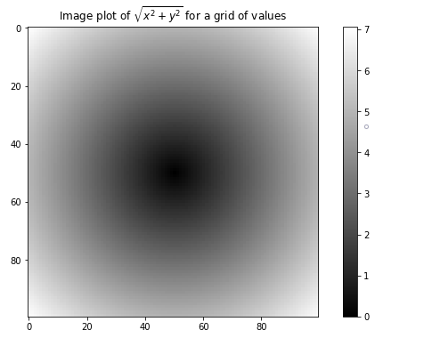
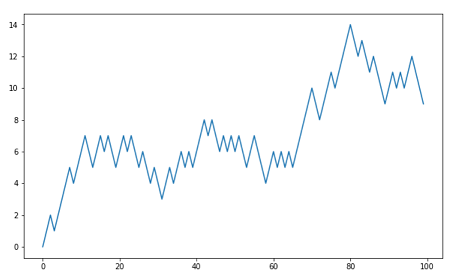

# NumPy基础：数组与向量化计算

>   Arrays and Vectorized Computation

NumPy（Numerical Python），是Python数值计算中最为重要的基础包，其主要优势：

- 对于含有大量数组的数据结构非常有效。

- Numpy算法库是用C语言编写的，它还提供了非常易用的C语言API，使得数据传递给用底层语言编写的外部类库，再将计算结果按NumPy数组返回变得简单。

- NumPy数组的内存使用量也小于其它Python内建序列。

- NumPy可以对全量数组进行复杂计算而不需要编写Python循环。

总之很好，很有用，得好好学


```python
import numpy as np

my_arr = np.arange(1000000)
my_list = list(range(1000000))

%time for _ in range(10): my_arr2 = my_arr * 2
# Wall time: 21.9 ms
%time for _ in range(10): my_list2 = [x * 2 for x in my_list]
# Wall time: 821 ms
```


Numpy的方法比Python快10到100倍，使用的内存也少

## 4.1 多维数组对象

>   Numpy ndarray：A Multidimensional Array Object


```python
import numpy as np
# Generate some random data
# 尽量这样引入，因为numpy里的函数与Python内建函数大量重名

data = np.random.randn(2, 3)
# 生成2*3
print(data)
# array([[ 1.669 , -0.4386, -0.5397],
#        [ 0.477 ,  3.2489, -1.0212]])

print(data* 10)
# 每个元素乘10
# array([[ 16.6903,  -4.3857,  -5.3974],
#        [  4.7699,  32.4894, -10.2123]])

print(data + data)
# 对应元素相加
# array([[ 3.3381, -0.8771, -1.0795],
#        [ 0.954 ,  6.4979, -2.0425]])

print(data.ndim) # 查看数组维度
# 2

print(data.shape) # 查看形状，也就是数量几乘几
# (2, 3)

print(data.dtype) # 类型
# dtype('float64')
```

`array.ndim` >> 数组维度

`array.shape` >>数组形状

`array.dtype` >>数组数据类型  默认为浮点型float64

### 4.1.1 生成

>   Creating ndarrays 

#### 4.1.1.1 array 接受序列型对象，生成数组

生成数组最简单的方式就是使用`array`函数。


```python
data1 = [6, 7.5, 8, 0, 1]
arr1 = np.array(data1)
print(arr1)
# array([6. , 7.5, 8. , 0. , 1. ])

data2 = [[1, 2, 3, 4], [5, 6, 7, 8]]
arr2 = np.array(data2)
print(arr2)
# array([[1, 2, 3, 4],
#        [5, 6, 7, 8]])

print(arr2.ndim) # 几行
# 2

print(arr2.shape) # 几乘几
# (2, 4)

print(arr1.dtype) # 自动生成浮点型
# dtype('float64')

print(arr2.dtype) # 根据类型自动识别
# dtype('int32')
```

除了`np.array`,还有很多函数可以创建新数组。

#### 4.1.1.2 zeros 都是零的数组


```python
np.zeros(10)
# array([0., 0., 0., 0., 0., 0., 0., 0., 0., 0.])
np.zeros((3, 6))
# array([[0., 0., 0., 0., 0., 0.],
#       [0., 0., 0., 0., 0., 0.],
#       [0., 0., 0., 0., 0., 0.]])
```

#### 4.1.1.3 empty 未初始化的数组


```python
np.empty((2, 3, 2))

# array([[[0., 0.],
#         [0., 0.],
#         [0., 0.]],
#
#        [[0., 0.],
#         [0., 0.],
#         [0., 0.]]])
```

#### 4.1.1.4 arange 未初始化的数组

就像range一样


```python
np.arange(15)
# array([ 0,  1,  2,  3,  4,  5,  6,  7,  8,  9, 10, 11, 12, 13, 14])
```

#### 4.1.1.5 数组生成函数

- array 接受：列表元组数组等序列，复制

- asarray 如果已经是ndarray则不再复制

- arange Python内建函数range的数组版

- ones 接受形状，全是1

- ones_like 接受数组，生成形状一样的全是1 

- zeros 全是0

- zeros_like 接受数组，生成形状一样的全是0

- empty 接受形状，未初始化

- empty_like 

- full 指定数值，指定类型

- full_like

- eye，identity n*n,对角线为1，其余位置为0

### 4.1.2 数据类型

>   Data Types for ndarrays

数据类型，即`dtype`,`dtype`是Numpy能够与其他系统数据灵活交互的原因。作为新手，只需关注数据的大类，如整数、浮点数、布尔值、字符串等。当需要在内存或硬盘作深入的读取操作时，则要深入了解。

**dtype 定义数据类型**

**astype 转换数据类型**


```python
arr1 = np.array([1, 2, 3], dtype=np.float64)
arr2 = np.array([1, 2, 3], dtype=np.int32)
print(arr1.dtype)
# float64
print(arr2.dtype)
# int32

arr = np.array([1, 2, 3, 4, 5])
print(arr.dtype)
# int32

float_arr = arr.astype(np.float64)
print(float_arr.dtype)
#float64

arr = np.array([3.7, -1.2, -2.6, 0.5, 12.9, 10.1])

print(arr)
# [ 3.7 -1.2 -2.6  0.5 12.9 10.1]
arr.astype(np.int32)## 转为整型
# array([ 3, -1, -2,  0, 12, 10])

numeric_strings = np.array(['1.25', '-9.6', '42'], dtype=np.string_)

numeric_strings.astype(float)## 转为浮点型
# array([ 1.25, -9.6 , 42.  ])

int_array = np.arange(10)

calibers = np.array([.22, .270, .357, .380, .44, .50], dtype=np.float64)

int_array.astype(calibers.dtype)# 第二个的类型浮点型，指定给第一个数组
#array([0., 1., 2., 3., 4., 5., 6., 7., 8., 9.])

empty_uint32 = np.empty(8, dtype='u4')
print(empty_uint32)
# array([1168,    0, 1168,    0, 1144,    0, 1144,    0], dtype=uint32)
```

### 4.1.3 数组计算

>   Arithmetic with NumPy Arrays

数组之所以重要是因为它允许你进行批量操作而无需任何for循环，Numpy用户称该特性为向量化。任何两个等尺寸数组之间的算术操作都运用了逐元素操作方式，同尺寸数组间的比较，会产生一个布尔值数组。不同尺寸的数组间操作，涉及广播特性，本书不必深入了解。


```python
arr = np.array([[1., 2., 3.], [4., 5., 6.]])
print(arr)
# array([[1., 2., 3.],
#        [4., 5., 6.]])

print(arr * arr)
# array([[ 1.,  4.,  9.],
#        [16., 25., 36.]])

print(arr - arr)
# array([[0., 0., 0.],
#        [0., 0., 0.]])

print(1 / arr)
# array([[1.    , 0.5   , 0.3333],
#        [0.25  , 0.2   , 0.1667]])

print(arr ** 0.5)
# array([[1.    , 1.4142, 1.7321],
#        [2.    , 2.2361, 2.4495]])

arr2 = np.array([[0., 4., 1.], [7., 2., 12.]])
print(arr2)
# array([[ 0.,  4.,  1.],
#        [ 7.,  2., 12.]])

print(arr2 > arr) # 对应位置 比较大小 
# array([[False,  True, False],
#        [ True, False,  True]])
```

### 4.1.4 基础索引与切片

>   Basic Indexing and Slicing

Numpy中数组索引、切片方法与python内建列表一样。不同之处在于，Numpy数组任何修改都直接反映在原数组上，而并非重新复制一份数据再修改。

> 这是由于Numpy特性决定的，Numpy被设计为适合处理非常大的数组，试想要是Numpy处理数据需要复制内容，得需要多大的内存。若还是想得到数组切片的拷贝而非原视图，必须显式地复制这个数组，例如：`arr[5:8].copy()`。

对于高维数组，例如二维数组，每个索引值对应的元素不再是一个值，而是一个一维数组，取单个元素的方法也略有不同：

这里不是复制，是取其中一部分的视图，所有的改变都会改变原列表


```python
arr3 = np.arange(10)
print(arr3)
# array([0, 1, 2, 3, 4, 5, 6, 7, 8, 9])

print(arr3[5])
# 5

print(arr3[5:8]) # 从5到8
# array([5, 6, 7])

arr3[5:8]=12 # 将5号到8号赋值12
print(arr3)
# array([ 0,  1,  2,  3,  4, 12, 12, 12,  8,  9])

arr3_slice = arr3[5:8]
print(arr3_slice)
# array([12, 12, 12])

arr3_slice[1] = 12345
print(arr3) 
## 这个跟变量的原则是一样的，原来的指向会改变
# array([    0,     1,     2,     3,     4,    12, 12345,    12,     8,9]

arr3_slice[:] = 64 ## 5到8位全改
print(arr3)
# array([ 0,  1,  2,  3,  4, 64, 64, 64,  8,  9])
```

对于多维数组，省略后续索引值，返回对象将是降低一个维度的数组。例如：


```python
arr2d = np.array([[1, 2, 3], [4, 5, 6], [7, 8, 9]])
print(arr2d[2])
## 多维数组，取一个元素
# array([7, 8, 9])

print(arr2d[0][2]) 
## 取某个单个元素
# 3

print(arr2d[0, 2])
## 这个跟上面一样效果
# 3

arr3d = np.array([[[1, 2, 3], [4, 5, 6]], [[7, 8, 9], [10, 11, 12]]])
print(arr3d)
# array([[[ 1,  2,  3],
#         [ 4,  5,  6]],
#
#        [[ 7,  8,  9],
#         [10, 11, 12]]])

print(arr3d[0])
# array([[1, 2, 3],
#        [4, 5, 6]])

old_values = arr3d[0].copy()
arr3d[0] = 42
print(arr3d)
# array([[[42, 42, 42],
#         [42, 42, 42]],

#        [[ 7,  8,  9],
#         [10, 11, 12]]])

arr3d[0] = old_values
print(arr3d)
# array([[[ 1,  2,  3],
#         [ 4,  5,  6]],

#        [[ 7,  8,  9],
#         [10, 11, 12]]])

print(arr3d[1, 0])
# array([7, 8, 9])

x = arr3d[1]
print(x)
# array([[ 7,  8,  9],
#       [10, 11, 12]])

print(x[0])
# array([7, 8, 9])
```

#### 4.1.4.1 切片索引

>   Indexing with slices

数组的切片索引，[行，列]，axis0 >> 行 ；axis1 >> 列。


```python
print(arr3
# array([ 0,  1,  2,  3,  4, 64, 64, 64,  8,  9])

print(arr3[1:6]) # 一维，就是从1号到6号止
# array([ 1,  2,  3,  4, 64])

arr4d = np.array([[1, 2, 3], [4, 5, 6], [7, 8, 9]]) # 这是一个3乘3的
print(arr4d)
# array([[1, 2, 3],
#        [4, 5, 6],
#        [7, 8, 9]])

print(arr4d[:2]) # 从0开始到2为止，0，1这两行
# array([[1, 2, 3],
#        [4, 5, 6]])

print(arr4d[:2, 1:])
# array([[2, 3],
#       [5, 6]])

#[[1, 2, 3]
# [4, 5, 6]
# [7, 8, 9]]
# 0，1两行，每行从1开始到最后，1，2

print(arr4d[1, :2]) 
# array([4, 5])

#[[1, 2, 3]
# [4, 5, 6]
# [7, 8, 9]]
# 1行，从0开始到2为止，0，1

print(arr4d[:2, 2]) 
# array([3, 6])

#[[1, 2, 3]
# [4, 5, 6]
# [7, 8, 9]]
# 竖着，0，1，横着2
# 生成一个列表似乎

print(arr4d[:, :1])
# array([[1],
#        [4],
#        [7]])

#[[1, 2, 3]
# [4, 5, 6]
# [7, 8, 9]]
# 竖着，从头撸到尾
# 横着0

arr5d = np.array([[1, 2, 3], [4, 5, 6], [7, 8, 9]])
arr5d[:2, 1:] = 0
print(arr5d)
# array([[1, 0, 0],
#        [4, 0, 0],
#        [7, 8, 9]])
```

### 4.1.5 布尔索引

我天这个最后用的时候我忘得一干二净，再来好好看一遍

例子：我们的数据是一组存在重复名字的数组 names，再生成一组正态分布的随机数据`data`，假设每个人名都和`data`中的一行数据对应，现在我们想找出所有与名字'Bob'对应的`data`行


```python
names = np.array(['Bob', 'Joe', 'Will', 'Bob', 'Will', 'Joe', 'Joe'])
data = np.random.randn(7, 4)

print(names)   
# array(['Bob', 'Joe', 'Will', 'Bob', 'Will', 'Joe', 'Joe'], dtype='<U4')

print(data)
# array([[-0.0119,  1.0048,  1.3272, -0.9193],
#        [-1.5491,  0.0222,  0.7584, -0.6605],
#        [ 0.8626, -0.01  ,  0.05  ,  0.6702],
#        [ 0.853 , -0.9559, -0.0235, -2.3042],
#        [-0.6525, -1.2183, -1.3326,  1.0746],
#        [ 0.7236,  0.69  ,  1.0015, -0.5031],
#        [-0.6223, -0.9212, -0.7262,  0.2229]])

print(names == 'Bob')
# array([ True, False, False, True, False, False, False])

print(data[names == 'Bob']) 
# array([[-0.0119,  1.0048,  1.3272, -0.9193],
#        [ 0.853 , -0.9559, -0.0235, -2.3042]])

# 这组布尔值传入data
# 作为索引取数组的值，第0行与第3行

print(data[names == 'Bob', 2:]) 
# array([[ 1.3272, -0.9193],
#        [-0.0235, -2.3042]])

# 行数按布尔值取
# 横着按切片索引

print(data[names == 'Bob', 3])
# array([-0.9193, -2.3042])
```


- 若想选择'Amy'之外的其他数据，可以使用：`data[names!='Amy']` 或者 `data[~(names='Amy')]` 

  ```python
  print(names != 'Bob')
  # array([False,  True,  True, False,  True,  True,  True])
  
  print(data[~(names == 'Bob')]) ## Bob之外的数据，~取反值
  # array([[-1.5491,  0.0222,  0.7584, -0.6605],
  #        [ 0.8626, -0.01  ,  0.05  ,  0.6702],
  #        [-0.6525, -1.2183, -1.3326,  1.0746],
  #        [ 0.7236,  0.69  ,  1.0015, -0.5031],
  #        [-0.6223, -0.9212, -0.7262,  0.2229]])
  
  cond = names == 'Bob' # 一个意思
  print(data[~cond])
  # array([[-1.5491,  0.0222,  0.7584, -0.6605],
  #        [ 0.8626, -0.01  ,  0.05  ,  0.6702],
  #        [-0.6525, -1.2183, -1.3326,  1.0746],
  #        [ 0.7236,  0.69  ,  1.0015, -0.5031],
  #        [-0.6223, -0.9212, -0.7262,  0.2229]])
  ```

  

- 当要选择多个名字时，需要使用数学操作符`&`（和），`|`(或)，例如` data[(names='Amy')|(names='Bob')]`

  ```python
  mask = (names == 'Bob') | (names == 'Will') # |或, &和
  print(mask)
  #array([ True, False,  True,  True,  True, False, False])
  
  print(data[mask])
  # array([[-0.0119,  1.0048,  1.3272, -0.9193],
  #        [ 0.8626, -0.01  ,  0.05  ,  0.6702],
  #        [ 0.853 , -0.9559, -0.0235, -2.3042],
  #        [-0.6525, -1.2183, -1.3326,  1.0746]])
  ```

  

- 判断并赋值

  ```python
  data_2 = np.random.randn(7, 4)
  data_2[data_2 < 0] = 0 ## 判断并赋值，这个本质上也是用了布尔值
  print(data_2)
  
  # array([[0.0513, 0.    , 0.8167, 0.4336],
  #        [1.0107, 1.8249, 0.    , 0.8506],
  #        [0.    , 0.9124, 0.1882, 2.1695],
  #        [0.    , 2.0037, 0.0296, 0.7953],
  #        [0.1181, 0.    , 0.585 , 0.1527],
  #        [0.    , 0.    , 0.    , 0.    ],
  #        [0.    , 0.    , 1.0954, 0.9809]])
  
  data_3 = np.random.randn(7, 4)
  data_3[names != 'Joe'] = 7
  print(data_3)
  # array([[ 7.    ,  7.    ,  7.    ,  7.    ],
  #        [ 0.93  , -1.5693, -1.0225, -0.4028],
  #        [ 7.    ,  7.    ,  7.    ,  7.    ],
  #        [ 7.    ,  7.    ,  7.    ,  7.    ],
  #        [ 7.    ,  7.    ,  7.    ,  7.    ],
  #        [-0.4171, -0.017 , -1.2241, -1.8008],
  #        [ 1.6347,  0.989 ,  0.4579,  0.5552]])
  ```

### 4.1.6 神奇索引

>   Fancy Indexing

神奇索引与是Numpy中的术语，用于使用整数数组进行数据索引。神奇索引与切片不同，它总是将数据复制到一个新的数组中。


```python
arr = np.empty((8, 4))
for i in range(8):
    arr[i] = i 
    ## 如arr[0]=0，就是0-7行里面的第0行，全部元素等于0
print(arr)
# array([[0., 0., 0., 0.],
#        [1., 1., 1., 1.],
#        [2., 2., 2., 2.],
#        [3., 3., 3., 3.],
#        [4., 4., 4., 4.],
#        [5., 5., 5., 5.],
#        [6., 6., 6., 6.],
#        [7., 7., 7., 7.]])

print(arr[[4, 3, 0, 6]]) 
# array([[4., 4., 4., 4.],
#        [3., 3., 3., 3.],
#        [0., 0., 0., 0.],
#        [6., 6., 6., 6.]])

## 用列表或数组做索引
## 取的就是相应的行
## 这里取的是axis=0

print(arr[[-3, -5, -7]])
# array([[5., 5., 5., 5.],
#        [3., 3., 3., 3.],
#        [1., 1., 1., 1.]])

## 倒数也可以

arr = np.arange(32).reshape((8, 4))
print(arr)
# array([[ 0,  1,  2,  3],
#        [ 4,  5,  6,  7],
#        [ 8,  9, 10, 11],
#        [12, 13, 14, 15],
#        [16, 17, 18, 19],
#        [20, 21, 22, 23],
#        [24, 25, 26, 27],
#        [28, 29, 30, 31]])

print(arr[[1, 5, 7, 2], [0, 3, 1, 2]])
# array([ 4, 23, 29, 10])

## （1，0）= 4
## （5，3）= 23
## （7，1）= 29
## （2，2）= 10
## 这里先取axis=0，再取axis=1
```

神奇索引所得结果与我们想象并不相同，若我们希望选中行列的子集所形成的矩形区域。实现方式如下：

```python
print(arr[[1, 5, 7, 2]][:, [0, 3, 1, 2]])
# array([[ 4,  7,  5,  6],
#        [20, 23, 21, 22],
#        [28, 31, 29, 30],
#        [ 8, 11,  9, 10]])

## 第一行都取出来，按4，7，5，6的顺序
## 第五行都取出来，20，23，21，22的顺序
```


### 4.1.7  数组转置和换轴

>   Transposing Arrays and Swapping Axes

**转置：**arr.T 

**换轴：**transpose\swapaxes 

**内积：**np.dot


```python
arr = np.arange(15).reshape((3, 5))
print(arr)
# array([[ 0,  1,  2,  3,  4],
#        [ 5,  6,  7,  8,  9],
#        [10, 11, 12, 13, 14]])

print(arr.T)
# array([[ 0,  5, 10],
#        [ 1,  6, 11],
#        [ 2,  7, 12],
#        [ 3,  8, 13],
#        [ 4,  9, 14]])

arr_6 = np.arange(6).reshape((2, 3))
print(arr_6)
# array([[0, 1, 2],
#        [3, 4, 5]])

print(arr_6.T)
# array([[0, 3],
#        [1, 4],
#        [2, 5]])

print(np.dot(arr_6, arr_6.T))
# array([[ 5, 14],
#        [14, 50]])

## dot矩阵内积
## 一行与一列对应相乘，加和
## 坐标（0，0）= 0*0 + 1*1 + 2*2 = 5
## 坐标（0，1）= 0*3 + 1*4 + 2*5 = 14
## 坐标（1，0）= 3*0 + 4*1 + 5*2 = 14
## 坐标（1，1）= 3*3 + 4*4 + 5*5 = 50

arr_7 = np.arange(24).reshape((2, 3, 4))
print(arr_7)
# array([[[ 0,  1,  2,  3],
#         [ 4,  5,  6,  7],
#         [ 8,  9, 10, 11]],
#
#        [[12, 13, 14, 15],
#         [16, 17, 18, 19],
#         [20, 21, 22, 23]]])

# 现在是2 * 3 * 4
# 如某一个点的坐标（1，2，0）= 20

print(arr_7.transpose((1, 0, 2))) 
# array([[[ 0,  1,  2,  3],
#         [12, 13, 14, 15]],
#
#        [[ 4,  5,  6,  7],
#         [16, 17, 18, 19]],
#
#        [[ 8,  9, 10, 11],
#         [20, 21, 22, 23]]])

# 现在轴有三个，0，1，2
# 现在换一下头两个
# 这就是个方块儿，怎么放的问题
# 现在是3 * 2 * 4
# 20 = （2，1，0）

print(arr_7)
# array([[[ 0,  1,  2,  3],
#         [ 4,  5,  6,  7],
#         [ 8,  9, 10, 11]],
#
#        [[12, 13, 14, 15],
#         [16, 17, 18, 19],
#         [20, 21, 22, 23]]])

# 现在是2 * 3 * 4

print(arr_7.swapaxes(1, 2))
# array([[[ 0,  4,  8],
#         [ 1,  5,  9],
#         [ 2,  6, 10],
#         [ 3,  7, 11]],
#
#        [[12, 16, 20],
#         [13, 17, 21],
#         [14, 18, 22],
#         [15, 19, 23]]])

# 现在是2 * 4 * 3
# 曾经的 （0，0，0）= 0 变成（0，0，0）= 0
# 曾经的（0，1，2）= 6 变成 （0，2，1）= 6
```

**<u>注意这个对数据没有复制</u>**

## 4.2 通用函数 

> Universal Functions: Fast Element-Wise Array Functions 

通用函数，又称ufunc，是一种在ndarray数据中进行逐元素操作的函数。


```python
arr_8 = np.arange(10)
print(arr_8)
#array([0, 1, 2, 3, 4, 5, 6, 7, 8, 9])

print(np.sqrt(arr_8)) ## 这个明显是根号
# array([0.    , 1.    , 1.4142, 1.7321, 2.    , 2.2361, 2.4495, 2.6458,
#        2.8284, 3.    ])

arr_9 = np.arange(10)
print(arr_9）
# array([0, 1, 2, 3, 4, 5, 6, 7, 8, 9])

print(np.exp(arr_9)) # e的n次方
# array([   1.    ,    2.7183,    7.3891,   20.0855,   54.5982,  148.4132,
#         403.4288, 1096.6332, 2980.958 , 8103.0839])
```

```python
x = np.random.randn(8)
print(x)
# array([ 0.427 , -1.5637, -0.3675,  1.0459,  1.22  , -0.2477, -0.4162,
#        -0.1167])

y = np.random.randn(8)
print(y)
# array([-1.8448,  2.0687, -0.777 ,  1.4402, -0.1106,  1.2274,  1.9208,
#         0.7464])

print(np.maximum(x, y)) ## 对应位置比较，取大的
# array([ 0.427 ,  2.0687, -0.3675,  1.4402,  1.22  ,  1.2274,  1.9208,
#         0.7464])
```

```python
arr10 = np.random.randn(7) * 5
print(arr10)
# array([11.1233, -3.397 ,  3.6368, -4.3437, -6.0693, -2.3532, -4.5962])

remainder, whole_part = np.modf(arr10) ## 将浮点数分为小数和整数
print(remainder) ## 小数部分
# array([ 0.1233, -0.397 ,  0.6368, -0.3437, -0.0693, -0.3532, -0.5962])

print(whole_part) ## 整数部分
# array([11., -3.,  3., -4., -6., -2., -4.])
```

```python
arr11 = np.random.randn(7) * 5
print(arr11)
# array([ 6.483 ,  1.2614,  5.6374, -2.8418,  1.5468, -2.8869, -5.8432])

print(np.sqrt(arr11)) ## 开根号，负数不能开，返回nan
# array([2.5462, 1.1231, 2.3743,    nan, 1.2437,    nan,    nan])

#-----报错
# D:\anaconda\lib\site-packages\ipykernel_launcher.py:1: RuntimeWarning: # # invalid value encountered in sqrt
#   """Entry point for launching an IPython kernel.

print(arr11) ## 原数组没有改变
# array([ 6.483 ,  1.2614,  5.6374, -2.8418,  1.5468, -2.8869, -5.8432])

print(np.sqrt(arr11, arr11)) 将改变的值赋给arr11
# array([2.5462, 1.1231, 2.3743,    nan, 1.2437,    nan,    nan])

#-----报错
# D:\anaconda\lib\site-packages\ipykernel_launcher.py:1: RuntimeWarning: # # invalid value encountered in sqrt
#   """Entry point for launching an IPython kernel

print(arr11) ## 原列数组改变
# array([2.5462, 1.1231, 2.3743,    nan, 1.2437,    nan,    nan])
```


### 4.2.1 一元通用函数

**也就是针对一个数组进行的操作：**

| 函数名                                            | 描述                                               |
| :------------------------------------------------ | :------------------------------------------------- |
| abs、fabs                                         | 整数 浮点数取绝对值                                |
| sqrt                                              | 平方根                                             |
| square                                            | 平方                                               |
| exp                                               | e的n次方                                           |
| log、log10、log2、log1p                           | 以e为底、以10为底、以2为底、log(1+x)               |
| sign                                              | 符号值，1（正数），0，-1（负数）                   |
| ceil                                              | 大于等于给定数字的最小整数                         |
| floor                                             | 小于给定数字的最大整数                             |
| rint                                              | 保留整数，dtype不变                                |
| modf                                              | 小数部分与整数部分分开，分别作为数组返回           |
| isnan                                             | 判断返回的东西，是不是nan，nan不是数值，得到布尔值 |
| isfinite、isinf                                   | 判断是否有限，是否无限，得到布尔值                 |
| cos、cosh、sin、sinh、tan、tanh                   | 三角函数                                           |
| arccos、arccosh、arcsin、arcsinh、arctan、arctanh | 反三角函数                                         |
| logical_not                                       | 对数组的元素取反，相当于~arr                       |

### 4.2.2 二元通用函数

**也就是针对两个数组进行的操作：**

| 函数名                               | 描述                                                         |
| ------------------------------------ | ------------------------------------------------------------ |
| add                                  | 数组的对应元素相加                                           |
| subtract                             | 第二个数组中去除第一个数组中的元素                           |
| multiply                             | 对应元素相乘                                                 |
| divide，floor_divide                 | 除或整除                                                     |
| power                                | [1,2],[3,4] 得到` [1**3=1, 2**4=16]`                         |
| maximum, fmax                        | 最大值，fmax忽略nan                                          |
| minimum，fmin                        | 最小值，fmin忽略nan                                          |
| mod                                  | 除法余数                                                     |
| copysign                             | [2,1] [-1,2] 变成 [-2,1]，第二个数组元素的符号赋值给第一个数组 |
| greater，greater_equal，             | 大于                                                         |
| less，less_equal                     | 等于                                                         |
| equal，not_equal                     | 小于                                                         |
| logical_and，logical_or，logical_xor | 逻辑操作，and、or和xor                                       |

## 4.3  使用数组进行面向数组编程

>   Array-Oriented Programming with Arrays

在Numpy中，可以利用数组表达式来代替显式循环，这种方法称为向量化。

-   `np.where`函数就是三元表达式`(x if condition else y)`的向量化版本。
    -   `np.where(condition,elementX,elementY)`

```python
points = np.arange(-5, 5, 0.1) 
## 100 equally spaced points
## 从-5到5，精度0.1，共100个数
print(points)
# array([-5. , -4.9, -4.8, -4.7, -4.6, -4.5, -4.4, -4.3, -4.2, -4.1, -4. ,
#        -3.9, -3.8, -3.7, -3.6, -3.5, -3.4, -3.3, -3.2, -3.1, -3. , -2.9,
#        -2.8, -2.7, -2.6, -2.5, -2.4, -2.3, -2.2, -2.1, -2. , -1.9, -1.8,
#        -1.7, -1.6, -1.5, -1.4, -1.3, -1.2, -1.1, -1. , -0.9, -0.8, -0.7,
#        -0.6, -0.5, -0.4, -0.3, -0.2, -0.1, -0. ,  0.1,  0.2,  0.3,  0.4,
#         0.5,  0.6,  0.7,  0.8,  0.9,  1. ,  1.1,  1.2,  1.3,  1.4,  1.5,
#         1.6,  1.7,  1.8,  1.9,  2. ,  2.1,  2.2,  2.3,  2.4,  2.5,  2.6,
#         2.7,  2.8,  2.9,  3. ,  3.1,  3.2,  3.3,  3.4,  3.5,  3.6,  3.7,
#         3.8,  3.9,  4. ,  4.1,  4.2,  4.3,  4.4,  4.5,  4.6,  4.7,  4.8,
#         4.9])

xs, ys = np.meshgrid(points, points)
print(ys)
# array([[-5. , -5. , -5. , ..., -5. , -5. , -5. ],
#        [-4.9, -4.9, -4.9, ..., -4.9, -4.9, -4.9],
#        [-4.8, -4.8, -4.8, ..., -4.8, -4.8, -4.8],
#        ...,
#        [ 4.7,  4.7,  4.7, ...,  4.7,  4.7,  4.7],
#        [ 4.8,  4.8,  4.8, ...,  4.8,  4.8,  4.8],
#        [ 4.9,  4.9,  4.9, ...,  4.9,  4.9,  4.9]])

print(xs)
# array([[-5. , -4.9, -4.8, ...,  4.7,  4.8,  4.9],
#        [-5. , -4.9, -4.8, ...,  4.7,  4.8,  4.9],
#        [-5. , -4.9, -4.8, ...,  4.7,  4.8,  4.9],
#        ...,
#        [-5. , -4.9, -4.8, ...,  4.7,  4.8,  4.9],
#        [-5. , -4.9, -4.8, ...,  4.7,  4.8,  4.9],
#        [-5. , -4.9, -4.8, ...,  4.7,  4.8,  4.9]])
```

使用两个坐标值同样的表达式来使用函数：


```python
z = np.sqrt(xs ** 2 + ys ** 2)
print(z)
# array([[7.0711, 7.0007, 6.9311, ..., 6.8622, 6.9311, 7.0007],
#        [7.0007, 6.9296, 6.8593, ..., 6.7897, 6.8593, 6.9296],
#        [6.9311, 6.8593, 6.7882, ..., 6.7179, 6.7882, 6.8593],
#        ...,
#        [6.8622, 6.7897, 6.7179, ..., 6.6468, 6.7179, 6.7897],
#        [6.9311, 6.8593, 6.7882, ..., 6.7179, 6.7882, 6.8593],
#        [7.0007, 6.9296, 6.8593, ..., 6.7897, 6.8593, 6.9296]])
```

生成二维数组可视化：


```python
import matplotlib.pyplot as plt
plt.imshow(z, cmap=plt.cm.gray)
plt.colorbar()
plt.title("Image plot of $\sqrt{x^2 + y^2}$ for a grid of values")
plt.draw()
# plt.close('all') 关闭图像
```




### 4.3.1 将条件逻辑作为数组操作

>   Expressing Conditional Logic as Array Operations

将条件逻辑作为数组操作


```python
xarr = np.array([1.1, 1.2, 1.3, 1.4, 1.5])
yarr = np.array([2.1, 2.2, 2.3, 2.4, 2.5])
cond = np.array([True, False, True, True, False])
result = [(x if c else y) ## if满足，要x，if不满足，要y
          for x, y, c in zip(xarr, yarr, cond)]

print(result)
# [1.1, 2.2, 1.3, 1.4, 2.5]
```

这个有局限，数组大的话，会很慢，因为用的Python中的函数

另外如果是多维数组就不行了，所以用下面这个`where`：


```python
result = np.where(cond, xarr, yarr) ## 判断，如果是就xarr，如果不是就yarr
print(result)
# array([1.1, 2.2, 1.3, 1.4, 2.5])
```

`np.where`的第二个第三个参数并不一定要是数组，也可以是标量。例如你有一个随机生成的数组，你想将数组中正值替换为1，负值替换为-1，操作如下：

```python
arr12 = np.random.randn(4, 4)
print(arr12)
# array([[-0.825 , -2.6444, -0.153 , -0.7519],
#        [-0.1326,  1.4573,  0.6095, -0.4938],
#        [ 1.24  , -0.1357,  1.43  , -0.8469],
#        [ 0.6033,  1.2636, -0.2555, -0.4457]])

print(arr12>0)
# array([[False, False, False, False],
#       [False,  True,  True, False],
#        [ True, False,  True, False],
#        [ True,  True, False, False]])

print(np.where(arr12 > 0, 2, -2))
# array([[-2, -2, -2, -2],
#        [-2,  2,  2, -2],
#        [ 2, -2,  2, -2],
#        [ 2,  2, -2, -2]])

print(np.where(arr12 > 0, 2, arr12)) 
# array([[-0.825 , -2.6444, -0.153 , -0.7519],
#        [-0.1326,  2.    ,  2.    , -0.4938],
#        [ 2.    , -0.1357,  2.    , -0.8469],
#        [ 2.    ,  2.    , -0.2555, -0.4457]])

# set only positive values to 2 
# 大于零的数变成2
```

### 4.3.2 数学和统计学方法

>   Mathematical and Statistical Methods 

`sum`求和、`mean`数学平均、`std`标准差、`min\max`最值、`argmin\argmax`最值位置、`cumsum`从0开始元素累计和、`cumprod`从1开始元素累积

```python
arr13 = np.arange(20).reshape((5, 4)) ## axis0，就是5，axis1就是4
print(arr13) # 你这里生出来的点（0，0）一直到（5，4）
# array([[ 0,  1,  2,  3],
#        [ 4,  5,  6,  7],
#        [ 8,  9, 10, 11],
#        [12, 13, 14, 15],
#        [16, 17, 18, 19]])

print(arr13.mean()) # 平均数
# 9.5

print(np.mean(arr13)) # 平均数，这么些也可以 (0+19)/2
#9.5

print(arr13.sum()) # 求和 （0+19）*10
# 190
```

`mean\sum`等函数还能接收一个可选参数`axis`，用于计算轴向统计值。

`np.sum(arr,axis=0) `（`axis=0`>>行,`axis=1` >>列）：

```python
print(arr13.mean(axis=1)) # 每行求平均，每4个数求平均，得到5个数
# array([ 1.5,  5.5,  9.5, 13.5, 17.5])

print(arr13.mean(axis=0)) # 5个数求平均，得到四个数 （0+16）/2
# array([ 8.,  9., 10., 11.]

print(arr13.sum(axis=0))  # 一样的，5个数求和
# array([40, 45, 50, 55])

arr14 = np.array([0, 1, 2, 3, 4, 5, 6, 7])
print(arr14.cumsum()) # 0，0+1，0+1+2，0+1+2+3
# array([ 0,  1,  3,  6, 10, 15, 21, 28], dtype=int32)

arr15 = np.array([[0, 1, 2], [3, 4, 5], [6, 7, 8]])
# 你这个3*3的
print(arr15) 
# array([[0, 1, 2],
#        [3, 4, 5],
#        [6, 7, 8]])

print(arr15.cumsum(axis=0)) ## 纵向相加,从0位开始
# array([[ 0,  1,  2],
#        [ 3,  5,  7],
#        [ 9, 12, 15]], dtype=int32)

# [0,1,2]
# [0+3,1+4,2+5]
# [0+3+6,1+4+7,2+5+8]

print(arr15.cumsum()) ## axis不给值，默认为一维数组
# array([ 0,  1,  3,  6, 10, 15, 21, 28, 36], dtype=int32)

print(arr15.cumprod(axis=1)) ##  从1未开始乘积，沿着axis=1这个周，也就是横向 
# array([[  0,   0,   0],
#        [  3,  12,  60],
#        [  6,  42, 336]], dtype=int32)

#[0, 1, 2] -- [0,0*1,0*1*2]
#[3, 4, 5] -- [3,3*4,3*4*5]
#[6, 7, 8]] -- [6,6*7,6*7*8]
```

基础数组统计方法，看一眼权威的解释：

| 方法           | 描述                                                 |
| -------------- | ---------------------------------------------------- |
| sum            | 沿着轴方向计算所有元素的累和，0长度的数组，累计和为0 |
| mean           | 数学平均，0长度的数组平均值为NaN                     |
| std，var       | 标准差和方差，可以选择自由调整度，默认分母是n        |
| min，max       | 最小值和最大值                                       |
| argmin，argmax | 最小值和最大值的位置                                 |
| cumsum         | 从0开始元素累积和                                    |
| cumprod        | 从1开始元素累积积                                    |

### 4.3.3 布尔值数组的方法

>   Methods for Boolean Arrays 

由于布尔值会被强制为1（TRUE）和0（FALSE），因此，`sum`可以计算出数组中TRUE的个数。

```python
arr16 = np.random.randn(10)
print(arr16)
# array([ 0.7623,  0.129 ,  0.6271, -1.0622, -1.4995,  0.5452,  0.4008,
#        -1.9462,  0.505 , -0.9105])

print((arr16 > 0).sum()) 
# 6

# Number of positive values
# 大于零的数，加起来
```

除此之外，介绍两个布尔数组中的重要方法：`any`和`al`l。

-   `any`>>检查数组中是否至少有一个TRUE
-   `all`>>检查数组是否全为TRUE

上述方法也适用于非布尔数组，所有非0元素都被当成TRUE处理

```python
bools = np.array([False, False, True, False])
print(bools.any()) ## 有一个True，这个值就为True
# True

print(bools.all()) ## 全部为True，这个值为True
# False
```

### 4.3.4 排序

>   Sorting

这个介绍的不够深啊


```python
arr17 = np.random.randn(6)
print(arr17)
# array([-0.2197,  0.4081, -0.6031, -0.3611,  0.564 , -1.0566])

arr17.sort()
print(arr17) ## 1*1 从小到大排序，改变本身
# array([-1.0566, -0.6031, -0.3611, -0.2197,  0.4081,  0.564 ])

arr18 = np.random.randn(5, 3)
print(arr18)
# array([[ 1.392 , -1.7613, -0.9116],
#        [ 0.6583, -1.5795,  0.4577],
#        [-0.1833, -0.6855,  0.1064],
#        [-0.3182,  0.4337,  0.5718],
#        [ 0.5671,  0.0816, -0.3023]])

arr18.sort(1) # 5*3，沿着横轴排序
print(arr18)
# array([[-1.7613, -0.9116,  1.392 ],
#        [-1.5795,  0.4577,  0.6583],
#        [-0.6855, -0.1833,  0.1064],
#        [-0.3182,  0.4337,  0.5718],
#        [-0.3023,  0.0816,  0.5671]])

arr18.sort(0) # 5*3，沿着纵轴排序
print(arr18)
# array([[-1.7613, -0.9116,  0.1064],
#        [-1.5795, -0.1833,  0.5671],
#        [-0.6855,  0.0816,  0.5718],
#        [-0.3182,  0.4337,  0.6583],
#        [-0.3023,  0.4577,  1.392 ]])

large_arr = np.random.randn(1000)
large_arr.sort()
print(large_arr[int(0.05 * len(large_arr))])  # 排序完了，长度0.05位置的元素取出来
# -1.5443647592587044

# 5% quantile
# 5% 分为点
```

### 4.3.5 唯一值和其他集合逻辑

>   Unique and Other Set Logic 


```python
names2 = np.array(['Bob', 'Joe', 'Will', 'Bob', 'Will', 'Joe', 'Joe'])
## 定义一个数组，里面有重复值
print(np.unique(names2))
# array(['Bob', 'Joe', 'Will'], dtype='<U4')

## 去掉重复值，每个留一个

ints = np.array([3, 3, 3, 2, 2, 1, 1, 4, 4])
## 数字也是一样的
print(np.unique(ints))
# array([1, 2, 3, 4])

print(sorted(set(names2)))
# ['Bob', 'Joe', 'Will']

# Python方法实现

values = np.array([6, 0, 0, 3, 2, 5, 6])
print(np.in1d(values, [2, 3, 6]))
# array([ True, False, False,  True,  True, False,  True])

# in1d检查注意这是个1，第一个数组中的数是不是2或3或6
```

**数组的集合操作：**

| 方法              | 描述                                             |
| ----------------- | ------------------------------------------------ |
| unique(x)         | 计算x的唯一值，并排序                            |
| intersect1d(x, y) | 计算x和y的交集，并排序                           |
| union1d(x, y)     | 计算x和y的并集，并排序                           |
| in1d(x, y)        | 计算x中的元素是否包含在y中，返回一个布尔值数值组 |
| setdiff1d(x, y)   | 差集，在x中但不在y中的x的元素                    |
| setxor1d(x, y)    | 在x或在y，不同时在xy中                           |

## 4.4 使用数组进行文件输入和输出

>   File Input and Output with Arrays 

Numpy可以实现文本文件或二进制文件的硬盘输入输出，但这里只讨论Numpy的内建二进制格式数据，因为大部分用户倾向于用pandas载入文本、表格数据。

`np.save`与`np.load`是高效存取硬盘数据的两大工具函数。数据存储时默认情况是未压缩的，且后缀为.npy

**<u>这个之后还会用pandas做，所以这里就是简单介绍Numpy的内建二进制模式</u>**。


```python
arr19 = np.arange(10)
np.save('some_array', arr19) # save存储，默认未压缩，后缀名.npy

np.load('some_array.npy') # load 读取
# array([0, 1, 2, 3, 4, 5, 6, 7, 8, 9])

np.savez('array_archive.npz', a=arr, b=arr)# savez 默认未压缩，多个数组，后缀名.npz

arch = np.load('array_archive.npz')  # load读取，是个字典型的对象
print(arch) 
# <numpy.lib.npyio.NpzFile object at 0x000002229D42ED30>
print(arch['b'])
# array([-0.0303,  0.9405, -0.6424,  1.0402, -1.0829,  0.4292, -0.2362,
#         0.6418, -0.3317,  1.3941, -1.0767, -0.1925, -0.8712,  0.4209,
#        -1.2114, -0.2589, -0.5816, -1.2604,  0.4646, -1.0702,  0.8042,
#        -0.1567,  2.0104, -0.8871, -0.9779, -0.2672,  0.4833, -0.4003,
#         0.4499,  0.3996, -0.1516, -2.5579,  0.1608,  0.0765, -0.2972,
#        -1.2943, -0.8852, -0.1875, -0.4936, -0.1154, -0.3507,  0.0447,
#        -0.8978,  0.8909, -1.1512, -2.6123,  1.1413, -0.8671,  0.3836,
#        -0.437 ,  0.3475, -1.2302,  0.5711,  0.0601, -0.2255,  1.3497,
#         1.3503, -0.3867,  0.866 ,  1.7472, -1.4102, -0.3782, -0.3458,
#         0.3801,  0.189 ,  1.3233, -2.2646, -0.915 , -0.479 ,  1.0472,
#         0.9239, -0.1142,  0.4058,  0.2885, -0.4348,  0.3588, -0.3882,
#         2.1287,  1.4096, -0.1054,  0.7004,  2.0929, -0.137 , -0.9305,
#         0.3275,  1.303 , -1.4094, -0.1441, -0.7164,  0.1036, -1.4957,
#        -1.1749,  2.614 , -0.6893, -0.7517,  0.6363, -1.1576,  0.6147,
#         1.0214,  0.6683])

np.savez_compressed('arrays_compressed.npz', a=arr, b=arr) # 存入压缩文件
```

## 4.5 线性函数

>   Linear Algebra 

我这会学尖了，我先看后面这个表

### 4.5.1 常用`numpy.linalg`函数

| 函数  | 描述                                                |
| ----- | --------------------------------------------------- |
| diag  | 将方阵的对角元素 -- 一位数组，之间转换，空白默认用0 |
| dot   | 矩阵点乘                                            |
| trace | 对角元素和                                          |
| det   | 矩阵的行列式                                        |
| eig   | 特征值和特征向量                                    |
| inv   | 逆矩阵                                              |
| pinv  | 计算矩阵的Moore-Penrose伪逆向，什么鬼               |
| qr    | 计算QR分解                                          |
| svd   | 计算奇异值分解（SVD）                               |
| solve | 求解x的线性系统 Ax = b， 其中A是方阵                |
| lstsq | 计算 Ax = b 的最小二乘解                            |

**线代基础资料：**

[这回要补一下线性代数](http://baijiahao.baidu.com/s?id=1596520892125761222&wfr=spider&for=pc)

[可汗学院](https://www.bilibili.com/video/av9504432/?p=3)

[线性代数的本质，3Blue1Brown](https://www.bilibili.com/video/av44855426/?p=13)


```python
x = np.array([[1., 2., 3.], [4., 5., 6.]])# （2，3）
print(x)
# array([[1., 2., 3.],
#        [4., 5., 6.]])

y = np.array([[6., 23.], [-1, 7], [8, 9]]) # （3，2）
print(y)
# array([[ 6., 23.],
#        [-1.,  7.],
#        [ 8.,  9.]])

print(x.dot(y)) 
# array([[ 28.,  64.],
#        [ 67., 181.]])

# x（2，3）取第一个轴，y（3，2）取第二个轴，xdoty生成（2，2）的数组
# xdoty对位置的元素，少不了跟x和y有对应的关系
# （0，0） x的第一个轴的0位，123，y的第二个轴的0位，竖着6，-1，8，对应相乘相加，其他以此类推

print(np.dot(x, y)) # 这么些一样的效果
# array([[ 28.,  64.],
#        [ 67., 181.]])

print(np.dot(x, np.ones(3))) 
# array([ 6., 15.])

# 这个np.ones(3)是啥，先看一眼
# 应该是2*3与3*1变成2*1

print(np.ones(3)) # 不过这里为啥是1*3
# array([1., 1., 1.])

print(x @ np.ones(3)) ##一个意思，@用于点乘矩阵
# array([ 6., 15.])

from numpy.linalg import inv, qr
X = np.random.randn(5, 5)
print(X)
# array([[ 1.637 ,  0.2513,  1.6246, -0.2406,  0.1631],
#        [-0.5867,  0.4146,  0.4272,  1.1726, -0.3516],
#        [ 1.4546,  2.0433, -1.7493, -0.3872, -0.2081],
#        [-1.222 , -0.0675,  0.229 , -0.5762,  0.8169],
#        [-0.7722, -1.3336, -0.3091,  0.0286,  1.1296]])

mat = X.T.dot(X) # 转置矩阵 与 X点积
print(mat)
# array([[ 7.2292,  4.2526, -0.1768, -0.9629, -1.7   ],
#        [ 4.2526,  6.1932, -2.5922, -0.3648, -2.0915],
#        [-0.1768, -2.5922,  6.03  ,  0.6467,  0.3166],
#        [-0.9629, -0.3648,  0.6467,  1.9156, -0.8094],
#        [-1.7   , -2.0915,  0.3166, -0.8094,  2.1368]])

print(inv(mat)) ## 逆矩阵
# array([[ 0.3209, -0.1953, -0.1082,  0.2316,  0.1679],
#        [-0.1953,  0.4785,  0.1767,  0.0648,  0.3113],
#        [-0.1082,  0.1767,  0.2486, -0.0995,  0.0123],
#        [ 0.2316,  0.0648, -0.0995,  0.9468,  0.621 ],
#        [ 0.1679,  0.3113,  0.0123,  0.621 ,  1.1397]])

print(mat.dot(inv(mat)))
# array([[ 1., -0.,  0., -0.,  0.],
#        [ 0.,  1.,  0., -0.,  0.],
#        [-0.,  0.,  1., -0., -0.],
#        [ 0.,  0., -0.,  1.,  0.],
#        [ 0., -0., -0.,  0.,  1.]])

# 与自己的逆矩阵点积，那不就是E嘛
# 对角线为1，其他为0

q, r = qr(mat) 计算QR分解
print(r)
# array([[-8.6136, -7.1335,  1.6867,  1.0559,  2.7971],
#        [ 0.    , -4.0963,  5.2003, -0.1211,  1.2752],
#        [ 0.    ,  0.    , -3.707 , -1.3074,  0.9618],
#        [ 0.    ,  0.    ,  0.    , -1.7216,  1.2876],
#        [ 0.    ,  0.    ,  0.    ,  0.    ,  0.7433]])
```

## 4.6 伪随机数生成 

>   Pseudorandom Number Generation

**`numpy.random` 中的部分函数列表：**

| 函数        | 描述                                                 |
| ----------- | ---------------------------------------------------- |
| seed        | 向随机数生成器传递随机状态种子                       |
| permutation | 返回一个序列的随机排列，或返回一个乱序的整数范围序列 |
| shuffle     | 随机排列一个序列                                     |
| rand        | 从均匀分布中抽取样本                                 |
| randint     | 根据给定的由低到高的范围抽取随机整数                 |
| randn       | 从均值0方差1的正太分布中抽取样本（MATLAB型接口）     |
| binomial    | 从二项分布中抽取样本                                 |
| normal      | 从正太分布中抽取样本                                 |
| beta        | 从beta分布中抽取样本                                 |
| chisqueare  | 从卡方分布中抽取样本                                 |
| gamma       | 从伽马分布中抽取样本                                 |
| uniform     | 从均匀[0,1)分布中抽取样本                            |

```python
samples = np.random.normal(size=(4, 4))
## 4乘4，正态分布
print(samples)
# array([[-0.3742, -0.0114,  0.2729, -0.6015],
#        [ 0.5743, -0.1941,  0.2022, -0.5051],
#        [ 2.9544, -2.6302, -0.3525, -0.4778],
#        [ 0.1616,  1.6868,  0.822 , -0.6674]])

from random import normalvariate # 正态变量，Python函数
N = 1000000
%timeit samples = [normalvariate(0, 1) for _ in range(N)]
# 800 ms ± 15.2 ms per loop (mean ± std. dev. of 7 runs, 1 loop each)
%timeit np.random.normal(size=N)# np函数比Python快了一个数量级，40倍
# 29.7 ms ± 1.39 ms per loop (mean ± std. dev. of 7 runs, 10 loops each)
```

`numpy.random中`数据的生成函数公用了一个全局的随机数种子。为了避免全局状态，可以使用`numpy.random.RandomState`生成一个随机数生成器，使数据独立于其它随机数状态

```python
random1 = np.random.seed(1234)
print(random1) # 这个1234是啥意思

rng = np.random.RandomState(1234)
print(rng.randn(100)) ## 这该不会是个随机数表吧
# array([ 0.4714, -1.191 ,  1.4327, -0.3127, -0.7206,  0.8872,  0.8596,
#        -0.6365,  0.0157, -2.2427,  1.15  ,  0.9919,  0.9533, -2.0213,
#        -0.3341,  0.0021,  0.4055,  0.2891,  1.3212, -1.5469, -0.2026,
#        -0.656 ,  0.1934,  0.5534,  1.3182, -0.4693,  0.6756, -1.817 ,
#        -0.1831,  1.059 , -0.3978,  0.3374,  1.0476,  1.0459,  0.8637,
#        -0.1221,  0.1247, -0.3228,  0.8417,  2.391 ,  0.0762, -0.5664,
#         0.0361, -2.075 ,  0.2478, -0.8972, -0.1368,  0.0183,  0.7554,
#         0.2153,  0.841 , -1.4458, -1.402 , -0.1009, -0.5482, -0.1446,
#         0.354 , -0.0355,  0.5657,  1.5457, -0.9742, -0.0703,  0.308 ,
#        -0.2085,  1.0338, -2.4005,  2.0306, -1.1426,  0.2119,  0.7047,
#        -0.7854,  0.4621,  0.7042,  0.5235, -0.9263,  2.0078,  0.227 ,
#        -1.1527,  0.632 ,  0.0395,  0.4644, -3.5635,  1.3211,  0.1526,
#         0.1645, -0.4301,  0.7674,  0.9849,  0.2708,  1.392 ,  0.0798,
#        -0.4   , -1.0279, -0.5847,  0.8166, -0.0819, -0.3448,  0.5283,
#        -1.069 , -0.5119])
```

**【补充知识】：**

-   关于Python之`Random.randint()`与`numpy.random.randint()`的区别
    1.  `random.randint(a,b)`,生成随机数范围是`[a,b]`，例如`random.randint(1,4)`，会生成随机数1、2、3、4。
    2.  `np.random.randint(a,b)`生成随机数范围是`[a,b)`，例如`np.random.randint(1,4)`,会生成随机数1、2、3。

## 4.7 Example: Random Walks 应用举例：随机漫步

模拟掷硬币100次，正面为1，反面为-1，且两种步进发生概率相等。下面使用内建random模块利用纯python实现一个1000步的随机漫步：


```python
import random
import matplotlib.pyplot as plt
position = 0
walk = [position] # 这个是个列表 walk=[0]
steps = 1000 # 准备实验1000次
for i in range(steps):
    step = 1 if random.randint(0, 1) else -1
    # random.randint 取0或1
    # 对应if False，True
    # 对应step=-1 或 1
    position += step
    # 比如第一次 0+1 = 1
    walk.append(position)
    # 得到的值放在walk里，walk=[0,1]
```

**把数据可视化：**


```python
plt.figure()
plt.plot(walk[:100]) # 取前100个画出
```




```python
np.random.seed(12345) 
# 随便给个起点，保证做出来的随机数跟书上一样
# 最后解释这个

nsteps = 100
draws = np.random.randint(0, 2, size=nsteps)
# draws = array [1,1,0,0,1,,1...] 比如
print(draws)

# array([1, 1, 1, 1, 0, 1, 0, 1, 1, 1, 0, 1, 0, 1, 1, 1, 1, 1, 0, 1, 0, 0,
#        0, 0, 1, 0, 1, 1, 1, 0, 0, 1, 0, 0, 0, 1, 0, 0, 1, 0, 1, 1, 1, 0,
#        0, 0, 1, 1, 1, 0, 1, 1, 1, 1, 0, 1, 0, 0, 1, 1, 1, 1, 1, 1, 1, 1,
#        0, 1, 1, 0, 0, 0, 0, 0, 0, 1, 1, 1, 1, 1, 0, 1, 0, 1, 0, 0, 0, 0,
#        1, 0, 1, 1, 1, 1, 1, 0, 0, 0, 1, 1])
```


```python
steps = np.where(draws > 0, 1, -1)
# draws > 0 = [True,True,False,False,True,False,True,..]
# np.where(condition[, x, y]) 函数原型
# draws的某个位置的为true时，输出x的对应位置的元素，否则选择y对应位置的元素
# steps = [1,1,-1,-1,1,-1,1...]

print(steps)
# array([ 1,  1,  1,  1, -1,  1, -1,  1,  1,  1, -1,  1, -1,  1,  1,  1,  1,
#         1, -1,  1, -1, -1, -1, -1,  1, -1,  1,  1,  1, -1, -1,  1, -1, -1,
#        -1,  1, -1, -1,  1, -1,  1,  1,  1, -1, -1, -1,  1,  1,  1, -1,  1,
#         1,  1,  1, -1,  1, -1, -1,  1,  1,  1,  1,  1,  1,  1,  1, -1,  1,
#         1, -1, -1, -1, -1, -1, -1,  1,  1,  1,  1,  1, -1,  1, -1,  1, -1,
#        -1, -1, -1,  1, -1,  1,  1,  1,  1,  1, -1, -1, -1,  1,  1])

walk = steps.cumsum()
print(walk)
# array([ 1,  2,  3,  4,  3,  4,  3,  4,  5,  6,  5,  6,  5,  6,  7,  8,  9,
#        10,  9, 10,  9,  8,  7,  6,  7,  6,  7,  8,  9,  8,  7,  8,  7,  6,
#         5,  6,  5,  4,  5,  4,  5,  6,  7,  6,  5,  4,  5,  6,  7,  6,  7,
#         8,  9, 10,  9, 10,  9,  8,  9, 10, 11, 12, 13, 14, 15, 16, 15, 16,
#        17, 16, 15, 14, 13, 12, 11, 12, 13, 14, 15, 16, 15, 16, 15, 16, 15,
#        14, 13, 12, 13, 12, 13, 14, 15, 16, 17, 16, 15, 14, 15, 16],
#       dtype=int32)
```


```python
print(walk.min())
# 1

print(walk.max())
# 17
```


```python
print(np.abs(walk) >= 10)
# array([False, False, False, False, False, False, False, False, False,
#        False, False, False, False, False, False, False, False,  True,
#        False,  True, False, False, False, False, False, False, False,
#        False, False, False, False, False, False, False, False, False,
#        False, False, False, False, False, False, False, False, False,
#        False, False, False, False, False, False, False, False,  True,
#        False,  True, False, False, False,  True,  True,  True,  True,
#         True,  True,  True,  True,  True,  True,  True,  True,  True,
#         True,  True,  True,  True,  True,  True,  True,  True,  True,
#         True,  True,  True,  True,  True,  True,  True,  True,  True,
#         True,  True,  True,  True,  True,  True,  True,  True,  True,
#         True]
```


```python
print((np.abs(walk) >= 10).argmax())
# 17
# 就是最大值第一次出现的位置
# 也就是Ture第一次出现的位置
```

### 4.7.1 同时模拟多次随机漫步

>   Simulating Many Random Walks at Once

这个例子真的很难

首先说一下any


```python
trys = np.array([[True,False,True],[False,False,True]])
print(trys.any()) 
# True

## 数组看做整体，所有[]去掉
## 只要有True，就返回一个值True

trys = np.array([[True,False,True],[False,False,True]])
print(trys.any(0))
# array([ True, False,  True])

# 竖着，沿axis=0方向
# 2*3的数组，剩下1*3

trys = np.array([[True,False,True],[False,False,True]])
print(trys.any(1))
# array([ True,  True])

# 横着，沿axis=1方向
# 2*3的数组，其实应该是2*1，写成1*2

trys = np.array([[True,False,True],[False,False,True]])
print(trys.any(2))
# 你是2*3，只有axis=0和axis=1两个轴
# 超出范围会报错
```


再说一下布尔值数组的`sum`


```python
trys = np.array([[True,False,True],[False,False,True]])
print(trys.sum())
# 3

print(trys.sum(0))
# array([1, 0, 2])

print(trys.sum(1))
# array([2, 1])
```

还得看一下这个`argmax`，最大值出现的位置：


```python
import numpy as np
trys = np.array([[1, 2, 3],[4, 5, 6]])
print(trys.argmax()) # 整体看，6出现在5位
# 5
print(trys.argmax(0)) # 竖着看，4，5，6 都出现在1位
# [1 1 1]
print(trys.argmax(1)) # 横着看，3出现在2位，6出现在2位
# [2 2]
```

OK说这个投掷硬币1000次，5000组实验同时做


```python
nwalks = 5000
nsteps = 1000
draws = np.random.randint(0, 2, size=(nwalks, nsteps)) # 0 or 1
print(draws.shape)
#(5000, 1000)

steps = np.where(draws > 0, 1, -1)
print(steps)
# array([[-1, -1,  1, ..., -1,  1, -1],
#        [-1, -1,  1, ...,  1,  1, -1],
#        [ 1, -1,  1, ...,  1, -1,  1],
#        ...,
#        [-1, -1,  1, ...,  1, -1,  1],
#        [-1,  1, -1, ..., -1, -1,  1],
#        [ 1, -1,  1, ...,  1, -1, -1]])

walks = steps.cumsum(1)
print(walks) # 5000*1000 的数组
# array([[ -1,  -2,  -1, ...,  22,  23,  22],
#        [ -1,  -2,  -1, ..., -12, -11, -12],
#        [  1,   0,   1, ..., -28, -29, -28],
#        ...,
#        [ -1,  -2,  -1, ..., -10, -11, -10],
#        [ -1,   0,  -1, ..., -20, -21, -20],
#        [  1,   0,   1, ...,  28,  27,  26]], dtype=int32)

print(walks.max())
# 126

print(walks.min())
# -119

print(np.abs(walks) >= 30)
# np.abs(walks)>=30 就会像刚才一样返回一个布尔值的数组 5

# array([[False, False, False, ..., False, False, False],
#        [False, False, False, ..., False, False, False],
#        [False, False, False, ..., False, False, False],
#        ...,
#        [False, False, False, ..., False, False, False],
#        [False, False, False, ..., False, False, False],
#        [False, False, False, ..., False, False, False]])

hits30 = (np.abs(walks) >= 30).any(1)
# trys.any(1)
# 横着，沿axis=1方向
# 横着一排判断一次
print(hits30)
# array([ True, False,  True, ...,  True,  True,  True])

print(len(hits30)) 
# 5000
# 我们这个例子里是5000*1000的数组，any（1），所以是得到1*5000

print(hits30.sum())
# 3350
# Number that hit 30 or -30
# 就是5000个值里面有多少个true
# 我觉着是5000组实验里，有多少组跨过了30

print(walks[hits30]) 
# array([[ -1,  -2,  -1, ...,  22,  23,  22],
#        [  1,   0,   1, ..., -28, -29, -28],
#        [ -1,  -2,  -1, ...,  34,  33,  34],
#        ...,
#        [ -1,  -2,  -1, ..., -10, -11, -10],
#        [ -1,   0,  -1, ..., -20, -21, -20],
#        [  1,   0,   1, ...,  28,  27,  26]], dtype=int32)

# 这里感觉是一个判断的索引
# https://www.jianshu.com/p/743b3bb340f6
# 这里是一个布尔索引，跟前面的Fancy Index类似
# True对应的留下来，False对应的不要

print(walks[hits30].shape) # True的都留下来了，False的都删掉了
# (3350, 1000)

crossing_times = (np.abs(walks[hits30]) >= 30).argmax(1)
print(crossing_times )
# array([563, 711, 265, ..., 211, 177, 477], dtype=int64)

## 在跨过了30的这些组里，第一次出现True的位置
## 3350个数

print(crossing_times.mean())
# 504.6683211678832
## 将这个数取平均值
```

### 4.7.2 正态分布生成随机漫步

-   loc：float

    此概率分布的均值（对应着整个分布的中心centre）

-   scale：float

    此概率分布的标准差（对应于分布的宽度，scale越大越矮胖，scale越小，越瘦高）

-   size：int or tuple of ints

    输出的shape，默认为None，只输出一个值


```python
nwalks3=3
nsteps3=10
steps3 = np.random.normal(loc=0, scale=0.25,size=(nwalks3, nsteps3))
print(steps3)
# array([[ 0.01598319,  0.18542233, -0.01471287, -0.00813775, -0.19089256,
#         -0.25363401, -0.064146  , -0.11737506, -0.46801482,  0.35274173],
#        [ 0.22194935, -0.31826094,  0.00628654, -0.0472256 , -0.01679309,
#         -0.01312635, -0.04690981,  0.11115611,  0.03861635, -0.06608047],
#        [ 0.15196925, -0.13496852,  0.07051793,  0.63197481, -0.11031172,
#          0.01711755, -0.02602593, -0.16913671,  0.13545818, -0.21930289]])
```

群里小伙伴的远程支援

**理解seed：**

-   `seed（n）`就是根据n生成一个randon数组，比如一个低级的随机算法，n一样 数组也是一样的。

-   `random`函数就当成是迭代，每次`random`就往后取一个数字。

-   123随机一个数，6种排列组合123 132 213 231 312 321，可以想成`seed（0）`到`seed（5）`对应一种。

    ```python
    from numpy import *
    num=0
    random.seed(5)
    while(num<5):
        print(random.random())
        num+=1
        
    # 0.22199317108973948
    # 0.8707323061773764
    # 0.20671915533942642
    # 0.9186109079379216
    # 0.48841118879482914    
    ```

    ```python
    from numpy import *
    num=0
    random.seed(5)
    while(num<5):
        print(random.random())
        num+=1
        
    # 0.22199317108973948
    # 0.8707323061773764
    # 0.20671915533942642
    # 0.9186109079379216
    # 0.48841118879482914
    ```

    ```python
    from numpy import *
    num=0
    random.seed(5)
    while(num<6):
        print(random.random())
        num+=1
        
    # 0.22199317108973948
    # 0.8707323061773764
    # 0.20671915533942642
    # 0.9186109079379216
    # 0.48841118879482914
    # 0.6117438629026457
    ```
