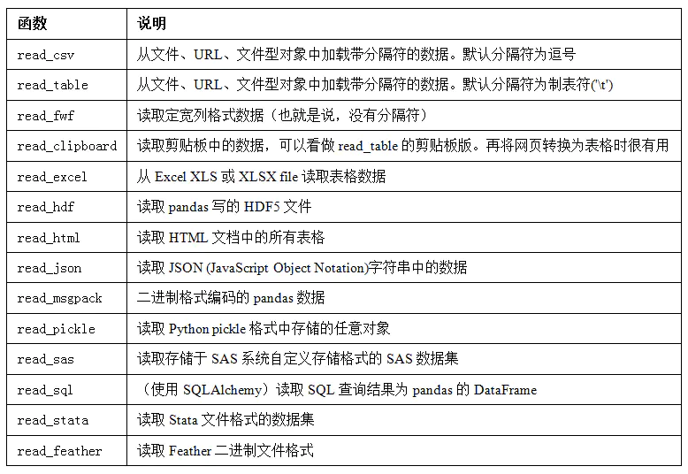

# 第六章 数据载入、存储及文件格式

尽管其它库中有很多工具可以帮助读写数据，但在本书中，我们主要关注利用pandas进行数据输入与输出。

数据输入与输出包含以下几种类型：读取文本文件及硬盘上其它更高效的格式文件、从数据库载入数据、与网络资源进行交互（Web API）

## 6.1 文本格式的数据读写

pandas可以读取各种格式的数据

输入上述代码，按tab键补全，可以查看所有函数


```python
# pd.read_
```

由于现实中的数据非常混乱，一些数据加载函数的可选参数非常复杂

将表格型数据读取为DataFrame对象是pandas的重要特性，表1总结了部分了能实行该特性的函数，其中`read_csv`与`read_table`最为重要。

**表6-1 pandas的解析函数**



我将大致介绍一下这些函数在将文本数据转换为DataFrame时所用到的一些技术。这些函数的选项可以划分为以下几个大类：

-   索引：将一个或多个列当做返回的DataFrame处理，以及是否从文件、用户获取列名。
-   类型推断和数据转换：包括用户定义值的转换、和自定义的缺失值标记列表等。
-   日期解析：包括组合功能，比如将分散在多个列中的日期时间信息组合成结果中的单个列。
-   迭代：支持对大文件进行逐块迭代。
-   不规整数据问题：跳过一些行、页脚、注释或其他一些不重要的东西（比如由成千上万个逗号隔开的数值数据）。

首先自己准备一个CSV文件，为了便于理解，使用! type 打印文件原始内容。由于文件是逗号分隔的，我们使用`read_csv`将其读入一个DataFrame：


```python
!type examples\ex1.csv
# a,b,c,d,message
# 1,2,3,4,hello
# 5,6,7,8,world
# 9,10,11,12,foo
```

>   **`!type:`**，查看原始内容，书上Unix shell使用的是`!cat`，windows中使用的是`!type`命令，注意这里斜杠的方向，与Unix shell的方向不同。

可以看到这个文件是逗号分隔的，下面我们使用`read_csv`将该文件读入DataFrame

1.  两种基本读取函数

    -   **`read_csv`**

        逗号是默认分隔符

        ```python
        df = pd.read_csv('examples/ex1.csv')
        print(df)
        #    a   b   c   d message
        # 0  1   2   3   4   hello
        # 1  5   6   7   8   world
        # 2  9  10  11  12     foo
        ```

    -   **`read_table`**

        `read_table`，允许自己指定分隔符

        ```python
        # 这里用sep指定','为默认分隔符
        print(pd.read_table('examples/ex1.csv', sep=','))
        #    a   b   c   d message
        # 0  1   2   3   4   hello
        # 1  5   6   7   8   world
        # 2  9  10  11  12     foo
        ```

2.  **`read_csv/read_table`函数基本参数：**

    -   **`header`参数**

        有的文件没有头行，比如下面这个

        ```python
        !type examples\ex2.csv
        # 1,2,3,4,hello
        # 5,6,7,8,world
        # 9,10,11,12,foo
        ```

        设置`header=None`，会默认给整数型索引当表头

        ```python
        print(pd.read_csv('examples/ex2.csv', header=None))
        #    0   1   2   3      4
        # 0  1   2   3   4  hello
        # 1  5   6   7   8  world
        # 2  9  10  11  12    foo
        ```

    -   **`names`参数**

        或者，用`names=[自己设置表头]`

        ```python
        print(pd.read_csv('examples/ex2.csv', names=['a', 'b', 'c', 'd', 'message']))
        #    a   b   c   d message
        # 0  1   2   3   4   hello
        # 1  5   6   7   8   world
        # 2  9  10  11  12     foo
        ```

    -   **`index_col`参数**

        如果你想指定第四列为索引，可以使用，`index_col=message`

        ```python
        names = ['a', 'b', 'c', 'd', 'message']
        print(pd.read_csv('examples/ex2.csv', names=names, index_col='message'))
        #          a   b   c   d
        # message               
        # hello    1   2   3   4
        # world    5   6   7   8
        # foo      9  10  11  12
        ```

        想要设置**<u>复合索引</u>**，如打类分成两个one two，one下分四个abcd，two下分四个abcd。

        我们看下面这个文件：

        ```python
        !type examples\csv_mindex.csv
        # key1,key2,value1,value2
        # one,a,1,2
        # one,b,3,4
        # one,c,5,6
        # one,d,7,8
        # two,a,9,10
        # two,b,11,12
        # two,c,13,14
        # two,d,15,16
        ```

         则使用`index_col`指定两列索引`['key1', 'key2']`

        ```python
        parsed = pd.read_csv('examples/csv_mindex.csv',
                             index_col=['key1', 'key2'])
        print(parsed)
        #            value1  value2
        # key1 key2                
        # one  a          1       2
        #      b          3       4
        #      c          5       6
        #      d          7       8
        # two  a          9      10
        #      b         11      12
        #      c         13      14
        #      d         15      16
        ```

    -   **使用正则表达式做分隔符：**

        有的时候，一张表的分隔符不是固定的，考虑下面这种情况，既有换行符也有空格符。

        ```python
        print(list(open('examples/ex3.txt')))
        # ['            A         B         C\n',
        #  'aaa -0.264438 -1.026059 -0.619500\n',
        #  'bbb  0.927272  0.302904 -0.032399\n',
        #  'ccc -0.264273 -0.386314 -0.217601\n',
        #  'ddd -0.871858 -0.348382  1.100491\n']
        ```

        该文档是数量不确定的空格分隔，指定分隔符为正则表达式`\s+`

        ```python
        result = pd.read_table('examples/ex3.txt', sep='\s+')
        print(result)
        #             A         B         C
        # aaa -0.264438 -1.026059 -0.619500
        # bbb  0.927272  0.302904 -0.032399
        # ccc -0.264273 -0.386314 -0.217601
        # ddd -0.871858 -0.348382  1.100491
        ```

        本例中，由于列名的数量少一个，`read_table`会自动推断第一列为索引

    -   **`skiprows`**参数

        解析异常，如下面这个文档

        ```python
        !type examples\ex4.csv
        
        # hey!  第一行
        a,b,c,d,message
        # just wanted to make things more difficult for you  第三行
        # who reads CSV files with computers, anyway?  第四行
        1,2,3,4,hello
        5,6,7,8,world
        9,10,1,12,foo
        ```
        
        这里面有一些注释行，使用`skiprows=[0, 2, 3]`跳过文档的第一行，第三行与第四行。
        
        ```python
        print(pd.read_csv('examples/ex4.csv', skiprows=[0, 2, 3]))
        #    a   b   c   d message
        # 0  1   2   3   4   hello
        # 1  5   6   7   8   world
        # 2  9  10  11  12     foo
        ```
        
        

3.  **处理缺失值：**

    -   使用`NULL`或`NA`等常见标识来标记

        ```python
        !type examples\ex5.csv
        # something,a,b,c,d,message
        # one,1,2,3,4,NA
        # two,5,6,,8,world
        # three,9,10,11,12,foo
        result = pd.read_csv('examples/ex5.csv')
        print(result)
        #   something  a   b     c   d message
        # 0       one  1   2   3.0   4     NaN
        # 1       two  5   6   NaN   8   world
        # 2     three  9  10  11.0  12     foo
    
        # 判断是否为缺失值
        print(pd.isnull(result))
        #    something      a      b      c      d  message
        # 0      False  False  False  False  False     True
        # 1      False  False  False   True  False    False
        # 2      False  False  False  False  False    False
        ```
    
    -   **`na_values`**参数
    
        可以传入一个类表或者一组字符串来指定缺失值
    
        ```python
        result = pd.read_csv('examples/ex5.csv', na_values=['Null'])
        print(result)
        #   something  a   b     c   d message
        # 0       one  1   2   3.0   4     NaN
        # 1       two  5   6   NaN   8   world
        # 2     three  9  10  11.0  12     foo
        ```
    
        利用字典，每列可以指定不同的缺失值表示
    
        ```python
        sentinels = {'message': ['foo', 'NA'], 'something': ['two']}
        print(pd.read_csv('examples/ex5.csv', na_values=sentinels))
        #   something  a   b     c   d message
        # 0       one  1   2   3.0   4     NaN
        # 1       NaN  5   6   NaN   8   world
        # 2     three  9  10  11.0  12     NaN
        ```
    
        
    

表6-2列举`pandas.read_csv`和`pandas.read_table`中常用选项：

**表6-2 一些`read_csv/read_table`函数参数**


### 6.1.1 分块读入文本文件

>   Reading Text Files in Pieces

#### 6.1.1.1 显示调整

当处理大型文件的时候，你也许只需要读取文件中的一小部分或者按小块遍历文件。在尝试大文件之前，我们先对pandas的显示设置进行更改，使之更为紧凑。

对pandas的显示进行调整，只显示10列：


```python
pd.options.display.max_rows = 10
result = pd.read_csv('examples/ex6.csv')
print(result)
#            one       two     three      four key
# 0     0.467976 -0.038649 -0.295344 -1.824726   L
# 1    -0.358893  1.404453  0.704965 -0.200638   B
# 2    -0.501840  0.659254 -0.421691 -0.057688   G
# 3     0.204886  1.074134  1.388361 -0.982404   R
# 4     0.354628 -0.133116  0.283763 -0.837063   Q
# ...        ...       ...       ...       ...  ..
# 9995  2.311896 -0.417070 -1.409599 -0.515821   L
# 9996 -0.479893 -0.650419  0.745152 -0.646038   E
# 9997  0.523331  0.787112  0.486066  1.093156   K
# 9998 -0.362559  0.598894 -1.843201  0.887292   G
# 9999 -0.096376 -1.012999 -0.657431 -0.573315   0
```

#### 6.1.1.2 指定行数

只读出前五行


```python
pd.read_csv('examples/ex6.csv', nrows=5)
#         one       two     three      four key
# 0  0.467976 -0.038649 -0.295344 -1.824726   L
# 1 -0.358893  1.404453  0.704965 -0.200638   B
# 2 -0.501840  0.659254 -0.421691 -0.057688   G
# 3  0.204886  1.074134  1.388361 -0.982404   R
# 4  0.354628 -0.133116  0.283763 -0.837063  
```

`chunker`就是分块的意思，`chunksize=1000`，指定每一块的行数。


```python
chunker = pd.read_csv('examples/ex6.csv', chunksize=1000)
print(chunker)
# <pandas.io.parsers.TextFileReader at 0x27fcf51f710>
```

比如，0-999是第一块，1000-1999是第二块儿

返回值为`TextParser`对象，允许遍历


```python
chunker = pd.read_csv('examples/ex6.csv', chunksize=1000)
for piece in chunker:
    print(piece)
    
#           one       two     three      four key
# 0    0.467976 -0.038649 -0.295344 -1.824726   L
# 1   -0.358893  1.404453  0.704965 -0.200638   B
# 2   -0.501840  0.659254 -0.421691 -0.057688   G
# 3    0.204886  1.074134  1.388361 -0.982404   R
# 4    0.354628 -0.133116  0.283763 -0.837063   Q
# ..        ...       ...       ...       ...  ..
# 995  2.311896 -0.417070 -1.409599 -0.515821   M
# 996 -0.479893 -0.650419  0.745152 -0.646038   H
# 997  0.523331  0.787112  0.486066  1.093156   D
# 998 -0.362559  0.598894 -1.843201  0.887292   W
# 999 -0.096376 -1.012999 -0.657431 -0.573315   K

# [1000 rows x 5 columns]
#            one       two     three      four key
# 1000  0.467976 -0.038649 -0.295344 -1.824726   T
# 1001 -0.358893  1.404453  0.704965 -0.200638   J
# 1002 -0.501840  0.659254 -0.421691 -0.057688   R
# 1003  0.204886  1.074134  1.388361 -0.982404   S
# 1004  0.354628 -0.133116  0.283763 -0.837063   B
# ...        ...       ...       ...       ...  ..
# 1995  2.311896 -0.417070 -1.409599 -0.515821   L
# 1996 -0.479893 -0.650419  0.745152 -0.646038   J
# 1997  0.523331  0.787112  0.486066  1.093156   V
# 1998 -0.362559  0.598894 -1.843201  0.887292   W
# 1999 -0.096376 -1.012999 -0.657431 -0.573315   D

# [1000 rows x 5 columns]
#            one       two     three      four key
# 2000  0.467976 -0.038649 -0.295344 -1.824726   1
# 2001 -0.358893  1.404453  0.704965 -0.200638   H
# 2002 -0.501840  0.659254 -0.421691 -0.057688   F
# 2003  0.204886  1.074134  1.388361 -0.982404   L
# 2004  0.354628 -0.133116  0.283763 -0.837063   E
# ...        ...       ...       ...       ...  ..
# 2995  2.311896 -0.417070 -1.409599 -0.515821   H
# 2996 -0.479893 -0.650419  0.745152 -0.646038   U
# 2997  0.523331  0.787112  0.486066  1.093156   A
# 2998 -0.362559  0.598894 -1.843201  0.887292   Y
# 2999 -0.096376 -1.012999 -0.657431 -0.573315   F

# [1000 rows x 5 columns]
#            one       two     three      four key
# 3000  0.467976 -0.038649 -0.295344 -1.824726   H
# 3001 -0.358893  1.404453  0.704965 -0.200638   Y
# 3002 -0.501840  0.659254 -0.421691 -0.057688   0
# 3003  0.204886  1.074134  1.388361 -0.982404   Z
# 3004  0.354628 -0.133116  0.283763 -0.837063   U
# ...        ...       ...       ...       ...  ..
# 3995  2.311896 -0.417070 -1.409599 -0.515821   W
# 3996 -0.479893 -0.650419  0.745152 -0.646038   E
# 3997  0.523331  0.787112  0.486066  1.093156   Q
# 3998 -0.362559  0.598894 -1.843201  0.887292   A
# 3999 -0.096376 -1.012999 -0.657431 -0.573315   M

# [1000 rows x 5 columns]
#            one       two     three      four key
# 4000  0.467976 -0.038649 -0.295344 -1.824726   H
# 4001 -0.358893  1.404453  0.704965 -0.200638   Z
# 4002 -0.501840  0.659254 -0.421691 -0.057688   2
# 4003  0.204886  1.074134  1.388361 -0.982404   B
# 4004  0.354628 -0.133116  0.283763 -0.837063   1
# ...        ...       ...       ...       ...  ..
# 4995  2.311896 -0.417070 -1.409599 -0.515821   X
# 4996 -0.479893 -0.650419  0.745152 -0.646038   M
# 4997  0.523331  0.787112  0.486066  1.093156   5
# 4998 -0.362559  0.598894 -1.843201  0.887292   T
# 4999 -0.096376 -1.012999 -0.657431 -0.573315   U

# [1000 rows x 5 columns]
#            one       two     three      four key
# 5000  0.467976 -0.038649 -0.295344 -1.824726   1
# 5001 -0.358893  1.404453  0.704965 -0.200638   Z
# 5002 -0.501840  0.659254 -0.421691 -0.057688   3
# 5003  0.204886  1.074134  1.388361 -0.982404   H
# 5004  0.354628 -0.133116  0.283763 -0.837063   B
# ...        ...       ...       ...       ...  ..
# 5995  2.311896 -0.417070 -1.409599 -0.515821   1
# 5996 -0.479893 -0.650419  0.745152 -0.646038   Y
# 5997  0.523331  0.787112  0.486066  1.093156   F
# 5998 -0.362559  0.598894 -1.843201  0.887292   0
# 5999 -0.096376 -1.012999 -0.657431 -0.573315   3

# [1000 rows x 5 columns]
#            one       two     three      four key
# 6000  0.467976 -0.038649 -0.295344 -1.824726   I
# 6001 -0.358893  1.404453  0.704965 -0.200638   X
# 6002 -0.501840  0.659254 -0.421691 -0.057688   A
# 6003  0.204886  1.074134  1.388361 -0.982404   C
# 6004  0.354628 -0.133116  0.283763 -0.837063   S
# ...        ...       ...       ...       ...  ..
# 6995  2.311896 -0.417070 -1.409599 -0.515821   P
# 6996 -0.479893 -0.650419  0.745152 -0.646038   9
# 6997  0.523331  0.787112  0.486066  1.093156   L
# 6998 -0.362559  0.598894 -1.843201  0.887292   5
# 6999 -0.096376 -1.012999 -0.657431 -0.573315   O

# [1000 rows x 5 columns]
#            one       two     three      four key
# 7000  0.467976 -0.038649 -0.295344 -1.824726   1
# 7001 -0.358893  1.404453  0.704965 -0.200638   I
# 7002 -0.501840  0.659254 -0.421691 -0.057688   H
# 7003  0.204886  1.074134  1.388361 -0.982404   P
# 7004  0.354628 -0.133116  0.283763 -0.837063   D
# ...        ...       ...       ...       ...  ..
# 7995  2.311896 -0.417070 -1.409599 -0.515821   A
# 7996 -0.479893 -0.650419  0.745152 -0.646038   6
# 7997  0.523331  0.787112  0.486066  1.093156   R
# 7998 -0.362559  0.598894 -1.843201  0.887292   R
# 7999 -0.096376 -1.012999 -0.657431 -0.573315   2

# [1000 rows x 5 columns]
#            one       two     three      four key
# 8000  0.467976 -0.038649 -0.295344 -1.824726   7
# 8001 -0.358893  1.404453  0.704965 -0.200638   W
# 8002 -0.501840  0.659254 -0.421691 -0.057688   C
# 8003  0.204886  1.074134  1.388361 -0.982404   S
# 8004  0.354628 -0.133116  0.283763 -0.837063   H
# ...        ...       ...       ...       ...  ..
# 8995  2.311896 -0.417070 -1.409599 -0.515821   W
# 8996 -0.479893 -0.650419  0.745152 -0.646038   N
# 8997  0.523331  0.787112  0.486066  1.093156   Q
# 8998 -0.362559  0.598894 -1.843201  0.887292   R
# 8999 -0.096376 -1.012999 -0.657431 -0.573315   M

# [1000 rows x 5 columns]
#            one       two     three      four key
# 9000  0.467976 -0.038649 -0.295344 -1.824726   B
# 9001 -0.358893  1.404453  0.704965 -0.200638   M
# 9002 -0.501840  0.659254 -0.421691 -0.057688   N
# 9003  0.204886  1.074134  1.388361 -0.982404   N
# 9004  0.354628 -0.133116  0.283763 -0.837063   Y
# ...        ...       ...       ...       ...  ..
# 9995  2.311896 -0.417070 -1.409599 -0.515821   L
# 9996 -0.479893 -0.650419  0.745152 -0.646038   E
# 9997  0.523331  0.787112  0.486066  1.093156   K
# 9998 -0.362559  0.598894 -1.843201  0.887292   G
# 9999 -0.096376 -1.012999 -0.657431 -0.573315   0

# [1000 rows x 5 columns]
```

 比如说，我们可以迭代处理`ex6.csv`，将值计数聚合到`"key"`列中，如下所示：

```python
chunker = pd.read_csv('examples/ex6.csv', chunksize=1000)

for piece in chunker:
    print(piece['key'].value_counts())
    
# S    48
# O    44
# F    40
# Q    39
# J    39
#      ..
# 1    13
# 9    11
# 2    11
# 0     9
# 5     9
# Name: key, Length: 36, dtype: int64
# O    48
# L    44
# X    40
# I    39
# R    38
#      ..
# 3    16
# 1    16
# 6    14
# 2    14
# 7    12
# Name: key, Length: 36, dtype: int64
# A    40
# O    40
# E    39
# X    39
# M    38
#      ..
# 2    14
# 4    14
# 5    14
# 8    14
# 1    11
# Name: key, Length: 36, dtype: int64
# X    43
# J    41
# V    38
# Q    38
# D    38
#      ..
# 9    15
# 0    15
# 8    13
# 4    12
# 7    12
# Name: key, Length: 36, dtype: int64
# E    54
# Q    42
# L    40
# H    39
# K    38
#      ..
# 5    17
# 8    16
# 7    13
# 9     8
# 1     8
# Name: key, Length: 36, dtype: int64
# Y    42
# K    41
# F    41
# X    38
# V    37
#      ..
# 6    17
# 3    16
# 4    13
# 2    12
# 0     8
# Name: key, Length: 36, dtype: int64
# C    41
# L    41
# W    39
# Z    39
# X    38
#      ..
# 2    17
# 1    16
# 5    15
# 3    11
# 6     8
# Name: key, Length: 36, dtype: int64
# J    42
# M    40
# D    39
# X    39
# E    39
#      ..
# 7    14
# 3    13
# 5    13
# 1    12
# 9     5
# Name: key, Length: 36, dtype: int64
# O    42
# U    41
# S    40
# A    39
# V    37
#      ..
# 3    15
# 0    14
# 8    12
# 6    12
# 5    11
# Name: key, Length: 36, dtype: int64
# K    42
# M    41
# U    39
# Y    38
# P    38
#      ..
# 9    15
# 2    15
# 5    15
# 7    14
# 1    12
# Name: key, Length: 36, dtype: int641
```

将值计数聚合到`"key"`列中，每个元素出现的频率，如下所示：

```python
chunker = pd.read_csv('examples/ex6.csv', chunksize=1000)

tot = pd.Series([])
for piece in chunker:
    tot = tot.add(piece['key'].value_counts(), fill_value=0)

tot = tot.sort_values(ascending=False)
print(tot)
# E    368.0
# X    364.0
# L    346.0
# O    343.0
# Q    340.0
#      ...  
# 5    157.0
# 2    152.0
# 0    151.0
# 9    150.0
# 1    146.0
# Length: 36, dtype: float64 

print(tot[:10]
# E    368.0
# X    364.0
# L    346.0
# O    343.0
# Q    340.0
# M    338.0
# J    337.0
# F    335.0
# K    334.0
# H    330.0
# dtype: float64
```

### 6.1.2 将数据写入文本格式

>   Writing Data to Text Format

读出文本，读出的变量存在data里


```python
data = pd.read_csv('examples/ex5.csv')
print(data)
#   something  a   b     c   d message
# 0       one  1   2   3.0   4     NaN
# 1       two  5   6   NaN   8   world
# 2     three  9  10  11.0  12     foo
```

写入文档


```python
data.to_csv('examples/out.csv')
```

查看写入的文档


```python
!type examples\out.csv
# ,something,a,b,c,d,message
# 0,one,1,2,3.0,4,
# 1,two,5,6,,8,world
# 2,three,9,10,11.0,12,foo
```

`sys.stdout`输出到屏幕，但是，使用`|`分割


```python
import sys
data.to_csv(sys.stdout, sep='|')
# |something|a|b|c|d|message
# 0|one|1|2|3.0|4|
# 1|two|5|6||8|world
# 2|three|9|10|11.0|12|foo
```


缺失值使用`NULL`填充缺失值


```python
data.to_csv(sys.stdout, na_rep='NULL')
# ,something,a,b,c,d,message
# 0,one,1,2,3.0,4,NULL
# 1,two,5,6,NULL,8,world
# 2,three,9,10,11.0,12,foo
```


写入文档，去掉`index`，去掉`header`


```python
print(data.to_csv(sys.stdout, index=False, header=False))
# one,1,2,3.0,4,
# two,5,6,,8,world
# three,9,10,11.0,12,foo
```


写入文档，列名为a,b,c(自定义列名)


```python
data.to_csv(sys.stdout, index=False, columns=['a', 'b', 'c'])
# a,b,c
# 1,2,3.0
# 5,6,
# 9,10,11.0
```


Series也有`to_csv`方法：


```python
# 生成时间数据，从2000年1月1日开始，期限为7天
dates = pd.date_range('1/1/2000', periods=7)
print(dates)
# DatetimeIndex(['2000-01-01', '2000-01-02', '2000-01-03', '2000-01-04',
#                '2000-01-05', '2000-01-06', '2000-01-07'],
#               dtype='datetime64[ns]', freq='D')

# 可以看到这里的数据类型是datetime
```

生成0-6七个数字，索引为刚才生成的日期


```python
ts = pd.Series(np.arange(7), index=dates)
print(ts)
# 2000-01-01    0
# 2000-01-02    1
# 2000-01-03    2
# 2000-01-04    3
# 2000-01-05    4
# 2000-01-06    5
# 2000-01-07    6
# Freq: D, dtype: int32
```

将文档写入文件


```python
ts.to_csv('examples/tseries.csv')
```


查看刚才保存的文档


```python
!type examples\tseries.csv
# 2000-01-01,0
# 2000-01-02,1
# 2000-01-03,2
# 2000-01-04,3
# 2000-01-05,4
# 2000-01-06,5
# 2000-01-07,6
```

### 6.1.3 处理分隔格式 

>Working with Delimited Formats

大部分存储在磁盘上的表格型数据都能用`pandas.read_table`进行加载。然而，有时还是需要做一些手工处理。由于接收到含有畸形行的文件而使`read_table`出毛病的情况并不少见。


```python
!type examples\ex7.csv
# "a","b","c"
# "1","2","3"
# "1","2","3"
```


对于这种带双引号的文档，首先导入`csv`包，读出`csv`文件：


```python
import csv
f = open('examples/ex7.csv')
reader = csv.reader(f)
```

读出来的reader是一个可迭代对象


```python
print(reader)
# <_csv.reader at 0x27fcf31ee18>
```

需要使用for循环读出来


```python
for line in reader:
    print(line)
# ['a', 'b', 'c']
# ['1', '2', '3']
# ['1', '2', '3']    

print(type(line))
# <class 'list'>
```


可以看到是类似列表的东西，将文件读取为行的列表


```python
with open('examples/ex7.csv') as f:
    lines = list(csv.reader(f))
print(lines)
# [['a', 'b', 'c'], ['1', '2', '3'], ['1', '2', '3']]
```

哦~，所以这个可迭代对象，就缺个马甲是嘛


```python
with open('examples/ex7.csv') as f:
    lines = tuple(csv.reader(f))
print(lines)
# (['a', 'b', 'c'], ['1', '2', '3'], ['1', '2', '3'])
```

哈哈哈似乎领悟到了什么真谛


```python
with open('examples/ex7.csv') as f:
    lines = list(csv.reader(f))
header, values = lines[0], lines[1:]

print(header)
# ['a', 'b', 'c']

print(values)
# [['1', '2', '3'], ['1', '2', '3']]
```

哦~再拆成字典格式，好好学学！！


```python
data_dict = {h: v for h, v in zip(header, zip(*values))}
print(data_dict)
# {'a': ('1', '1'), 'b': ('2', '2'), 'c': ('3', '3')}
```

可用的选项（`csv.Dialect`的属性）及其功能如表所示：

**表6-3：CSV方言选项**


### 6.1.4 `JSON` Data

一回生二回熟，`JavaScript Object Notation`

常用的标准格式，比`csv`更为自由

看下面这个例子


```python
obj = """
{"name": "Wes",
 "places_lived": ["United States", "Spain", "Germany"],
 "pet": null,
 "siblings": [{"name": "Scott", "age": 30, "pets": ["Zeus", "Zuko"]},
              {"name": "Katie", "age": 38,
               "pets": ["Sixes", "Stache", "Cisco"]}]
}
"""
```

我们使用Python中内置的`json`标准库读取`json`文件

`json`字符串转换为python形式


```python
import json
import pandas as pd
result = json.loads(obj)
print(result)
# {'name': 'Wes',
#  'places_lived': ['United States', 'Spain', 'Germany'],
#  'pet': None,
#  'siblings': [{'name': 'Scott', 'age': 30, 'pets': ['Zeus', 'Zuko']},
#   {'name': 'Katie', 'age': 38, 'pets': ['Sixes', 'Stache', 'Cisco']}]}
```

`json.dumps`则将Python对象转换成`JSON`格式：


```python
asjson = json.dumps(result)
print(asjson)
# '{"name": "Wes", "places_lived": ["United States", "Spain", "Germany"], "pet": null, "siblings": [{"name": "Scott", "age": 30, "pets": ["Zeus", "Zuko"]}, {"name": "Katie", "age": 38, "pets": ["Sixes", "Stache", "Cisco"]}]}'
```

可以自由转换数据结构，如`result`变量里面的`‘siblings’`对应的字典，字典里面取出`name`和`age`作为列。


```python
siblings = pd.DataFrame(result['siblings'], columns=['name', 'age'])
print(siblings)
#     name  age
# 0  Scott   30
# 1  Katie   38
```

`pandas.read_json`可以自动将特别格式的`JSON`数据集转换为Series或DataFrame。例如：


```python
!type examples\example.json
# [{"a": 1, "b": 2, "c": 3},
#  {"a": 4, "b": 5, "c": 6},
#  {"a": 7, "b": 8, "c": 9}]
data = pd.read_json('examples/example.json')
print(data)
#    a  b  c
# 0  1  2  3
# 1  4  5  6
# 2  7  8  9
```

从pandas中将数据转换为`json`


```python
print(data.to_json())
# {"a":{"0":1,"1":4,"2":7},"b":{"0":2,"1":5,"2":8},"c":{"0":3,"1":6,"2":9}}
```


注意跟上面不同的保存方式


```python
print(data.to_json(orient='records'))
# [{"a":1,"b":2,"c":3},{"a":4,"b":5,"c":6},{"a":7,"b":8,"c":9}]
```

### 6.1.5 网络抓取 XML and HTML

>   Web Scraping

`html`和`xml`格式文件的读取


```python
# !pip install lxml
# !pip install beautifulsoup4 html5lib
```

pandas有一个内置的功能，`read_html`，它可以使用`lxml`和`Beautiful Soup`自动将HTML文件中的表格解析为`DataFrame`对象。

美国FDIC政府机构下载的显示银行倒闭数据的HTML文件


```python
!type examples\fdic_failed_bank_list.html
```

`pd.read_html`有很多选项，但默认的情况下，会搜索并尝试解析所有包含在标签中的表格型数据，返回的结果是DataFrame对象的列表


```python
tables = pd.read_html('examples/fdic_failed_bank_list.html')
print(len(tables))
# 1

failures = tables[0]
print(failures.head())
#                       Bank Name  ...       Updated Date
# 0                   Allied Bank  ...  November 17, 2016
# 1  The Woodbury Banking Company  ...  November 17, 2016
# 2        First CornerStone Bank  ...  September 6, 2016
# 3            Trust Company Bank  ...  September 6, 2016
# 4    North Milwaukee State Bank  ...      June 16, 2016
# 
# [5 rows x 7 columns]
```

可以进行一些简单的清理工作，比如计算每年银行倒闭的数量


```python
close_timestamps = pd.to_datetime(failures['Closing Date'])
print(close_timestamps.dt.year)
# 0     2016-09-23
# 1     2016-08-19
# 2     2016-05-06
# 3     2016-04-29
# 4     2016-03-11
# 5     2015-10-02
# 6     2015-10-02
# 7     2015-07-10
# 8     2015-05-08
# 9     2015-02-27
# 10    2015-02-13
# 11    2015-01-23
# 12    2015-01-16
# 13    2014-12-19
# 14    2014-11-07
# 15    2014-10-24
# 16    2014-10-17
# 17    2014-07-25
# 18    2014-07-18
# 19    2014-06-27
# 20    2014-06-20
# 21    2014-06-20
# 22    2014-05-30
# 23    2014-05-23
# 24    2014-05-16
# 25    2014-04-25
# 26    2014-02-28
# 27    2014-02-28
# 28    2014-01-31
# 29    2014-01-24
#          ...    
# 517   2008-05-09
# 518   2008-03-07
# 519   2008-01-25
# 520   2007-10-04
# 521   2007-09-28
# 522   2007-02-02
# 523   2004-06-25
# 524   2004-03-19
# 525   2004-03-12
# 526   2004-02-14
# 527   2003-11-14
# 528   2003-05-09
# 529   2003-02-07
# 530   2002-12-17
# 531   2002-11-08
# 532   2002-09-30
# 533   2002-06-27
# 534   2002-06-26
# 535   2002-03-28
# 536   2002-03-01
# 537   2002-02-07
# 538   2002-02-01
# 539   2002-01-18
# 540   2002-01-11
# 541   2001-09-07
# 542   2001-07-27
# 543   2001-05-03
# 544   2001-02-02
# 545   2000-12-14
# 546   2000-10-13
# Name: Closing Date, Length: 547, dtype: datetime64[ns]
```

??没太看懂这行，dt是是啥，year是啥？

-   `s.dt.hour`

-   `s.dt.second`

-   `s.dt.quarter`

-   `dt.year`，获得时间中的年份，`value_counts()`并统计这一列中有多少个。


```python
print(close_timestamps.dt.year.value_counts())
# 2010    157
# 2009    140
# 2011     92
# 2012     51
# 2008     25
# 2013     24
# 2014     18
# 2002     11
# 2015      8
# 2016      5
# 2004      4
# 2001      4
# 2007      3
# 2003      3
# 2000      2
# Name: Closing Date, dtype: int64
```

#### 6.1.5.1 解析`XML`使用`lxml.objectify`

`XML`,是一种常用的结构化数据格式，使用元数据支持分层、嵌套数据

下面是纽约大都会交通局发布的一份关于公交、火车服务的数据集

```XML
<INDICATOR>
  <INDICATOR_SEQ>373889</INDICATOR_SEQ>
  <PARENT_SEQ></PARENT_SEQ>
  <AGENCY_NAME>Metro-North Railroad</AGENCY_NAME>
  <INDICATOR_NAME>Escalator Availability</INDICATOR_NAME>
  <DESCRIPTION>Percent of the time that escalators are operational
  systemwide. The availability rate is based on physical observations performed
  the morning of regular business days only. This is a new indicator the agency
  began reporting in 2009.</DESCRIPTION>
  <PERIOD_YEAR>2011</PERIOD_YEAR>
  <PERIOD_MONTH>12</PERIOD_MONTH>
  <CATEGORY>Service Indicators</CATEGORY>
  <FREQUENCY>M</FREQUENCY>
  <DESIRED_CHANGE>U</DESIRED_CHANGE>
  <INDICATOR_UNIT>%</INDICATOR_UNIT>
  <DECIMAL_PLACES>1</DECIMAL_PLACES>
  <YTD_TARGET>97.00</YTD_TARGET>
  <YTD_ACTUAL></YTD_ACTUAL>
  <MONTHLY_TARGET>97.00</MONTHLY_TARGET>
  <MONTHLY_ACTUAL></MONTHLY_ACTUAL>
</INDICATOR>
```

使用`lxml.objectify`


```python
from lxml import objectify

path = 'datasets/mta_perf/Performance_MNR.xml'
parsed = objectify.parse(open(path))
root = parsed.getroot() # 获得对XML文件的根节点的引用
```

返回一个迭代器，可以产生每一个`XML`元素


```python
print(root)
# <Element PERFORMANCE at 0x1ae3e848dc8>
```


```python
data = []
# 储存所有数据的列表

skip_fields = ['PARENT_SEQ', 'INDICATOR_SEQ',
               'DESIRED_CHANGE', 'DECIMAL_PLACES']
# 这几个标签下的值不要

for elt in root.INDICATOR:
    # 一组数据
    el_data = {}
    # 储存该组数据的字典
    for child in elt.getchildren():
        # 取出一列数据
        if child.tag in skip_fields:
            # 如果这列的标签，在我们上面定义的列表里
            continue
            # 舍弃，继续
        el_data[child.tag] = child.pyval
        # 如果不在，标签作为key值，这列的pyval作为value值加入字典
    data.append(el_data)
    # 该组数据加入总体数据列表
    
print(len(data))
# 648
print(data[1])
# {'AGENCY_NAME': 'Metro-North Railroad',
#  'INDICATOR_NAME': 'On-Time Performance (West of Hudson)',
#  'DESCRIPTION': 'Percent of commuter trains that arrive at their destinations within 5 minutes and 59 seconds of the scheduled time. West of Hudson services include the Pascack Valley and Port Jervis lines. Metro-North Railroad contracts with New Jersey Transit to operate service on these lines.\n',
#  'PERIOD_YEAR': 2008,
#  'PERIOD_MONTH': 2,
#  'CATEGORY': 'Service Indicators',
#  'FREQUENCY': 'M',
#  'INDICATOR_UNIT': '%',
#  'YTD_TARGET': 95.0,
#  'YTD_ACTUAL': 96.0,
#  'MONTHLY_TARGET': 95.0,
#  'MONTHLY_ACTUAL': 95.0}
```

可以看到生成的data是一个类表，每个元素是一个字典，所有字典的`key`值顺序对应最将包含字典的列表转换为DataFrame


```python
perf = pd.DataFrame(data)
print(perf.head())
#             AGENCY_NAME  ... MONTHLY_ACTUAL
# 0  Metro-North Railroad  ...           96.9
# 1  Metro-North Railroad  ...             95
# 2  Metro-North Railroad  ...           96.9
# 3  Metro-North Railroad  ...           98.3
# 4  Metro-North Railroad  ...           95.8
# 
# [5 rows x 12 columns]
```

XML数据如果更复杂，比如每个标签包含元数据

==好吧没懂。。==


```python
from io import StringIO
tag = '<a href="http://www.google.com">Google</a>'
root = objectify.parse(StringIO(tag)).getroot()

print(root)
print(root.get('href'))
print(root.text)
# 'Google'
```

## 6.2 二进制格式 

> Binary Data Formats


```python
frame = pd.read_csv('examples/ex1.csv')
print(frame)
#    a   b   c   d message
# 0  1   2   3   4   hello
# 1  5   6   7   8   world
# 2  9  10  11  12     foo
```

保存为二进制格式


```python
frame.to_pickle('examples/frame_pickle')
print(pd.read_pickle('examples/frame_pickle'))
#    a   b   c   d message
# 0  1   2   3   4   hello
# 1  5   6   7   8   world
# 2  9  10  11  12     foo
```

>   注意：`pickle`仅建议用于短期存储格式。其原因是很难保证该格式永远是稳定的，今天pickle的对象可能无法被后续版本的库`unpickle`出来。

pandas内置支持两个二进制数据格式：`HDF5`和`MessagePack`。下一节，我会给出几个`HDF5`的例子。

pandas或NumPy数据的其它存储格式有：

-   **`bcolz`**：一种可压缩的列存储二进制格式，基于`Blosc`压缩库。
-   **`Feather`**：我与R语言社区的Hadley Wickham设计的一种跨语言的列存储文件格式。`Feather`使用了`Apache Arrow`的列式内存格式。

### 6.2.1 使用HDF5格式

用于存储大量的科学数组数据


```python
import numpy as np
frame = pd.DataFrame({'a': np.random.randn(100)})
store = pd.HDFStore('mydata.h5')
store['obj1'] = frame
store['obj1_col'] = frame['a']
print(store)
# <class 'pandas.io.pytables.HDFStore'>
# File path: mydata.h5
```


```python
print(store['obj1_col'])
# 0     0.309250
# 1     0.680037
# 2     0.989194
# 3    -1.362328
# 4    -0.533243
# 5    -1.187825
# 6    -1.029347
# 7    -1.077026
# 8     0.933109
# 9    -1.806425
# 10   -1.347547
# 11    0.592021
# 12    0.178162
# 13   -1.090297
# 14    0.852064
# 15    0.280577
# 16    0.671429
# 17   -0.167449
# 18    0.184109
# 19   -0.400377
# 20   -0.946493
# 21   -1.740762
# 22   -1.744523
# 23    0.287905
# 24   -0.735220
# 25    1.071231
# 26   -0.828809
# 27   -0.094955
# 28    0.409779
# 29    0.719787
#         ...   
# 70    1.831866
# 71    1.571385
# 72    0.439236
# 73    0.603217
# 74   -0.300065
# 75   -1.053181
# 76   -0.168029
# 77    1.839252
# 78    0.413853
# 79    0.931166
# 80    0.106162
# 81    0.208946
# 82   -0.725353
# 83   -1.010852
# 84   -1.026712
# 85    2.229865
# 86   -0.738917
# 87    0.017304
# 88   -0.873912
# 89    0.504836
# 90   -0.099655
# 91   -0.608003
# 92   -1.631771
# 93    0.567855
# 94   -0.060269
# 95    0.993129
# 96   -0.592249
# 97   -0.784817
# 98   -0.325682
# 99    0.360261
# Name: a, Length: 100, dtype: float64
```


```python
store.put('obj2', frame, format='table')
print(store.select('obj2', where=['index >= 10 and index <= 15']))
```


```python
print(store.close())
# frame.to_hdf('mydata.h5', 'obj3', format='table')
# pd.read_hdf('mydata.h5', 'obj3', where=['index < 5'])

# import os
# os.remove('mydata.h5')
```

### 6.2.2 读取Microsoft Excel文件

> Reading Microsoft Excel Files

pandas的`ExcelFile`类或`pandas.read_excel`函数支持读取存储在Excel 2003（或更高版本）中的表格型数据。这两个工具分别使用扩展包`xlrd`和`openpyxl`读取`XLS`和`XLSX`文件。

要使用`ExcelFile`，通过传递`xls`或`xlsx`路径创建一个实例：


```python
xlsx = pd.ExcelFile('examples/ex1.xlsx')
print(pd.read_excel(xlsx, 'Sheet1'))
#    Unnamed: 0  a   b   c   d message
# 0           0  1   2   3   4   hello
# 1           1  5   6   7   8   world
# 2           2  9  10  11  12     foo
```

如果要读取一个文件中的多个表单，创建ExcelFile会更快，但你也可以将文件名传递到`pandas.read_excel`：


```python
frame = pd.read_excel('examples/ex1.xlsx', 'Sheet1')
print(frame)
#    Unnamed: 0  a   b   c   d message
# 0           0  1   2   3   4   hello
# 1           1  5   6   7   8   world
# 2           2  9  10  11  12     foo
```

如果要将pandas数据写入为Excel格式，你必须首先创建一个`ExcelWriter`，然后使用pandas对象的`to_excel`方法将数据写入到其中：


```python
# 两种把pandas对象写入xlsx文件的方法
#1  方法一
writer = pd.ExcelWriter('examples/ex2.xlsx')
frame.to_excel(writer, 'Sheet1')
writer.save()

#2  方法二
frame.to_excel('examples/ex2.xlsx')
```

## 6.3 与Web API 交互

>Interacting with Web APIs

许多网站都有一些通过`JSON`或其他格式提供数据的公共`API`。通过Python访问这些`API`的办法有不少，一个简单易用的办法（推荐）是[requests包](http://docs.python-requests.org)。

获取github上最新的30条关于pandas的问题，发送一个HTTP GET请求


```python
import requests
url = 'https://api.github.com/repos/pandas-dev/pandas/issues'
resp = requests.get(url)
print(resp)
# <Response [200]>
```

Response对象的json方法将返回一个包含解析为本地Python对象的JSON字典


```python
data = resp.json()
print(data[0]['title'])
# QST: Distinguishing row and column slices in DataFrame subclass
```

data中的每个元素都是一个包含GitHub问题页面上所有数据的字典，我们可以将data直接传给DataFrame，并提取感兴趣的字段


```python
issues = pd.DataFrame(data, columns=['number', 'title',
                                     'labels', 'state'])
print(issues)
#     number  ... state
# 0    34089  ...  open
# 1    34088  ...  open
# 2    34087  ...  open
# 3    34086  ...  open
# 4    34085  ...  open
# 5    34084  ...  open
# 6    34083  ...  open
# 7    34082  ...  open
# 8    34081  ...  open
# 9    34080  ...  open
# 10   34079  ...  open
# 11   34077  ...  open
# 12   34076  ...  open
# 13   34075  ...  open
# 14   34074  ...  open
# 15   34073  ...  open
# 16   34072  ...  open
# 17   34071  ...  open
# 18   34070  ...  open
# 19   34069  ...  open
# 20   34067  ...  open
# 21   34066  ...  open
# 22   34065  ...  open
# 23   34064  ...  open
# 24   34063  ...  open
# 25   34062  ...  open
# 26   34061  ...  open
# 27   34060  ...  open
# 28   34059  ...  open
# 29   34058  ...  open
# 
# [30 rows x 4 columns]
```

## 6.4 与数据库交互 

>    Interacting with Databases

通常，企业中的数据不是存储在文本或Excel文件中的，而是基于`SQL`的关系型数据库，如`SQL Server`，`PostgreSQL`，`MySQL`等。

- 数据库连接
- 执行`sql`语句
- 提交
- 关闭连接

### 6.4.1 数据库连接

使用`sqlite3`创建数据库的连接


```python
import sqlite3
```

### 6.4.2 执行`sql`语句

1.  **`sql`命令**

    在Python中用三引号创建一个多行文本变量，该变量为`sql`命令，用于创建一个名字叫test的表格，里面有4列数据：

    ```python
    query = """
    CREATE TABLE test
    (a VARCHAR(20), b VARCHAR(20),
     c REAL,        d INTEGER
    );"""
    ```

    -   其中a和b字段是字符串类型，最长20

    -   c是十进制8位存储

    -   d是整数类型

    里面有4列数据

    ```python
    query = """
    CREATE TABLE test
    (a VARCHAR(20), b VARCHAR(20),
     c REAL,        d INTEGER
    );"""
    ```

    其中a和b字段是字符串类型，最长20

    c是十进制8位存储

    d是整数类型

2.  **打开或创建数据库文件**

    当我们指定的数据库文件不存在的时候，连接对象会自动创建数据库文件，如果数据库文件已经存在，直接打开该数据库文件。

    ```python
con = sqlite3.connect('mydata_1.sqlite')
    ```

    其中`.sqlite`，表面该文件的类型是文件型数据库
    
3.  **执行命令**

    ```python
    print(con.execute(query))
    # <sqlite3.Cursor at 0x1ae40e42960>
    ```

###  6.4.3 提交命令

对数据库产生修改的语句，要`commit`才会生效，如果是查询，就只要`execute`提交语句。


```python
con.commit()
```

1.  **执行多条命令并提交**

    将数据一行一行插进去

    ```python
    data = [('Atlanta', 'Georgia', 1.25, 6),
            ('Tallahassee', 'Florida', 2.6, 3),
            ('Sacramento', 'California', 1.7, 5)]
    stmt = "INSERT INTO test VALUES(?, ?, ?, ?)"
    con.executemany(stmt, data)
    con.commit()
    ```

2.  **读出所有数据**

    ```python
    select * from test
    ```

    `*`是通配符，类似正则表达式，在test表格里读出所有数据。

    ```python
    cursor = con.execute('select * from test')
    print(cursor)
    # <sqlite3.Cursor at 0x1ae40e66570>
    ```

    返回的这个东西类似一个指针，指向数据表中某一行，以此类推的话就一定是个可迭代对象。

3.  **使用`fetchall()`函数读出** 

    ```python
    rows = cursor.fetchall()
    print(rows)
    # [('Atlanta', 'Georgia', 1.25, 6),
    #  ('Tallahassee', 'Florida', 2.6, 3),
    #  ('Sacramento', 'California', 1.7, 5)]
    ```

    这里读出类表格内容，但是没有读出列名，列名在`cursor`的`description`属性中，所以，我们可以将它读出：

    ```python
for x in cursor.description:
        print(x[0]) 
        
    # a
    # b
    # c
    # d
    ```
    
    将列名作为DataFrame的`columns`，`row`作为每行的值，创建DataFrame

    ```python
cursor.description
    print(pd.DataFrame(rows, columns=[x[0] for x in cursor.description]))
    ```

### 6.4.4 关闭连接

```python
con.close()
```

### 6.4.5 `sqlalchemy` 数据库

[SQLAlchemy项目](http://www.sqlalchemy.org/)是一个流行的`Python SQL`工具，它抽象出了`SQL`数据库中的许多常见差异。pandas有一个`read_sql`函数，可以让你轻松的从`SQLAlchemy`连接读取数据。这里，我们用`SQLAlchemy`连接`SQLite`数据库，并从之前创建的表读取数据：


```python
import sqlalchemy as sqla
db = sqla.create_engine('sqlite:///mydata.sqlite')
print(pd.read_sql('select * from test', db))
#              a           b     c  d
# 0      Atlanta     Georgia  1.25  6
# 1  Tallahassee     Florida  2.60  3
# 2   Sacramento  California  1.70  5

# linux系统删除命令
# !rm mydata.sqlite

# windows系统删除命令
!del mydata_1.sqlite
```

 ### 6.4.6 `SQL`语法

[SQL 语法](https://www.w3school.com.cn/sql/sql_syntax.asp)

## 6.5 总结

访问数据通常是数据分析的第一步。在本章中，我们已经学了一些有用的工具。在接下来的章节中，我们将深入研究数据规整、数据可视化、时间序列分析和其它主题。