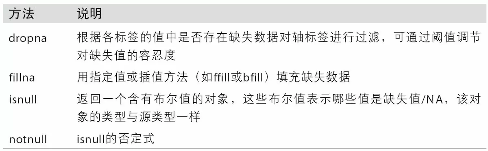
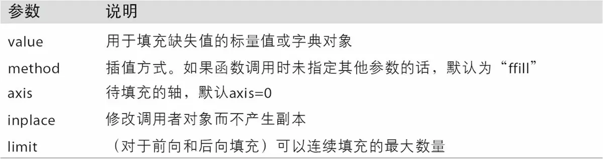

# 第7章 数据清洗与预处理

>   Data Cleaning and Preparation

数据分析和建模过程中，80%以上的时间花在了数据准备上：加载、清理、转换、重新排列。本章中，我们将学习使用Pandas和内置的Python语言功能来处理缺失值、重复值、字符串操作及其它分析数据的转换工具。

## 7.1 处理缺失值 

>Handling Missing Data

-   对于数值型数据，pandas中使用`NaN`（Not a Number）来表示缺失值。

-   缺失值还表示为`NA`（Not Available），NA数据是不存在或者是存在但不可观察的数据。

当清洗数据用于分析时，对缺失数据本身进行分析以确定数据收集问题、或数据丢失导致的数据偏差是非常重要的。


```python
string_data = pd.Series(['aardvark', 'artichoke', np.nan, 'avocado'])
print(string_data)
# 0     aardvark
# 1    artichoke
# 2          NaN
# 3      avocado
# dtype: object

print(string_data.isnull())
# 0    False
# 1    False
# 2     True
# 3    False
# dtype: bool

from numpy import nan as NA
string_data[0] = None
string_data[1] = NA
print(string_data)
# 0       None
# 1        NaN
# 2        NaN
# 3    avocado
# dtype: object

print(string_data.isnull())
# 0     True
# 1     True
# 2     True
# 3    False
# dtype: bool
```

pandas项目中还在不断优化内部细节以更好处理缺失数据，像用户API功能，例如`pandas.isnull`，去除了许多恼人的细节。表7-1列出了一些关于缺失数据处理的函数。



### 7.1.1 过滤缺失值 

>Filtering Out Missing Data

过滤缺失值非常有用的方法是：`dropna`，在Series上使用`dropna`它会返回Series中所有非空数据及其索引值：


```python
from numpy import nan as NA
data = pd.Series([1, NA, 3.5, NA, 7])
print(data)
# 0    1.0
# 1    NaN
# 2    3.5
# 3    NaN
# 4    7.0
# dtype: float64

print(data.dropna())
# 0    1.0
# 2    3.5
# 4    7.0
# dtype: float64

print(data)
# 0    1.0
# 1    NaN
# 2    3.5
# 3    NaN
# 4    7.0
# dtype: float64
```

等价于下面这个，利用布尔索引过滤


```python
print(data[data.notnull()] )
# 0    1.0
# 2    3.5
# 4    7.0
# dtype: float64
```

DataFrame对象


```python
data = pd.DataFrame([[1., 6.5, 3.], [1., NA, NA],
                     [NA, NA, NA], [NA, 6.5, 3.]])
print(data)
#      0    1    2
# 0  1.0  6.5  3.0
# 1  1.0  NaN  NaN
# 2  NaN  NaN  NaN
# 3  NaN  6.5  3.0
```

`data.dropna()`删除包含缺失值的行或列


```python
cleaned = data.dropna()
print(data)
#      0    1    2
# 0  1.0  6.5  3.0
# 1  1.0  NaN  NaN
# 2  NaN  NaN  NaN
# 3  NaN  6.5  3.0

print(cleaned)
#      0    1    2
# 0  1.0  6.5  3.0
```

`how='all'`，表示删除全部为缺失值的行


```python
print(data.dropna(how='all'))
#      0    1    2
# 0  1.0  6.5  3.0
# 1  1.0  NaN  NaN
# 3  NaN  6.5  3.0
```

如果想删除全为缺失值的列


```python
data[4] = NA
print(data)
#      0    1    2   4
# 0  1.0  6.5  3.0 NaN
# 1  1.0  NaN  NaN NaN
# 2  NaN  NaN  NaN NaN
# 3  NaN  6.5  3.0 NaN
```

传入参数`axis=1`


```python
print(data.dropna(axis=1, how='all'))
#      0    1    2
# 0  1.0  6.5  3.0
# 1  1.0  NaN  NaN
# 2  NaN  NaN  NaN
# 3  NaN  6.5  3.0
```

如果想删除包含两个缺失值以上的行


```python
df = pd.DataFrame(np.random.randn(7, 3))
df.iloc[:4, 1] = NA
df.iloc[:2, 2] = NA
print(df)
#           0         1         2
# 0  0.555233       NaN       NaN
# 1  0.593395       NaN       NaN
# 2  0.971324       NaN -1.031621
# 3  1.657651       NaN  1.412773
# 4 -1.384497 -0.816921  0.359179
# 5  1.363282  1.444028  1.083408
# 6  0.230826 -0.245138 -0.223949

print(df.dropna())
#           0         1         2
# 4  0.673434 -0.027491  0.407918
# 5  0.864850  0.305405  1.620457
# 6  0.179300 -0.879799  1.130826
```

可以设置`thresh=2`


```python
print(df.dropna(thresh=2))
#           0         1         2
# 2 -1.087820       NaN  0.111020
# 3  0.596102       NaN  1.027629
# 4  1.480743 -0.872469  1.274842
# 5 -0.979315 -2.796134  1.861241
# 6  0.104989  0.768166 -0.647448
```

### 7.1.2 补全缺失值 

>Filling In Missing Data

当数据中有缺失值时，使用前面所说的过滤方法，实际上是丢弃了那部分数据。但很多时候，数据是非常珍贵的，我们希望通过合理的补全，来使这部分数据可以正常使用。

我们使用`fillna`来补全缺失值


```python
print(df)
#           0         1         2
# 0  0.555233       NaN       NaN
# 1  0.593395       NaN       NaN
# 2  0.971324       NaN -1.031621
# 3  1.657651       NaN  1.412773
# 4 -1.384497 -0.816921  0.359179
# 5  1.363282  1.444028  1.083408
# 6  0.230826 -0.245138 -0.223949

print(df.fillna(0))
#           0         1         2
# 0 -1.069444  0.000000  0.000000
# 1 -0.611056  0.000000  0.000000
# 2 -1.745674  0.000000  0.734941
# 3  0.960710  0.000000 -0.611505
# 4 -0.346986 -0.804230 -0.592075
# 5 -0.336443 -0.569134  0.532421
# 6 -0.012545 -0.259031 -1.403206
```

填充缺失值是使用字典，可以指定不同的列用不同的值填充


```python
print(df.fillna({1: 0.5, 2: 0})
#           0         1         2
# 0 -1.435467  0.500000  0.000000
# 1  0.614075  0.500000  0.000000
# 2 -1.213754  0.500000  0.770273
# 3  0.848635  0.500000  1.145970
# 4 -0.068718  1.742044  0.690519
# 5  0.686296  1.977164  0.325795
# 6 -1.021679  0.941713 -0.592980
```

`fillna`返回的是一个新的对象，但你添加`inplace=True`后，可以修改已经存在的对象


```python
_ = df.fillna(0, inplace=True)
print(df)
#           0         1         2
# 0 -0.479438  1.771458 -1.335366
# 1  0.688816 -0.708115 -0.691940
# 2  0.650792 -0.433914 -0.912341
# 3 -0.007152 -0.951840 -0.920722
# 4 -0.207762  0.052605 -1.029004
# 5  1.573431  1.388614  0.677252
# 6  1.102031 -1.866005  0.544473
```

生成一个例子，可以使用`method`方法参数指定填充方法


```python
df = pd.DataFrame(np.random.randn(6, 3))
df.iloc[2:, 1] = NA
df.iloc[4:, 2] = NA
print(df)
#           0         1         2
# 0 -0.740805 -1.027584  1.014869
# 1  0.721189 -0.584009  1.114802
# 2 -0.430500       NaN  0.168589
# 3  0.128291       NaN -1.019269
# 4  0.928989       NaN       NaN
# 5  0.287597       NaN       NaN
```

`method='ffill'`，填充方法，这个默认是前项填充


```python
print(df.fillna(method='ffill'))
#           0         1         2
# 0  0.728779  0.677743  3.151209
# 1  1.228228  2.008259 -2.285046
# 2 -0.076851  2.008259 -0.094609
# 3 -1.117218  2.008259 -0.225676
# 4  0.366458  2.008259 -0.225676
# 5  0.775815  2.008259 -0.225676
```

参数`limit`，最大填充范围


```python
print(df.fillna(method='ffill', limit=2))
#           0         1         2
# 0 -0.469660 -0.929584  0.544379
# 1  0.691847 -1.209569  0.112304
# 2  0.549800 -1.209569 -0.157983
# 3  2.377427 -1.209569 -0.291457
# 4 -1.838440       NaN -0.291457
# 5  0.287897       NaN -0.291457
```

可以传入Series的平均值，保证填充前后均值不改变。

```python
data = pd.Series([1., NA, 3.5, NA, 7])
print(data)
# 0    1.0
# 1    NaN
# 2    3.5
# 3    NaN
# 4    7.0
# dtype: float64
print(data.fillna(data.mean()))
# 0    1.000000
# 1    3.833333
# 2    3.500000
# 3    3.833333
# 4    7.000000
# dtype: float64
```

表7-2列出了fillna的参考：



## 7.2 数据转换 

>   Data Transformation

由于各种原因，DataFrame中会出现重复行，我们可以使用duplicated方法返回一个布尔值Series，确定哪些是重复行；若想直接删除重复行，则使用drop_duplicates,返回的是数组中为FALSE的部分

### 7.2.1 删除重复值 

>   Removing Duplicates

由于各种原因，DataFrame会出现重复行


```python
data = pd.DataFrame({'k1': ['one', 'two'] * 3 + ['two'],
                     'k2': [1, 1, 2, 3, 3, 4, 4]})
print(data)
#     k1  k2
# 0  one   1
# 1  two   1
# 2  one   2
# 3  two   3
# 4  one   3
# 5  two   4
# 6  two   4
```

判断该行之前是否出现过


```python
print(data.duplicated())
# 0    False
# 1    False
# 2    False
# 3    False
# 4    False
# 5    False
# 6     True
# dtype: bool
```

删除重复的行


```python
print(data.drop_duplicates())
#     k1  k2
# 0  one   1
# 1  two   1
# 2  one   2
# 3  two   3
# 4  one   3
# 5  two   4
```

对于某列的重复值


```python
data['v1'] = range(7)
print(data)
#     k1  k2  v1
# 0  one   1   0
# 1  two   1   1
# 2  one   2   2
# 3  two   3   3
# 4  one   3   4
# 5  two   4   5
# 6  two   4   6
```

可以指定列名


```python
print(data.drop_duplicates(['k1']))
#     k1  k2  v1
# 0  one   1   0
# 1  two   1   1
```

默认重复的值，默认保留第一个检测到的，传入` keep='last'`，将会返回后一个


```python
print(data.drop_duplicates(['k2'], keep='last'))
#     k1  k2  v1
# 1  two   1   1
# 2  one   2   2
# 4  one   3   4
# 6  two   4   6
```

### 7.2.2 使用函数或映射进行数据转换 

>   Transforming Data Using a Function or Mapping

以下是收集到的一些水果数据，包含水果名称（fruits）和水果重量盎司（ounces）,我们希望添加一列（color），用于表明每种水果对应的颜色：


```python
data = pd.DataFrame({'food': ['bacon', 'pulled pork', 'bacon',
                              'Pastrami', 'corned beef', 'Bacon',
                              'pastrami', 'honey ham', 'nova lox'],
                     'ounces': [4, 3, 12, 6, 7.5, 8, 3, 5, 6]})
print(data)
#           food  ounces
# 0        bacon     4.0
# 1  pulled pork     3.0
# 2        bacon    12.0
# 3     Pastrami     6.0
# 4  corned beef     7.5
# 5        Bacon     8.0
# 6     pastrami     3.0
# 7    honey ham     5.0
# 8     nova lox     6.0
```

想要对食品中肉的种类做个标签


```python
meat_to_animal = {
  'bacon': 'pig',
  'pulled pork': 'pig',
  'pastrami': 'cow',
  'corned beef': 'cow',
  'honey ham': 'pig',
  'nova lox': 'salmon'
}
```

首先将字母统一为小写


```python
lowercased = data['food'].str.lower()
print(lowercased)
# 0          bacon
# 1    pulled pork
# 2          bacon
# 3       pastrami
# 4    corned beef
# 5          bacon
# 6       pastrami
# 7      honey ham
# 8       nova lox
# Name: food, dtype: object
```

`.map()`，按照字典的指定进行匹配


```python
data['animal'] = lowercased.map(meat_to_animal)
print(data)
#           food  ounces  animal
# 0        bacon     4.0     pig
# 1  pulled pork     3.0     pig
# 2        bacon    12.0     pig
# 3     Pastrami     6.0     cow
# 4  corned beef     7.5     cow
# 5        Bacon     8.0     pig
# 6     pastrami     3.0     cow
# 7    honey ham     5.0     pig
# 8     nova lox     6.0  salmon
```

也可以写成下面这种形式


```python
print(data['food'].map(lambda x: meat_to_animal[x.lower()]))
# 0       pig
# 1       pig
# 2       pig
# 3       cow
# 4       cow
# 5       pig
# 6       cow
# 7       pig
# 8    salmon
# Name: food, dtype: object

data['animal']= data['food'].map(lambda x: meat_dict[x.lower()])
# 把匹配出来的结果，加入data新建的animal这列
print(data)
#           food  ounces  animal
# 0        bacon     4.0     pig
# 1  pulled pork     3.0     pig
# 2        bacon    12.0     pig
# 3     Pastrami     6.0     cow
# 4  corned beef     7.5     cow
# 5        Bacon     8.0     pig
# 6     pastrami     3.0     cow
# 7    honey ham     5.0     pig
# 8     nova lox     6.0  salmon
```

给两个例子解释下`lambda`的用法

```python
print(data['food'].map(lambda x: print(x)))
# bacon
# pulled pork
# bacon
# Pastrami
# corned beef
# Bacon
# pastrami
# honey ham
# nova lox
# 0    None
# 1    None
# 2    None
# 3    None
# 4    None
# 5    None
# 6    None
# 7    None
# 8    None
# Name: food, dtype: object

print(meat_to_animal['bacon'])
# pig
```

### 7.2.3 替代值 

>Replacing Values

`replace`也可以用于替换


```python
data = pd.Series([1., -999., 2., -999., -1000., 3.])
print(data)
# 0       1.0
# 1    -999.0
# 2       2.0
# 3    -999.0
# 4   -1000.0
# 5       3.0
# dtype: float64
```

-999很可能是缺失值的标识


```python
print(data.replace(-999, np.nan))
# 0       1.0
# 1       NaN
# 2       2.0
# 3       NaN
# 4   -1000.0
# 5       3.0
# dtype: float64
```

一次替代多个值


```python
print(data.replace([-999, -1000], np.nan))
# 0    1.0
# 1    NaN
# 2    2.0
# 3    NaN
# 4    NaN
# 5    3.0
# dtype: float64
```

替换为不同的值，用列表


```python
print(data.replace([-999, -1000], [np.nan, 0]))
# 0    1.0
# 1    NaN
# 2    2.0
# 3    NaN
# 4    0.0
# 5    3.0
# dtype: float64
```

或者用字典的形式传递参数


```python
print(data.replace({-999: np.nan, -1000: 0}))
# 0    1.0
# 1    NaN
# 2    2.0
# 3    NaN
# 4    0.0
# 5    3.0
# dtype: float64
```

### 7.2.4 重命名轴索引 

> Renaming Axis Indexes


```python
data = pd.DataFrame(np.arange(12).reshape((3, 4)),
                    index=['Ohio', 'Colorado', 'New York'],
                    columns=['one', 'two', 'three', 'four'])
print(data)
#           one  two  three  four
# Ohio        0    1      2     3
# Colorado    4    5      6     7
# New York    8    9     10    11
```

先定义一个匿名函数，取出前四个字母，全大写


```python
transform = lambda x: x[:4].upper()
print(transform)
# <function <lambda> at 0x000001D6FFDCB288>
```

`data`的`index`属性中取出前四个，并执行`upper`函数


```python
print(data.index.map(transform))
# Index(['OHIO', 'COLO', 'NEW '], dtype='object')
```

让原来的`index`，等于转为大写处理之后的，可以看到`index`被替换掉了


```python
data.index = data.index.map(transform)
print(data)
#       one  two  three  four
# OHIO    0    1      2     3
# COLO    4    5      6     7
# NEW     8    9     10    11
```

或者使用`rename`方法


```python
print(data.rename(index=str.title, columns=str.upper))
#       ONE  TWO  THREE  FOUR
# Ohio    0    1      2     3
# Colo    4    5      6     7
# New     8    9     10    11
```

可以用字典指定，替换方案


```python
print(data.rename(index={'OHIO': 'INDIANA'},
            columns={'three': 'peekaboo'}))
#          one  two  peekaboo  four
# INDIANA    0    1         2     3
# COLO       4    5         6     7
# NEW        8    9        10    11
```

想要改变原有变量，传入参数`inplace=True`


```python
data.rename(index={'OHIO': 'INDIANA'}, inplace=True)
print(data)
#          one  two  three  four
# INDIANA    0    1      2     3
# COLO       4    5      6     7
# NEW        8    9     10    11
```

### 7.2.5 离散化和分箱 

>Discretization and Binning、

连续值经常需要离散化，或者分离成“箱子”进行分析。假如下面有一组人群年龄数据，你想将其进行分组，放入分散的年龄框中：

也就是分组


```python
ages = [20, 22, 25, 27, 21, 23, 37, 31, 61, 45, 41, 32]
```

分为18\~25，26\~35，36\~60，61~100


```python
bins = [18, 25, 35, 60, 100]
```

 `pd.cut(ages, bins)`进行分组，返回的对象是一个特殊的对象。


```python
cats = pd.cut(ages, bins)
print(cats)
# [(18, 25], (18, 25], (18, 25], (25, 35], (18, 25], ..., (25, 35], (60, 100], (35, 60], (35, 60], (25, 35]]
# Length: 12
# Categories (4, interval[int64]): [(18, 25] < (25, 35] < (35, 60] < (60, 100]]

```

查看里面的属性，12个数字对应分组标签，如20为（18~25]，属于第0类


```python
print(cats.codes)
# array([0, 0, 0, 1, 0, 0, 2, 1, 3, 2, 2, 1], dtype=int8)
```

相当于x轴


```python
print(cats.categories)
# IntervalIndex([(18, 25], (25, 35], (35, 60], (60, 100]],
#               closed='right',
#               dtype='interval[int64]')
```

统计一下每个里面的个数


```python
print(pd.value_counts(cats))
# (18, 25]     5
# (35, 60]     3
# (25, 35]     3
# (60, 100]    1
# dtype: int64
```

上面的开区间与闭区间可以自己设置，传入`right=False`可以变为左闭右开区间


```python
print(pd.cut(ages, [18, 26, 36, 61, 100], right=False))
# [[18, 26), [18, 26), [18, 26), [26, 36), [18, 26), ..., [26, 36), [61, 100), [36, 61), [36, 61), [26, 36)]
# Length: 12
# Categories (4, interval[int64]): [[18, 26) < [26, 36) < [36, 61) < [61, 100)]
```

可以给分类价格名称


```python
group_names = ['Youth', 'YoungAdult', 'MiddleAged', 'Senior']
print(pd.cut(ages, bins, labels=group_names))
# [Youth, Youth, Youth, YoungAdult, Youth, ..., YoungAdult, Senior, MiddleAged, MiddleAged, YoungAdult]
# Length: 12
# Categories (4, object): [Youth < YoungAdult < MiddleAged < Senior]
```

数据均匀分成四份，使用`cut`函数


```python
data = np.random.rand(20)
print(data)
# array([0.9296, 0.3164, 0.1839, 0.2046, 0.5677, 0.5955, 0.9645, 0.6532,
#        0.7489, 0.6536, 0.7477, 0.9613, 0.0084, 0.1064, 0.2987, 0.6564,
#        0.8098, 0.8722, 0.9646, 0.7237])
```

 `precision=2`将十进制精度限制为两位


```python
print(pd.cut(data, 4, precision=2))
# [(0.73, 0.96], (0.25, 0.49], (0.0074, 0.25], (0.0074, 0.25], (0.49, 0.73], ..., (0.49, 0.73], (0.73, 0.96], (0.73, 0.96], (0.73, 0.96], (0.49, 0.73]]
# Length: 20
# Categories (4, interval[float64]): [(0.0074, 0.25] < (0.25, 0.49] < (0.49, 0.73] < (0.73, 0.96]]
```

`qcut`基于样本的分位数分割


```python
data = np.random.randn(1000)  # Normally distributed
cats = pd.qcut(data, 4)  # Cut into quartiles
print(cats)
# [(0.00814, 0.697], (0.00814, 0.697], (-3.21, -0.725], (0.00814, 0.697], (-3.21, -0.725], ..., (-3.21, -0.725], (0.697, 3.0], (0.00814, 0.697], (-0.725, 0.00814], (-3.21, -0.725]]
# Length: 1000
# Categories (4, interval[float64]): [(-3.21, -0.725] < (-0.725, 0.00814] < (0.00814, 0.697] < (0.697, 3.0]]
```

每个范围都是250个


```python
print(pd.value_counts(cats))
# (0.697, 3.0]         250
# (0.00814, 0.697]     250
# (-0.725, 0.00814]    250
# (-3.21, -0.725]      250
# dtype: int64
```

可以传入自定义分位数，0-1之间的数组


```python
cats = pd.qcut(data, [0, 0.1, 0.5, 0.9, 1.])
print(cats)
# [(1.297, 3.928], (-0.0171, 1.297], (-2.9499999999999997, -1.191], (-1.191, -0.0171], (1.297, 3.928], ..., (-0.0171, 1.297], (-0.0171, 1.297], (-1.191, -0.0171], (-1.191, -0.0171], (-0.0171, 1.297]]
# Length: 1000
# Categories (4, interval[float64]): [(-2.9499999999999997, -1.191] < (-1.191, -0.0171] < (-0.0171, 1.297] < (1.297, 3.928]]

print(pd.value_counts(cats))
# (-0.0171, 1.297]                 400
# (-1.191, -0.0171]                400
# (1.297, 3.928]                   100
# (-2.9499999999999997, -1.191]    100
# dtype: int64
```

### 7.2.6 检测和过滤异常值 

>   Detecting and Filtering Outliers

下面是一个具有正态分布数据的DataFrame


```python
data = pd.DataFrame(np.random.randn(1000, 4))
print(data.describe())
#                 0            1            2            3
# count  1000.000000  1000.000000  1000.000000  1000.000000
# mean     -0.026883    -0.008331     0.036879     0.030145
# std       0.969823     1.044672     1.017422     1.015334
# min      -2.823901    -3.362794    -4.042259    -2.862948
# 25%      -0.643226    -0.642422    -0.660736    -0.660164
# 50%      -0.009039    -0.039806     0.020828     0.016794
# 75%       0.626912     0.697722     0.701445     0.720497
# max       3.199873     3.412104     3.553789     3.267733
```

假设想找出一列中绝对值大于三的值


```python
col = data[2]
print(col[np.abs(col) > 3])
# 269   -3.428254
# 646    3.366626
# Name: 2, dtype: float64
```

**==选出所有绝对值大于3的，使用`any`方法，`any`方法表示，一行内，只要有一列数为`True`则保留该行。==**


```python
print(data[(np.abs(data) > 3).any(1)])
#             0         1         2         3
# 25   0.642770 -3.339955 -1.317222  0.129158
# 44  -1.378123 -3.277597  0.359940 -0.932616
# 73  -0.248558  0.621955  1.083408  3.267733
# 97   1.642060  0.066999  3.155829 -0.614554
# 109 -1.023252 -1.357087 -4.042259 -0.153079
# 149  0.630418  3.302422  0.683067 -1.256679
# 158  3.199873  1.243108 -0.119834 -2.356270
# 316  1.045984 -1.436378  3.429640  0.531472
# 490  0.038765 -3.059514 -0.730386  0.238367
# 560  0.848216 -3.362794 -0.904850 -1.141918
# 572  1.040190 -0.117611  3.553789 -0.438868
# 576  0.625201 -0.424043  3.081766  1.285774
# 594  0.274939  3.412104  0.630544 -0.203348
# 785 -0.089325 -0.918945  0.356589  3.006395
# 808 -0.920506  0.619020  3.317481 -0.064973
```

首先，变为-3或者3

利用`np.sign(data)`，把绝对值大于`3`的数变为`±1`（正为`+1`，负为`-1`），让`±1*3=±3`。


```python
data[np.abs(data) > 3] = np.sign(data) * 3
print(data.describe())
#                  0            1            2            3
# count  1000.000000  1000.000000  1000.000000  1000.000000
# mean     -0.027083    -0.008005     0.036383     0.029870
# std       0.969178     1.039336     1.008946     1.014495
# min      -2.823901    -3.000000    -3.000000    -2.862948
# 25%      -0.643226    -0.642422    -0.660736    -0.660164
# 50%      -0.009039    -0.039806     0.020828     0.016794
# 75%       0.626912     0.697722     0.701445     0.720497
# max       3.000000     3.000000     3.000000     3.000000
```

`np.sign(data)`为取每个元素的`±`，正的取`+`，负的取`-`。


```python
print(np.sign(data).head())
#      0    1    2    3
# 0 -1.0 -1.0 -1.0  1.0
# 1  1.0  1.0 -1.0 -1.0
# 2  1.0 -1.0 -1.0 -1.0
# 3  1.0 -1.0  1.0 -1.0
# 4 -1.0  1.0  1.0  1.0
```

### 7.2.7 置换和随机抽样 

>Permutation and Random Sampling

使用`numpy.random.permutation`对DataFrame或Series中的行进行随机排序是非常方便的


```python
df = pd.DataFrame(np.arange(5 * 4).reshape((5, 4)))
print(df)
#     0   1   2   3
# 0   0   1   2   3
# 1   4   5   6   7
# 2   8   9  10  11
# 3  12  13  14  15
# 4  16  17  18  19
```

生成一个长度为5的随机数数组


```python
sampler = np.random.permutation(5)
print(sampler)
# [4 0 3 2 1]
```

`take`函数，按索引排序


```python
print(df.take(sampler))
#     0   1   2   3
# 4  16  17  18  19
# 0   0   1   2   3
# 3  12  13  14  15
# 2   8   9  10  11
# 1   4   5   6   7
```

生成一个随机样本（n=3表示3行），不可重复，即在`df`上生成一个属于`df`的子集。


```python
print(df.sample(n=3))
#     0   1   2   3
# 3  12  13  14  15
# 2   8   9  10  11
# 0   0   1   2   3
```

随机抽样，可重复的话`replace=True`


```python
choices = pd.Series([5, 7, -1, 6, 4])
print(choices)
# 0    5
# 1    7
# 2   -1
# 3    6
# 4    4
# dtype: int64

draws = choices.sample(n=10, replace=True)
print(draws)
# 2   -1
# 1    7
# 3    6
# 3    6
# 1    7
# 4    4
# 4    4
# 4    4
# 2   -1
# 0    5
# dtype: int64
```

### 7.2.8 计算指标/虚拟变量 

>   Computing Indicator/Dummy Variables

将分类变量转化为“虚拟”或“指标”矩阵是另一种用于统计建模或机器学习的操作。

如果DataFrame中的某一列有k个不同的值，则可以衍生一个k列的值为0和1的矩阵或DataFrame，这可以用Pandas中的`get_dummies`函数实现：


```python
df = pd.DataFrame({'key': ['b', 'b', 'a', 'c', 'a', 'b'],
                   'data1': range(6)})
print(df)
#   key  data1
# 0   b      0
# 1   b      1
# 2   a      2
# 3   c      3
# 4   a      4
# 5   b      5
```

这abc变成三列，用1标记


```python
print(pd.get_dummies(df['key']))
#    a  b  c
# 0  0  1  0
# 1  0  1  0
# 2  1  0  0
# 3  0  0  1
# 4  1  0  0
# 5  0  1  0
```

列上面加上前缀`key`

某些情况下你可能会想在指标DataFrame列上加上前缀，以表明该列名是属于原DataFrame中的哪一列，`get_dummies`中有一个前缀参数`prefix`用于实现该功能：


```python
dummies = pd.get_dummies(df['key'], prefix='key')
print(dummies)
#    key_a  key_b  key_c
# 0      0      1      0
# 1      0      1      0
# 2      1      0      0
# 3      0      0      1
# 4      1      0      0
# 5      0      1      0
```

与其他类合并


```python
df_with_dummy = df[['data1']].join(dummies)
print(df_with_dummy)
#    data1  key_a  key_b  key_c
# 0      0      0      1      0
# 1      1      0      1      0
# 2      2      1      0      0
# 3      3      0      0      1
# 4      4      1      0      0
# 5      5      0      1      0
```

如果一行属于多个类别


```python
mnames = ['movie_id', 'title', 'genres']
movies = pd.read_table('datasets/movielens/movies.dat', sep='::',
                       header=None, names=mnames)
print(movies[:10])
#    movie_id                               title                        genres
# 0         1                    Toy Story (1995)   Animation|Children's|Comedy
# 1         2                      Jumanji (1995)  Adventure|Children's|Fantasy
# 2         3             Grumpier Old Men (1995)                Comedy|Romance
# 3         4            Waiting to Exhale (1995)                  Comedy|Drama
# 4         5  Father of the Bride Part II (1995)                        Comedy
# 5         6                         Heat (1995)         Action|Crime|Thriller
# 6         7                      Sabrina (1995)                Comedy|Romance
# 7         8                 Tom and Huck (1995)          Adventure|Children's
# 8         9                 Sudden Death (1995)                        Action
# 9        10                    GoldenEye (1995)     Action|Adventure|Thriller


all_genres = []
for x in movies.genres:
    # 列表加入列表
    all_genres.extend(x.split('|'))
   
genres = pd.unique(all_genres) # 取唯一值
print(genres)
# ['Animation' "Children's" 'Comedy' 'Adventure' 'Fantasy' 'Romance' 'Drama'
#  'Action' 'Crime' 'Thriller' 'Horror' 'Sci-Fi' 'Documentary' 'War'
#  'Musical' 'Mystery' 'Film-Noir' 'Western']

print(movies.genres[0])
# Animation|Children's|Comedy

print(movies.genres[0].split('|'))
# ['Animation', "Children's", 'Comedy']
```

生成行数等于movies，列数等于电影类别的全为0的数组


```python
zero_matrix = np.zeros((len(movies), len(genres)))
print(zero_matrix)
# [[0. 0. 0. ... 0. 0. 0.]
#  [0. 0. 0. ... 0. 0. 0.]
#  [0. 0. 0. ... 0. 0. 0.]
#  ...
#  [0. 0. 0. ... 0. 0. 0.]
#  [0. 0. 0. ... 0. 0. 0.]
#  [0. 0. 0. ... 0. 0. 0.]]
```

使用刚才整理出的电影类别，作为列，数组作为值，生成DataFrame


```python
dummies = pd.DataFrame(zero_matrix, columns=genres)
print(dummies)
#       Animation  Children's  Comedy  ...  Mystery  Film-Noir  Western
# 0           0.0         0.0     0.0  ...      0.0        0.0      0.0
# 1           0.0         0.0     0.0  ...      0.0        0.0      0.0
# 2           0.0         0.0     0.0  ...      0.0        0.0      0.0
# 3           0.0         0.0     0.0  ...      0.0        0.0      0.0
# 4           0.0         0.0     0.0  ...      0.0        0.0      0.0
# ...         ...         ...     ...  ...      ...        ...      ...
# 3878        0.0         0.0     0.0  ...      0.0        0.0      0.0
# 3879        0.0         0.0     0.0  ...      0.0        0.0      0.0
# 3880        0.0         0.0     0.0  ...      0.0        0.0      0.0
# 3881        0.0         0.0     0.0  ...      0.0        0.0      0.0
# 3882        0.0         0.0     0.0  ...      0.0        0.0      0.0
```

在这张表中，我们统计，每一行对应的类别

如果属于该类别，就标记为1，如果不属于，则标记为0


```python
gen = movies.genres[0]
print(gen)
# Animation|Children's|Comedy

print(gen.split('|'))
# ['Animation', "Children's", 'Comedy']
```

找到这三个值对应的列序号


```python
print(dummies.columns.get_indexer(gen.split('|')))
```

列序号找到了，就能确定元素的位置

让该位置元素值为1


```python
print(type(movies.genres))
# [0 1 2]
```


```python
for i, gen in enumerate(movies.genres):
    indices = dummies.columns.get_indexer(gen.split('|'))
    dummies.iloc[i, indices] = 1
print(dummies)
#       Animation  Children's  Comedy  ...  Mystery  Film-Noir  Western
# 0           1.0         1.0     1.0  ...      0.0        0.0      0.0
# 1           0.0         1.0     0.0  ...      0.0        0.0      0.0
# 2           0.0         0.0     1.0  ...      0.0        0.0      0.0
# 3           0.0         0.0     1.0  ...      0.0        0.0      0.0
# 4           0.0         0.0     1.0  ...      0.0        0.0      0.0
# ...         ...         ...     ...  ...      ...        ...      ...
# 3878        0.0         0.0     1.0  ...      0.0        0.0      0.0
# 3879        0.0         0.0     0.0  ...      0.0        0.0      0.0
# 3880        0.0         0.0     0.0  ...      0.0        0.0      0.0
# 3881        0.0         0.0     0.0  ...      0.0        0.0      0.0
# 3882        0.0         0.0     0.0  ...      0.0        0.0      0.0
# 
# [3883 rows x 18 columns]
```

把标记好的列加入到原来的列中


```python
movies_windic = movies.join(dummies.add_prefix('Genre_'))
print(movies_windic)
#       movie_id  ... Genre_Western
# 0            1  ...           0.0
# 1            2  ...           0.0
# 2            3  ...           0.0
# 3            4  ...           0.0
# 4            5  ...           0.0
# ...        ...  ...           ...
# 3878      3948  ...           0.0
# 3879      3949  ...           0.0
# 3880      3950  ...           0.0
# 3881      3951  ...           0.0
# 3882      3952  ...           0.0
# 
# [3883 rows x 21 columns]
```

查看第0行


```python
print(movies_windic.iloc[0])
# movie_id                                       1
# title                           Toy Story (1995)
# genres               Animation|Children's|Comedy
# Genre_Animation                                1
# Genre_Children's                               1
# Genre_Comedy                                   1
# Genre_Adventure                                0
# Genre_Fantasy                                  0
# Genre_Romance                                  0
# Genre_Drama                                    0
# Genre_Action                                   0
# Genre_Crime                                    0
# Genre_Thriller                                 0
# Genre_Horror                                   0
# Genre_Sci-Fi                                   0
# Genre_Documentary                              0
# Genre_War                                      0
# Genre_Musical                                  0
# Genre_Mystery                                  0
# Genre_Film-Noir                                0
# Genre_Western                                  0
# Name: 0, dtype: object

```

也可以将get_dummies与cut结合使用


```python
np.random.seed(12345)
values = np.random.rand(10)
print(values)
# [0.92961609 0.31637555 0.18391881 0.20456028 0.56772503 0.5955447
#  0.96451452 0.6531771  0.74890664 0.65356987]
bins = [0, 0.2, 0.4, 0.6, 0.8, 1]
print(pd.get_dummies(pd.cut(values, bins)))
#    (0.0, 0.2]  (0.2, 0.4]  (0.4, 0.6]  (0.6, 0.8]  (0.8, 1.0]
# 0           0           0           0           0           1
# 1           0           1           0           0           0
# 2           1           0           0           0           0
# 3           0           1           0           0           0
# 4           0           0           1           0           0
# 5           0           0           1           0           0
# 6           0           0           0           0           1
# 7           0           0           0           1           0
# 8           0           0           0           1           0
# 9           0           0           0           1           0
```

## 7.3 字符串操作 

>String Manipulation

字符串对象的内建方法已经使得大部分文本操作非常简单，但是对于更为复杂的模式匹配和文本操作，我们可能需要用到正则表达式

### 7.3.1 字符串对象方法 

>String Object Methods

拆分


```python
val = 'a,b,  guido'
print(val.split(','))
# ['a', 'b', '  guido']
```

常常和`strip`一起使用，用于清除空格


```python
pieces = [x.strip() for x in val.split(',')]
print(pieces)
# ['a', 'b', 'guido']
```

加号合并字符串


```python
first, second, third = pieces
print(first + '::' + second + '::' + third)
# a::b::guido
```

`join`方法合并字符串


```python
print('::'.join(pieces))
# a::b::guido
```

判断


```python
print(val)
# a,b,  guido

print('guido' in val).
# True
```

获取索引


```python
# val.index(',')
print(val.index('b'))
# 2
```

获取索引


```python
print(val.find('p'))
# -1
```

与`index`的区别是，如果该字符不存在，`index`会抛出一个异常，find会返回-1


```python
print(val.index(':'))
```


计数


```python
print(val.count(','))
# 2
```

替换


```python
print(val.replace(',', '::'))
# a::b::  guido

print(val.replace(',', ''))
# ab  guido
```

### 7.3.2 正则表达式 

>Regular Expressions

在最开始的时候讲的非常详细了，这里就过一下

### 7.3.3 向量化字符串函数 

>Vectorized String Functions in pandas

清理杂乱的数据集用于分析通常需要大量的字符串处理和正则化，有时包含字符串的列还会出现缺失数据，使情况变得复杂：


```python
data = {'Dave': 'dave@google.com', 'Steve': 'steve@gmail.com',
        'Rob': 'rob@gmail.com', 'Wes': np.nan}
data = pd.Series(data)
print(data)
# Dave     dave@google.com
# Steve    steve@gmail.com
# Rob        rob@gmail.com
# Wes                  NaN
# dtype: object
```

Series的`str`属性，可以跳过`NA`值

通过`str.contains`可以检查字符串中是否含有某个字符，如下面判断字符串是否含有gmail


```python
print(data.str.contains('gmail'))
# Dave     False
# Steve     True
# Rob       True
# Wes        NaN
# dtype: object
```

可以使用正则表达式的规则


```python
pattern = r'([A-Z0-9._%+-]+)@([A-Z0-9.-]+)\.([A-Z]{2,4})'
print(data.str.findall(pattern, flags=re.IGNORECASE))
# Dave     [(dave, google, com)]
# Steve    [(steve, gmail, com)]
# Rob        [(rob, gmail, com)]
# Wes                        NaN
# dtype: object

matches = data.str.match(pattern, flags=re.IGNORECASE)
print(matches)
# Dave     True
# Steve    True
# Rob      True
# Wes       NaN
# dtype: object
```

判断后的结果，对对象按索引进行查找


```python
print(data.str.get(1))
# Dave       a
# Steve      t
# Rob        o
# Wes      NaN
# dtype: object
```

布尔值取不到索引值，所以结果为NaN

```python
print(matches)
# Dave     True
# Steve    True
# Rob      True
# Wes       NaN
# dtype: object

print(matches.str[0])
# Dave    NaN
# Steve   NaN
# Rob     NaN
# Wes     NaN
# dtype: float64
```

切片


```python
print(data.str[:5])
# Dave     dave@
# Steve    steve
# Rob      rob@g
# Wes        NaN
# dtype: object
```


```python
pd.options.display.max_rows = PREVIOUS_MAX_ROWS
```

第七章完结！！！！
