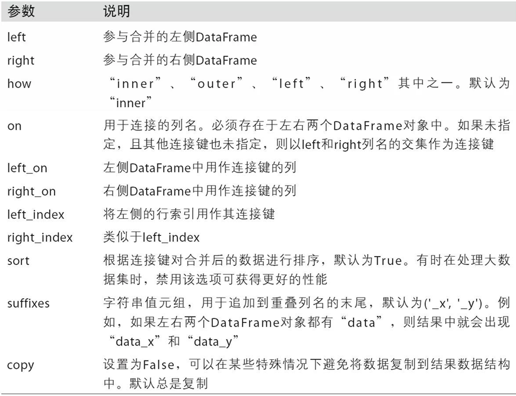
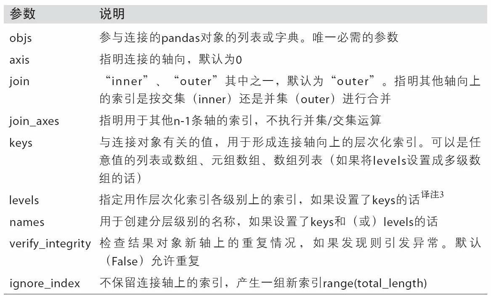

# 第8章 数据规整：连接、联合与重塑 

>   Data Wrangling: Join, Combine

## 8.1 分层索引 

>   Hierarchical Indexing

分层索引是Pandas的重要特性，允许你在一个轴上拥有多个索引层级。笼统的说，分层索引提供了一种在更低维度形式中处理更高维度数据的方式。例子如下：

九个数，三个a，两个b，两个c，两个d

a里面有三个，编号为123

b里面有两个，编号为13

好吧


```python
data = pd.Series(np.random.randn(9),
                 index=[['a', 'a', 'a', 'b', 'b', 'c', 'c', 'd', 'd'],
                        [1, 2, 3, 1, 3, 1, 2, 2, 3]])
print(data)
# a  1    1.331587
#    2    0.715279
#    3   -1.545400
# b  1   -0.008384
#    3    0.621336
# c  1   -0.720086
#    2    0.265512
# d  2    0.108549
#    3    0.004291
# dtype: float64
```

查看数据的索引，返回MultiIndex

里面使用索引来标注一行的索引是什么


```python
print(data.index)
# MultiIndex(levels=[['a', 'b', 'c', 'd'], [1, 2, 3]],
#            codes=[[0, 0, 0, 1, 1, 2, 2, 3, 3], [0, 1, 2, 0, 2, 0, 1, 1, 2]])
```

查看，通过分层索引，你可以简洁的选出对象的子集：


```python
print(data['b'])
# 1   -0.008384
# 3    0.621336
# dtype: float64

print(data['b':'c'])
# b  1   -0.008384
#    3    0.621336
# c  1   -0.720086
#    2    0.265512
# dtype: float64

print(data.loc[['b', 'd']])
# b  1   -0.008384
#    3    0.621336
# d  2    0.108549
#    3    0.004291
# dtype: float64
```

所有的内层行索引为`2`的元素


```python
print(data.loc[:, 2])
# a    0.715279
# c    0.265512
# d    0.108549
# dtype: float64
```

分层索引在数据重塑和数组透视表等分组操作中扮演了重要的角色。例如：使用`unstack`可以将数据在DataFrame中重新排列，`unstack`的反操作是`stack `


```python
print(data.unstack())
#           1         2         3
# a  1.331587  0.715279 -1.545400
# b -0.008384       NaN  0.621336
# c -0.720086  0.265512       NaN
# d       NaN  0.108549  0.004291

print(data.unstack(fill_value = 0))
#           1         2         3
# a  1.331587  0.715279 -1.545400
# b -0.008384  0.000000  0.621336
# c -0.720086  0.265512  0.000000
# d  0.000000  0.108549  0.004291
```

反操作


```python
print(data.unstack().stack())
# a  1    1.331587
#    2    0.715279
#    3   -1.545400
# b  1   -0.008384
#    3    0.621336
# c  1   -0.720086
#    2    0.265512
# d  2    0.108549
#    3    0.004291
# dtype: float64
```

分层索引同样适用于DataFrame中，而且DataFrame的每个轴都可以拥有分层索引：


```python
frame = pd.DataFrame(np.arange(12).reshape((4, 3)),
                     index=[['a', 'a', 'b', 'b'], [1, 2, 1, 2]],
                     columns=[['Ohio', 'Ohio', 'Colorado'],
                              ['Green', 'Red', 'Green']])
print(frame)
#      Ohio     Colorado
#     Green Red    Green
# a 1     0   1        2
#   2     3   4        5
# b 1     6   7        8
#   2     9  10       11
```

还可以为每个层级的索引设置名称：


```python
frame.index.names = ['key1', 'key2']
frame.columns.names = ['state', 'color']
print(frame)
# state      Ohio     Colorado
# color     Green Red    Green
# key1 key2                   
# a    1        0   1        2
#      2        3   4        5
# b    1        6   7        8
#      2        9  10       11
```

查看


```python
print(frame['Ohio'])
# color      Green  Red
# key1 key2            
# a    1         0    1
#      2         3    4
# b    1         6    7
#      2         9   10
```

### 8.1.1 重排序与层级排序 

>Reordering and Sorting Levels

`swaplevel`接受两个层级序号或层级名称，返回一个进行了层级变更的对象。

说人话，也就是交叉分类，分类次序调整，以前是先`key1`，后`key2`，现在变成先`key2`，后`key1`。


```python
print(frame.swaplevel('key1', 'key2'))
# key2 key1                   
# 1    a        0   1        2
# 2    a        3   4        5
# 1    b        6   7        8
# 2    b        9  10       11
```

`sort_index`，按哪一层排序


```python
print(frame.sort_index(level=0)) # 按key1排序
# state      Ohio     Colorado
# color     Green Red    Green
# key1 key2                   
# a    1        0   1        2
#      2        3   4        5
# b    1        6   7        8
#      2        9  10       11

print(frame.sort_index(level=1)) # 按key2排序
# state      Ohio     Colorado
# color     Green Red    Green
# key1 key2                   
# a    1        0   1        2
# b    1        6   7        8
# a    2        3   4        5
# b    2        9  10       11
```

交换分类层级，且按交换后的1层（a与b）排序


```python
print(frame.swaplevel(0, 1).sort_index(level=1))
# state      Ohio     Colorado
# color     Green Red    Green
# key2 key1                   
# 1    a        0   1        2
# 2    a        3   4        5
# 1    b        6   7        8
# 2    b        9  10       11
```

### 8.1.2 按层级进行汇总统计 

>Summary Statistics by Level

在特定轴上进行聚合


```python
print(frame.sum(level='key2'))
# state  Ohio     Colorado
# color Green Red    Green
# key2                    
# 1         6   8       10
# 2        12  14       16
```

可以选择横轴留下什么，我们横轴有两个分类，一个是`state`，一个是`color`


```python
print(frame.sum(level='color', axis=1))
# color      Green  Red
# key1 key2            
# a    1         2    1
#      2         8    4
# b    1        14    7
#      2        20   10

print(frame.sum(level='state', axis=1))
# state      Ohio  Colorado
# key1 key2
# a    1        1         2
#      2        7         5
# b    1       13         8
#      2       19        11
```

### 8.1.3 使用DataFrame的列进行索引 

>   Indexing with a DataFrame's columns

看一下这个例子


```python
frame = pd.DataFrame({'a': range(7), 'b': range(7, 0, -1),
                      'c': ['one', 'one', 'one', 'two', 'two',
                            'two', 'two'],
                      'd': [0, 1, 2, 0, 1, 2, 3]})
print(frame)
#    a  b    c  d
# 0  0  7  one  0
# 1  1  6  one  1
# 2  2  5  one  2
# 3  3  4  two  0
# 4  4  3  two  1
# 5  5  2  two  2
# 6  6  1  two  3
```

将c、d两列作为索引，`set_index`会生成一个新的DataFrame


```python
frame2 = frame.set_index(['c', 'd'])
print(frame2)
#        a  b
# c   d      
# one 0  0  7
#     1  1  6
#     2  2  5
# two 0  3  4
#     1  4  3
#     2  5  2
#     3  6  1
```

默认情况先，列会被移动到索引位置

如果既想作为索引，又要保留原始列，可以选择`drop=False`


```python
print(frame.set_index(['c', 'd'], drop=False))
#        a  b    c  d
# c   d              
# one 0  0  7  one  0
#     1  1  6  one  1
#     2  2  5  one  2
# two 0  3  4  two  0
#     1  4  3  two  1
#     2  5  2  two  2
#     3  6  1  two  3
```

`reset_index()`是`set_index()`的反操作


```python
print(frame2.reset_index())
#      c  d  a  b
# 0  one  0  0  7
# 1  one  1  1  6
# 2  one  2  2  5
# 3  two  0  3  4
# 4  two  1  4  3
# 5  two  2  5  2
# 6  two  3  6  1
```

## 8.2 联合与合并数据集 

>Combining and Merging Datasets

各种合并方式

### 8.2.1 数据库风格数据合并 

>Database-Style DataFrame Joins

#### merge

随便生成一个DataFrame

`key:abc`


```python
df1 = pd.DataFrame({'key': ['b', 'b', 'a', 'c', 'a', 'a', 'b'],
                    'data1': range(7)})
print(df1)
#   key  data1
# 0   b      0
# 1   b      1
# 2   a      2
# 3   c      3
# 4   a      4
# 5   a      5
# 6   b      6
```

再生成一个，为了说明merge默认的合并效果，我这里改了一下

`key:abd`,但是有两个b


```python
df2 = pd.DataFrame({'key': ['a', 'b', 'd','b'],
                    'data2': range(4)})
print(df2)
#   key  data2
# 0   a      0
# 1   b      1
# 2   d      2
# 3   b      3
```

1.  **`merge`情况1：**没指定用什么链接么连接，默认用名字相同的列连接，也就是key

    **直接看效果：**

    ```python
    print(pd.merge(df1, df2))
    #   key  data1  data2
    # 0   b      0      1
    # 1   b      0      3
    # 2   b      1      1
    # 3   b      1      3
    # 4   b      6      1
    # 5   b      6      3
    # 6   a      2      0
    # 7   a      4      0
    # 8   a      5      0
    ```

    -   key值中，b和a留下，不重合的部分c和d删除了

    -   **<u>其中b，在data1有 0,1,6三种，data2有1，3两种，所以在merge之后的表连，共有6种</u>**

    -   a同理

2. **`merge`情况2：**指定按`key`这一列的值链接

    ```python
    print(pd.merge(df1, df2, on='key'))
    #   key  data1  data2
    # 0   b      0      1
    # 1   b      0      3
    # 2   b      1      1
    # 3   b      1      3
    # 4   b      6      1
    # 5   b      6      3
    # 6   a      2      0
    # 7   a      4      0
    # 8   a      5      0
    ```

3. **`merge`情况3：**左右两个表分别指定连接的列

    下面看另一个例子，[Youtube，10:37处](https://www.youtube.com/watch?v=vv4rYbqq7k0&list=PL8xPPUJdubH4rAr3gw8q8-zYRIsA-QaBl&index=27)

    ```python
    df3 = pd.DataFrame({'lkey': ['b', 'b', 'a', 'c', 'a', 'a', 'b'],
                        'data1': range(7)})
    print(df3)
    #   lkey  data1
    # 0    b      0
    # 1    b      1
    # 2    a      2
    # 3    c      3
    # 4    a      4
    # 5    a      5
    # 6    b      6
    
    df4 = pd.DataFrame({'rkey': ['a', 'b', 'd'],
                        'data2': range(4)})
    print(df4)
    #   rkey  data2
    # 0    a      0
    # 1    b      1
    # 2    d      2
    # 3    a      3
    print(pd.merge(df3, df4, left_on='lkey', right_on='rkey'))
    #   lkey  data1 rkey  data2
    # 0    b      0    b      1
    # 1    b      1    b      1
    # 2    b      6    b      1
    # 3    a      2    a      0
    # 4    a      2    a      3
    # 5    a      4    a      0
    # 6    a      4    a      3
    # 7    a      5    a      0
    # 8    a      5    a      3
    ```

    上面默认删除c和d，如果像保留，可是设置how参数
    
    ```python
    print(pd.merge(df1, df2, how='outer'))
    ```

    -   参数 how
    
        **表8-1**
        
        | 选项  | 说明                 |
        | ----- | -------------------- |
        | inner | 使用两个表中都有的键 |
        | left  | 使用左表中所有的键   |
    | right | 使用右表中所有的键   |
        | outer | 使用两个表中的所有键 |
    
        **例1：**`how`参数解释
        
        ```python
        df1 = pd.DataFrame({'key': ['b', 'b', 'a', 'c', 'a', 'b'],
                            'data1': range(6)})
        print(df1)
        #   key  data1
        # 0   b      0
        # 1   b      1
        # 2   a      2
        # 3   c      3
        # 4   a      4
        # 5   b      5
        
        df2 = pd.DataFrame({'key': ['a', 'b', 'a', 'b', 'd'],
                            'data2': range(5)})
        print(df2)
        #   key  data2
        # 0   a      0
        # 1   b      1
        # 2   a      2
        # 3   b      3
        # 4   d      4
        
        #1 how='left'的情况
        print(pd.merge(df1, df2, on='key', how='left'))
        #    key  data1  data2
        # 0    b      0    1.0
        # 1    b      0    3.0
        # 2    b      1    1.0
        # 3    b      1    3.0
        # 4    a      2    0.0
        # 5    a      2    2.0
        # 6    c      3    NaN
        # 7    a      4    0.0
        # 8    a      4    2.0
        # 9    b      5    1.0
        # 10   b      5    3.0
        
        #2 how='right'的情况
        print(pd.merge(df1, df2, on='key', how='right'))
        #    key  data1  data2
        # 0    b    0.0      1
        # 1    b    1.0      1
        # 2    b    5.0      1
        # 3    b    0.0      3
        # 4    b    1.0      3
        # 5    b    5.0      3
        # 6    a    2.0      0
        # 7    a    4.0      0
        # 8    a    2.0      2
        # 9    a    4.0      2
        # 10   d    NaN      4
        
        #3 how='inner'的情况，即默认情况。
        print(pd.merge(df1, df2, how='inner'))
        #   key  data1  data2
        # 0   b      0      1
        # 1   b      0      3
        # 2   b      1      1
        # 3   b      1      3
        # 4   b      5      1
        # 5   b      5      3
        # 6   a      2      0
        # 7   a      2      2
        # 8   a      4      0
        # 9   a      4      2
    
        ```
    
        **例2：**多个键进行合并
        
        ```python
        left = pd.DataFrame({'key1': ['foo', 'foo', 'bar'],
                             'key2': ['one', 'two', 'one'],
                             'lval': [1, 2, 3]})
        print(left)
        #   key1 key2  lval
        # 0  foo  one     1
        # 1  foo  two     2
        # 2  bar  one     3
        
        right = pd.DataFrame({'key1': ['foo', 'foo', 'bar', 'bar'],
                              'key2': ['one', 'one', 'one', 'two'],
                              'rval': [4, 5, 6, 7]})
        print(right)
        #   key1 key2  rval
        # 0  foo  one     4
        # 1  foo  one     5
        # 2  bar  one     6
        # 3  bar  two     7
        
        print(pd.merge(left, right, on=['key1', 'key2'], how='outer'))
        #   key1 key2  lval  rval
        # 0  foo  one   1.0   4.0
        # 1  foo  one   1.0   5.0
        # 2  foo  two   2.0   NaN
        # 3  bar  one   3.0   6.0
        # 4  bar  two   NaN   7.0
    
        ```
    
        处理重叠列名，采用重命名函数`suffixes`
        
        ```python
        print(pd.merge(left, right, on='key1'))
        #   key1 key2_x  lval key2_y  rval
        # 0  foo    one     1    one     4
        # 1  foo    one     1    one     5
        # 2  foo    two     2    one     4
        # 3  foo    two     2    one     5
        # 4  bar    one     3    one     6
        # 5  bar    one     3    two     7
        
        print(pd.merge(left, right, on='key1', suffixes=('_left', '_right')))
        #   key1 key2_left  lval key2_right  rval
        # 0  foo       one     1        one     4
        # 1  foo       one     1        one     5
        # 2  foo       two     2        one     4
        # 3  foo       two     2        one     5
        # 4  bar       one     3        one     6
        # 5  bar       one     3        two     7
        ```


merge的参数请参见表8-2。使用DataFrame的行索引合并是下一节的主题



### 8.2.2 根据索引合并 

>Merging on Index

比如你有两个表，想合并

我们随便定义其中一个列表


```python
left1 = pd.DataFrame({'key': ['a', 'b', 'a', 'a', 'b', 'c'],
                      'value': range(6)})
print(left1)
#   key  value
# 0   a      0
# 1   b      1
# 2   a      2
# 3   a      3
# 4   b      4
# 5   c      5
```

注意索引，a，b，c，定义第二个列表，其中之后两行


```python
right1 = pd.DataFrame({'group_val': [3.5, 7]}, index=['a', 'b'])
print(right1)
#    group_val
# a        3.5
# b        7.0
```

使用`merge`合并两个列表，

其中左边用`left1`，右边`right1`，左边的表用`left_on='key'`，key这一列，右边的表用`index`。


```python
print(pd.merge(left1, right1, left_on='key', right_index=True))
#   key  value  group_val
# 0   a      0        3.5
# 2   a      2        3.5
# 3   a      3        3.5
# 1   b      1        7.0
# 4   b      4        7.0
```

这时，c不见了，只有a和b，顺序为先a，后b。

`how：inner，outer，left，right`

`how`设置为`outer`


```python
print(pd.merge(left1, right1, left_on='key', right_index=True, how='outer'))
#   key  value  group_val
# 0   a      0        3.5
# 2   a      2        3.5
# 3   a      3        3.5
# 1   b      1        7.0
# 4   b      4        7.0
# 5   c      5        NaN
```

这时c会保留，没有c的地方会记为NaN

#### 8.2.2.1 多重索引的情况

多重索引的情况下，会更复杂，因为索引的合并默认是多键合并

先定义一个放在左边的表


```python
lefth = pd.DataFrame({'key1': ['Ohio', 'Ohio', 'Ohio',
                               'Nevada', 'Nevada'],
                      'key2': [2000, 2001, 2002, 2001, 2002],
                      'data': np.arange(5.)})
print(lefth)
#      key1  key2  data
# 0    Ohio  2000   0.0
# 1    Ohio  2001   1.0
# 2    Ohio  2002   2.0
# 3  Nevada  2001   3.0
# 4  Nevada  2002   4.0
```

定义右边的表，注意一下右边的index，就是我们要连接的依据


```python
righth = pd.DataFrame(np.arange(12).reshape((6, 2)),
                      index=[['Nevada', 'Nevada', 'Ohio', 'Ohio',
                              'Ohio', 'Ohio'],
                             [2001, 2000, 2000, 2000, 2001, 2002]],
                      columns=['event1', 'event2'])
print(righth)
#              event1  event2
# Nevada 2001       0       1
#        2000       2       3
# Ohio   2000       4       5
#        2000       6       7
#        2001       8       9
#        2002      10      11
```

观察，右边的表索引有Navada，Ohio与年份两层

左边的设置为`left_on=['key1', 'key2']`，右边设置`right_index=True`，用索引链接


```python
print(pd.merge(lefth, righth, left_on=['key1', 'key2'], right_index=True))
#      key1  key2  data  event1  event2
# 0    Ohio  2000   0.0       4       5
# 0    Ohio  2000   0.0       6       7
# 1    Ohio  2001   1.0       8       9
# 2    Ohio  2002   2.0      10      11
# 3  Nevada  2001   3.0       0       1
```

默认情况下，两个表两层索引相同的列，数据会对齐。不相同的删除，如果想要保留，则需要设置`how='outer'`。


```python
print(pd.merge(lefth, righth, left_on=['key1', 'key2'], right_index=True, how='outer'))
#      key1  key2  data  event1  event2
# 0    Ohio  2000   0.0     4.0     5.0
# 0    Ohio  2000   0.0     6.0     7.0
# 1    Ohio  2001   1.0     8.0     9.0
# 2    Ohio  2002   2.0    10.0    11.0
# 3  Nevada  2001   3.0     0.0     1.0
# 4  Nevada  2002   4.0     NaN     NaN
# 4  Nevada  2000   NaN     2.0     3.0
```

#### 8.2.2.2 使用两边的索引进行连接

定义左边的索引是`ace`


```python
left2 = pd.DataFrame([[1., 2.], [3., 4.], [5., 6.]],
                     index=['a', 'c', 'e'],
                     columns=['Ohio', 'Nevada'])
print(left2)
#    Ohio  Nevada
# a   1.0     2.0
# c   3.0     4.0
# e   5.0     6.0
```

右边，定义所以为`bcde`


```python
right2 = pd.DataFrame([[7., 8.], [9., 10.], [11., 12.], [13, 14]],
                      index=['b', 'c', 'd', 'e'],
                      columns=['Missouri', 'Alabama'])
print(right2)
#    Missouri  Alabama
# b       7.0      8.0
# c       9.0     10.0
# d      11.0     12.0
# e      13.0     14.0
```

`merge`连接

设置参数


```python
print(pd.merge(left2, right2, how='outer', left_index=True, right_index=True))
#    Ohio  Nevada  Missouri  Alabama
# a   1.0     2.0       NaN      NaN
# b   NaN     NaN       7.0      8.0
# c   3.0     4.0       9.0     10.0
# d   NaN     NaN      11.0     12.0
# e   5.0     6.0      13.0     14.0
```

#### 8.2.2.3 join方法

join也可以实现按照索引合并


```python
print(left2.join(right2, how='outer'))
# 等同于print(pd.merge(left2, right2, how='outer', left_index=True, right_index=True))
#    Ohio  Nevada  Missouri  Alabama
# a   1.0     2.0       NaN      NaN
# b   NaN     NaN       7.0      8.0
# c   3.0     4.0       9.0     10.0
# d   NaN     NaN      11.0     12.0
# e   5.0     6.0      13.0     14.0
```

`on='key'`的效果，添加一列叫做`‘key’`，以前的索引放到这一列

```python
print(left1.join(right1, on='key'))
#   key  value  group_val
# 0   a      0        3.5
# 1   b      1        7.0
# 2   a      2        3.5
# 3   a      3        3.5
# 4   b      4        7.0
# 5   c      5        NaN
```

可以多个表链接在一起，**<u>这个跟之后要介绍的`concat`类似。</u>**


```python
another = pd.DataFrame([[7., 8.], [9., 10.], [11., 12.], [16., 17.]],
                       index=['a', 'c', 'e', 'f'],
                       columns=['New York', 'Oregon'])
print(another)
#    New York  Oregon
# a       7.0     8.0
# c       9.0    10.0
# e      11.0    12.0
# f      16.0    17.0
```

并排并到一起咯


```python
print(left2.join([right2, another]))
#    Ohio  Nevada  Missouri  Alabama  New York  Oregon
# a   1.0     2.0       NaN      NaN       7.0     8.0
# c   3.0     4.0       9.0     10.0       9.0    10.0
# e   5.0     6.0      13.0     14.0      11.0    12.0
```

设置`how='outer'`


```python
print(left2.join([right2, another], how='outer'))
#    Ohio  Nevada  Missouri  Alabama  New York  Oregon
# a   1.0     2.0       NaN      NaN       7.0     8.0
# c   3.0     4.0       9.0     10.0       9.0    10.0
# e   5.0     6.0      13.0     14.0      11.0    12.0
# b   NaN     NaN       7.0      8.0       NaN     NaN
# d   NaN     NaN      11.0     12.0       NaN     NaN
# f   NaN     NaN       NaN      NaN      16.0    17.0
```

### 8.2.3 沿轴向连接

>Concatenating Along an Axis

`concatenate`函数

生成一个数组


```python
arr = np.arange(12).reshape((3, 4))
print(arr)
# [[ 0  1  2  3]
#  [ 4  5  6  7]
#  [ 8  9 10 11]]
```

两个表连起来axis=1


```python
print(np.concatenate([arr, arr], axis=1))
# [[ 0  1  2  3  0  1  2  3]
#  [ 4  5  6  7  4  5  6  7]
#  [ 8  9 10 11  8  9 10 11]]
```


```python
print(np.concatenate([arr, arr], axis=0))
# [[ 0  1  2  3]
#  [ 4  5  6  7]
#  [ 8  9 10 11]
#  [ 0  1  2  3]
#  [ 4  5  6  7]
#  [ 8  9 10 11]]
```

#### 8.2.3.1 `concat`函数

三个索引不重叠的Series


```python
s1 = pd.Series([0, 1], index=['a', 'b'])
s2 = pd.Series([2, 3, 4], index=['c', 'd', 'e'])
s3 = pd.Series([5, 6], index=['f', 'g'])
```

默认axis=0


```python
print(pd.concat([s1, s2, s3]))
# a    0
# b    1
# c    2
# d    3
# e    4
# f    5
# g    6
# dtype: int64
```

如果设置axis=1


```python
print(pd.concat([s1, s2, s3], axis=1))
#      0    1    2
# a  0.0  NaN  NaN
# b  1.0  NaN  NaN
# c  NaN  2.0  NaN
# d  NaN  3.0  NaN
# e  NaN  4.0  NaN
# f  NaN  NaN  5.0
# g  NaN  NaN  6.0
```


```python
s4 = pd.concat([s1, s3])
print(s4)
# a    0
# b    1
# f    5
# g    6
# dtype: int64

print(pd.concat([s1, s4], axis=1))
#      0  1
# a  0.0  0
# b  1.0  1
# f  NaN  5
# g  NaN  6
```

`join='inner'`，`fg`消失了


```python
print(pd.concat([s1, s4], axis=1, join='inner'))
#      0  1
# a  0.0  0
# b  1.0  1
```

可以指定轴


```python
print(pd.concat([s1, s4], axis=1, join_axes=[['a', 'c', 'b', 'e']]))
```

假设你想要在连接轴上创建一个层次化索引。使用`keys`参数即可达到这个目的：


```python
result = pd.concat([s1, s1, s3], keys=['one', 'two', 'three'])
print(result)
# one    a    0
#        b    1
# two    a    0
#        b    1
# three  f    5
#        g    6
# dtype: int64

print(result.unstack())
#          a    b    f    g
# one    0.0  1.0  NaN  NaN
# two    0.0  1.0  NaN  NaN
# three  NaN  NaN  5.0  6.0
```

如果沿着`axis=1`对Series进行合并，则`keys`就会成为DataFrame的列头：


```python
print(pd.concat([s1, s2, s3], axis=1, keys=['one', 'two', 'three']))
#    one  two  three
# a  0.0  NaN    NaN
# b  1.0  NaN    NaN
# c  NaN  2.0    NaN
# d  NaN  3.0    NaN
# e  NaN  4.0    NaN
# f  NaN  NaN    5.0
# g  NaN  NaN    6.0
```

同样的逻辑也适用于DataFrame对象：


```python
df1 = pd.DataFrame(np.arange(6).reshape(3, 2), index=['a', 'b', 'c'],
                   columns=['one', 'two'])
print(df1)
#    one  two
# a    0    1
# b    2    3
# c    4    5
df2 = pd.DataFrame(5 + np.arange(4).reshape(2, 2), index=['a', 'c'],
                   columns=['three', 'four'])
print(df2)
#    three  four
# a      5     6
# c      7     8

print(pd.concat([df1, df2], axis=1, keys=['level1', 'level2']))
#   level1     level2     
#      one two  three four
# a      0   1    5.0  6.0
# b      2   3    NaN  NaN
# c      4   5    7.0  8.0
```

如果传入的不是列表而是一个字典，则字典的键就会被当做`keys`选项的值：


```python
print(pd.concat({'level1': df1, 'level2': df2}, axis=1))
#   level1     level2     
#      one two  three four
# a      0   1    5.0  6.0
# b      2   3    NaN  NaN
# c      4   5    7.0  8.0
```

此外还有两个用于管理层次化索引创建方式的参数（参见表8-3）。举个例子，我们可以用`names`参数命名创建的轴级别：


```python
print(pd.concat([df1, df2], axis=1, keys=['level1', 'level2'],
          names=['upper', 'lower']))
# upper level1     level2     
# lower    one two  three four
# a          0   1    5.0  6.0
# b          2   3    NaN  NaN
# c          4   5    7.0  8.0
```

最后一个关于DataFrame的问题是，DataFrame的行索引不包含任何相关数据：


```python
df1 = pd.DataFrame(np.random.randn(3, 4), columns=['a', 'b', 'c', 'd'])
print(df1)
#           a         b         c         d
# 0 -0.892310  0.822556 -2.259217  0.176445
# 1 -0.431545 -0.166489  0.578054  0.381429
# 2 -1.450604 -0.327524 -1.014904 -2.358456
df2 = pd.DataFrame(np.random.randn(2, 3), columns=['b', 'd', 'a'])
print(df2)
#           b         d         a
# 0 -0.289760  1.250928  0.842712
# 1  0.069096  0.079401 -0.109181

print(pd.concat([df1, df2], ignore_index=True))
#           a         b         c         d
# 0 -0.892310  0.822556 -2.259217  0.176445
# 1 -0.431545 -0.166489  0.578054  0.381429
# 2 -1.450604 -0.327524 -1.014904 -2.358456
# 3  0.842712 -0.289760       NaN  1.250928
# 4 -0.109181  0.069096       NaN  0.079401
```



### 8.2.4 联合重叠数据 

>Combining Data with Overlap

还有一种数据组合问题不能用简单的合并（merge）或连接（concatenation）运算来处理。比如说，你可能有索引全部或部分重叠的两个数据集。举个有启发性的例子，我们使用NumPy的where函数，它表示一种等价于面向数组的if-else：


```python
a = pd.Series([np.nan, 2.5, 0.0, 3.5, 4.5, np.nan],
              index=['f', 'e', 'd', 'c', 'b', 'a'])
print(a)
# f    NaN
# e    2.5
# d    0.0
# c    3.5
# b    4.5
# a    NaN
# dtype: float64

b = pd.Series([0, np.nan, 2., np.nan, np.nan, 5],
              index=['a', 'b', 'c', 'd', 'e', 'f'])
print(b)
# a    0.0
# b    NaN
# c    2.0
# d    NaN
# e    NaN
# f    5.0
# dtype: float64

print(np.where(pd.isnull(a), b, a))
# [0.  2.5 0.  3.5 4.5 5. ]
```

Series有一个`combine_first`方法，实现的也是一样的功能，还带有pandas的数据对齐：


```python
print(b.combine_first(a))
# a    0.0
# b    1.0
# c    2.0
# d    3.0
# e    4.0
# f    5.0
# dtype: float64
```

对于DataFrame，`combine_first`自然也会在列上做同样的事情，因此你可以将其看做：用传递对象中的数据为调用对象的缺失数据“打补丁”：


```python
df1 = pd.DataFrame({'a': [1., np.nan, 5., np.nan],
                    'b': [np.nan, 2., np.nan, 6.],
                    'c': range(2, 18, 4)})
print(df1)
#      a    b   c
# 0  1.0  NaN   2
# 1  NaN  2.0   6
# 2  5.0  NaN  10
# 3  NaN  6.0  14

df2 = pd.DataFrame({'a': [5., 4., np.nan, 3., 7.],
                    'b': [np.nan, 3., 4., 6., 8.]})
print(df2)
#      a    b
# 0  5.0  NaN
# 1  4.0  3.0
# 2  NaN  4.0
# 3  3.0  6.0
# 4  7.0  8.0

print(df1.combine_first(df2))
#      a    b     c
# 0  1.0  NaN   2.0
# 1  4.0  2.0   6.0
# 2  5.0  4.0  10.0
# 3  3.0  6.0  14.0
# 4  7.0  8.0   NaN
```

## 8.3 重塑和透视

>Reshaping and Pivoting

有许多用于重新排列表格型数据的基础运算。这些函数也称作重塑（reshape）或透视（pivot）运算。

### 8.3.1 使用多层索引进行重塑 

>Reshaping with Hierarchical Indexing

层次化索引为DataFrame数据的重排任务提供了一种具有良好一致性的方式。主要功能有二：

-   `stack`：将数据的列“旋转”为行。
-   `unstack`：将数据的行“旋转”为列。

我将通过一系列的范例来讲解这些操作。接下来看一个简单的DataFrame，其中的行列索引均为字符串数组：


```python
data = pd.DataFrame(np.arange(6).reshape((2, 3)),
                    index=pd.Index(['Ohio', 'Colorado'], name='state'),
                    columns=pd.Index(['one', 'two', 'three'],
                    name='number'))
print(data)
# number    one  two  three
# state                    
# Ohio        0    1      2
# Colorado    3    4      5
```

对该数据使用`stack`方法即可将列转换为行，得到一个Series：


```python
result = data.stack()
print(result)
# state     number
# Ohio      one       0
#           two       1
#           three     2
# Colorado  one       3
#           two       4
#           three     5
# dtype: int32
```

对于一个层次化索引的Series，你可以用`unstack`将其重排为一个DataFrame：


```python
print(result.unstack())
# number    one  two  three
# state                    
# Ohio        0    1      2
# Colorado    3    4      5
```

默认情况下，`unstack`操作的是最内层（`stack`也是如此）。传入分层级别的编号或名称即可对其它级别进行`unstack`操作：


```python
print(result.unstack(0))
# state   Ohio  Colorado
# number                
# one        0         3
# two        1         4
# three      2         5

print(result.unstack('state'))
# state   Ohio  Colorado
# number                
# one        0         3
# two        1         4
# three      2         5
```

如果不是所有的级别值都能在各分组中找到的话，则`unstack`操作可能会引入缺失数据：


```python
s1 = pd.Series([0, 1, 2, 3], index=['a', 'b', 'c', 'd'])
s2 = pd.Series([4, 5, 6], index=['c', 'd', 'e'])
data2 = pd.concat([s1, s2], keys=['one', 'two'])
print(data2)
# one  a    0
#      b    1
#      c    2
#      d    3
# two  c    4
#      d    5
#      e    6
# dtype: int64
print(data2.unstack())
#        a    b    c    d    e
# one  0.0  1.0  2.0  3.0  NaN
# two  NaN  NaN  4.0  5.0  6.0
```

stack默认会滤除缺失数据，因此该运算是可逆的：


```python
print(data2.unstack().stack())
# one  a    0.0
#      b    1.0
#      c    2.0
#      d    3.0
# two  c    4.0
#      d    5.0
#      e    6.0
# dtype: float64

print(data2.unstack().stack(dropna=False))
# one  a    0.0
#      b    1.0
#      c    2.0
#      d    3.0
#      e    NaN
# two  a    NaN
#      b    NaN
#      c    4.0
#      d    5.0
#      e    6.0
# dtype: float64
```

在对DataFrame进行`unstack`操作时，作为旋转轴的级别将会成为结果中的最低级别：


```python
df = pd.DataFrame({'left': result, 'right': result + 5},
                  columns=pd.Index(['left', 'right'], name='side'))
print(df)
# side             left  right
# state    number
# Ohio     one        0      5
#          two        1      6
#          three      2      7
# Colorado one        3      8
#          two        4      9
#          three      5     10

print(df.unstack('state'))
# side   left          right
# state  Ohio Colorado  Ohio Colorado
# number
# one       0        3     5        8
# two       1        4     6        9
# three     2        5     7       10

print(df.unstack('state').stack('side'))
# state         Colorado  Ohio
# number side
# one    left          3     0
#        right         8     5
# two    left          4     1
#        right         9     6
# three  left          5     2
#        right        10     7
```

### 8.3.2 将长透视为宽 

>   Pivoting “Long” to “Wide” Format


```python
data = pd.read_csv('examples/macrodata.csv')
print(data.head())
#      year  quarter   realgdp  realcons  ...  unemp      pop  infl  realint
# 0  1959.0      1.0  2710.349    1707.4  ...    5.8  177.146  0.00     0.00
# 1  1959.0      2.0  2778.801    1733.7  ...    5.1  177.830  2.34     0.74
# 2  1959.0      3.0  2775.488    1751.8  ...    5.3  178.657  2.74     1.09
# 3  1959.0      4.0  2785.204    1753.7  ...    5.6  179.386  0.27     4.06
# 4  1960.0      1.0  2847.699    1770.5  ...    5.2  180.007  2.31     1.19
# 
# [5 rows x 14 columns]

periods = pd.PeriodIndex(year=data.year, quarter=data.quarter,
                         name='date')

print(periods)
# PeriodIndex(['1959Q1', '1959Q2', '1959Q3', '1959Q4', '1960Q1', '1960Q2',
#              '1960Q3', '1960Q4', '1961Q1', '1961Q2',
#              ...
#              '2007Q2', '2007Q3', '2007Q4', '2008Q1', '2008Q2', '2008Q3',
#              '2008Q4', '2009Q1', '2009Q2', '2009Q3'],
#             dtype='period[Q-DEC]', name='date', length=203, freq='Q-DEC')

columns = pd.Index(['realgdp', 'infl', 'unemp'], name='item')
data = data.reindex(columns=columns)
print(data.head())
# item   realgdp  infl  unemp
# 0     2710.349  0.00    5.8
# 1     2778.801  2.34    5.1
# 2     2775.488  2.74    5.3
# 3     2785.204  0.27    5.6
# 4     2847.699  2.31    5.2

data.index = periods.to_timestamp('D', 'end')
print(data.index)
# DatetimeIndex(['1959-03-31 23:59:59.999999999',
#                '1959-06-30 23:59:59.999999999',
#                '1959-09-30 23:59:59.999999999',
#                '1959-12-31 23:59:59.999999999',
#                '1960-03-31 23:59:59.999999999',
#                '1960-06-30 23:59:59.999999999',
#                '1960-09-30 23:59:59.999999999',
#                '1960-12-31 23:59:59.999999999',
#                '1961-03-31 23:59:59.999999999',
#                '1961-06-30 23:59:59.999999999',
#                ...
#                '2007-06-30 23:59:59.999999999',
#                '2007-09-30 23:59:59.999999999',
#                '2007-12-31 23:59:59.999999999',
#                '2008-03-31 23:59:59.999999999',
#                '2008-06-30 23:59:59.999999999',
#                '2008-09-30 23:59:59.999999999',
#                '2008-12-31 23:59:59.999999999',
#                '2009-03-31 23:59:59.999999999',
#                '2009-06-30 23:59:59.999999999',
#                '2009-09-30 23:59:59.999999999'],
#               dtype='datetime64[ns]', name='date', length=203, freq='Q-DEC')

print(data.head())
# item                            realgdp  infl  unemp
# date                                                
# 1959-03-31 23:59:59.999999999  2710.349  0.00    5.8
# 1959-06-30 23:59:59.999999999  2778.801  2.34    5.1
# 1959-09-30 23:59:59.999999999  2775.488  2.74    5.3
# 1959-12-31 23:59:59.999999999  2785.204  0.27    5.6
# 1960-03-31 23:59:59.999999999  2847.699  2.31    5.2

print(data.stack().head(15))   #此时的item与data都是索引，且是个多层索引
# date                           item   
# 1959-03-31 23:59:59.999999999  realgdp    2710.349
#                                infl          0.000
#                                unemp         5.800
# 1959-06-30 23:59:59.999999999  realgdp    2778.801
#                                infl          2.340
#                                unemp         5.100
# 1959-09-30 23:59:59.999999999  realgdp    2775.488
#                                infl          2.740
#                                unemp         5.300
# 1959-12-31 23:59:59.999999999  realgdp    2785.204
#                                infl          0.270
#                                unemp         5.600
# 1960-03-31 23:59:59.999999999  realgdp    2847.699
#                                infl          2.310
#                                unemp         5.200
# dtype: float64

print(data.stack().reset_index().head(15))  #此时最后一列的columns名字为0
#                             date     item         0
# 0  1959-03-31 23:59:59.999999999  realgdp  2710.349
# 1  1959-03-31 23:59:59.999999999     infl     0.000
# 2  1959-03-31 23:59:59.999999999    unemp     5.800
# 3  1959-06-30 23:59:59.999999999  realgdp  2778.801
# 4  1959-06-30 23:59:59.999999999     infl     2.340
# 5  1959-06-30 23:59:59.999999999    unemp     5.100
# 6  1959-09-30 23:59:59.999999999  realgdp  2775.488
# 7  1959-09-30 23:59:59.999999999     infl     2.740
# 8  1959-09-30 23:59:59.999999999    unemp     5.300
# 9  1959-12-31 23:59:59.999999999  realgdp  2785.204
# 10 1959-12-31 23:59:59.999999999     infl     0.270
# 11 1959-12-31 23:59:59.999999999    unemp     5.600
# 12 1960-03-31 23:59:59.999999999  realgdp  2847.699
# 13 1960-03-31 23:59:59.999999999     infl     2.310
# 14 1960-03-31 23:59:59.999999999    unemp     5.200

ldata = data.stack().reset_index().rename(columns={0: 'value'})
print(ldata[:10])
#                            date     item     value
# 0 1959-03-31 23:59:59.999999999  realgdp  2710.349
# 1 1959-03-31 23:59:59.999999999     infl     0.000
# 2 1959-03-31 23:59:59.999999999    unemp     5.800
# 3 1959-06-30 23:59:59.999999999  realgdp  2778.801
# 4 1959-06-30 23:59:59.999999999     infl     2.340
# 5 1959-06-30 23:59:59.999999999    unemp     5.100
# 6 1959-09-30 23:59:59.999999999  realgdp  2775.488
# 7 1959-09-30 23:59:59.999999999     infl     2.740
# 8 1959-09-30 23:59:59.999999999    unemp     5.300
# 9 1959-12-31 23:59:59.999999999  realgdp  2785.204
```

DataFrame的`pivot`方法完全可以实现这个转换：长→宽


```python
pivoted = ldata.pivot('date', 'item', 'value')
print(pivoted)
# item                           infl    realgdp  unemp
# date                                                 
# 1959-03-31 23:59:59.999999999  0.00   2710.349    5.8
# 1959-06-30 23:59:59.999999999  2.34   2778.801    5.1
# 1959-09-30 23:59:59.999999999  2.74   2775.488    5.3
# 1959-12-31 23:59:59.999999999  0.27   2785.204    5.6
# 1960-03-31 23:59:59.999999999  2.31   2847.699    5.2
# ...                             ...        ...    ...
# 2008-09-30 23:59:59.999999999 -3.16  13324.600    6.0
# 2008-12-31 23:59:59.999999999 -8.79  13141.920    6.9
# 2009-03-31 23:59:59.999999999  0.94  12925.410    8.1
# 2009-06-30 23:59:59.999999999  3.37  12901.504    9.2
# 2009-09-30 23:59:59.999999999  3.56  12990.341    9.6
# 
# [203 rows x 3 columns]
```

为`ldate`添加一列`value2`值


```python
ldata['value2'] = np.random.randn(len(ldata))
print(ldata[:10])
#                            date     item     value    value2
# 0 1959-03-31 23:59:59.999999999  realgdp  2710.349 -0.120006
# 1 1959-03-31 23:59:59.999999999     infl     0.000 -1.084930
# 2 1959-03-31 23:59:59.999999999    unemp     5.800 -2.115228
# 3 1959-06-30 23:59:59.999999999  realgdp  2778.801 -0.823987
# 4 1959-06-30 23:59:59.999999999     infl     2.340  0.354944
# 5 1959-06-30 23:59:59.999999999    unemp     5.100  1.053078
# 6 1959-09-30 23:59:59.999999999  realgdp  2775.488 -0.840466
# 7 1959-09-30 23:59:59.999999999     infl     2.740 -1.098074
# 8 1959-09-30 23:59:59.999999999    unemp     5.300  0.637775
# 9 1959-12-31 23:59:59.999999999  realgdp  2785.204 -0.359298
```

不指定保留的`value`，即展现两个`value`


```python
pivoted = ldata.pivot('date', 'item')
print(pivoted[:5])
#                               value            ...    value2          
# item                           infl   realgdp  ...   realgdp     unemp
# date                                           ...                    
# 1959-03-31 23:59:59.999999999  0.00  2710.349  ... -0.968053  1.106565
# 1959-06-30 23:59:59.999999999  2.34  2778.801  ... -0.805357  0.513802
# 1959-09-30 23:59:59.999999999  2.74  2775.488  ...  1.583807  0.171831
# 1959-12-31 23:59:59.999999999  0.27  2785.204  ... -1.587786 -0.033126
# 1960-03-31 23:59:59.999999999  2.31  2847.699  ...  1.410496  0.906580
# 
# [5 rows x 6 columns]

print(pivoted['value'][:5])
# item                           infl   realgdp  unemp
# date                                                
# 1959-03-31 23:59:59.999999999  0.00  2710.349    5.8
# 1959-06-30 23:59:59.999999999  2.34  2778.801    5.1
# 1959-09-30 23:59:59.999999999  2.74  2775.488    5.3
# 1959-12-31 23:59:59.999999999  0.27  2785.204    5.6
# 1960-03-31 23:59:59.999999999  2.31  2847.699    5.2
```

`pviot`的方法等价于`set_index（创建分层索引）+unstack（拆堆）`


```python
unstacked = ldata.set_index(['date', 'item']).unstack('item')
print(unstacked[:7])
#                               value            ...    value2          
# item                           infl   realgdp  ...   realgdp     unemp
# date                                           ...                    
# 1959-03-31 23:59:59.999999999  0.00  2710.349  ... -0.759410  0.823400
# 1959-06-30 23:59:59.999999999  2.34  2778.801  ...  0.079814  0.340697
# 1959-09-30 23:59:59.999999999  2.74  2775.488  ...  0.428638  0.627631
# 1959-12-31 23:59:59.999999999  0.27  2785.204  ... -0.787755  1.118051
# 1960-03-31 23:59:59.999999999  2.31  2847.699  ... -0.524310  0.575181
# 1960-06-30 23:59:59.999999999  0.14  2834.390  ... -0.738292 -1.547950
# 1960-09-30 23:59:59.999999999  2.70  2839.022  ...  0.050874 -1.073047
# 
# [7 rows x 6 columns]
```

### 8.3.3 将宽透视为长 

>Pivoting “Wide” to “Long” Format


```python
df = pd.DataFrame({'key': ['foo', 'bar', 'baz'],
                   'A': [1, 2, 3],
                   'B': [4, 5, 6],
                   'C': [7, 8, 9]})
print(df)
#    key  A  B  C
# 0  foo  1  4  7
# 1  bar  2  5  8
# 2  baz  3  6  9
```

key列可能是分组指标，其它的列是数据值。当使用pandas.melt，我们必须指明哪些列是分组指标。下面使用key作为唯一的分组指标：


```python
melted = pd.melt(df, ['key'])
print(melted)
#    key variable  value
# 0  foo        A      1
# 1  bar        A      2
# 2  baz        A      3
# 3  foo        B      4
# 4  bar        B      5
# 5  baz        B      6
# 6  foo        C      7
# 7  bar        C      8
# 8  baz        C      9
```

使用pivot，可以重塑回原来的样子：


```python
reshaped = melted.pivot('key', 'variable', 'value')
print(reshaped)
# variable  A  B  C
# key              
# bar       2  5  8
# baz       3  6  9
# foo       1  4  7
```

因为pivot的结果从列创建了一个索引，用作行标签，我们可以使用reset_index将数据移回列：


```python
print(reshaped.reset_index())
# variable  key  A  B  C
# 0         bar  2  5  8
# 1         baz  3  6  9
# 2         foo  1  4  7
```

你还可以指定列的子集，作为值的列：


```python
print(pd.melt(df, id_vars=['key'], value_vars=['A', 'B']))
#    key variable  value
# 0  foo        A      1
# 1  bar        A      2
# 2  baz        A      3
# 3  foo        B      4
# 4  bar        B      5
# 5  baz        B      6
```

pandas.melt也可以不用分组指标：


```python
print(pd.melt(df, value_vars=['A', 'B', 'C']))
#   variable  value
# 0        A      1
# 1        A      2
# 2        A      3
# 3        B      4
# 4        B      5
# 5        B      6
# 6        C      7
# 7        C      8
# 8        C      9


print(pd.melt(df, value_vars=['key', 'A', 'B']))
#   variable value
# 0      key   foo
# 1      key   bar
# 2      key   baz
# 3        A     1
# 4        A     2
# 5        A     3
# 6        B     4
# 7        B     5
# 8        B     6
```
